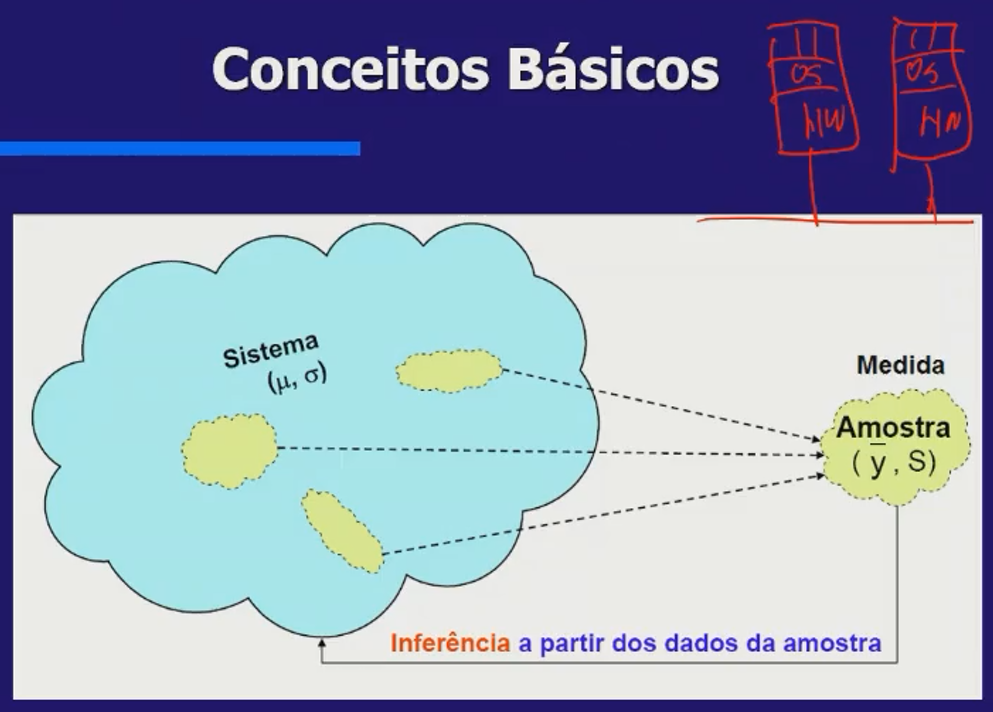
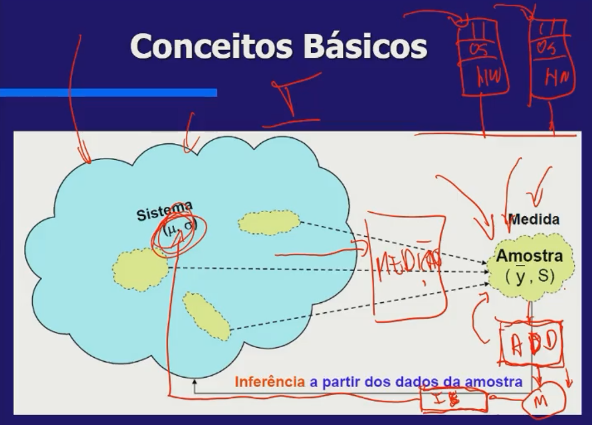
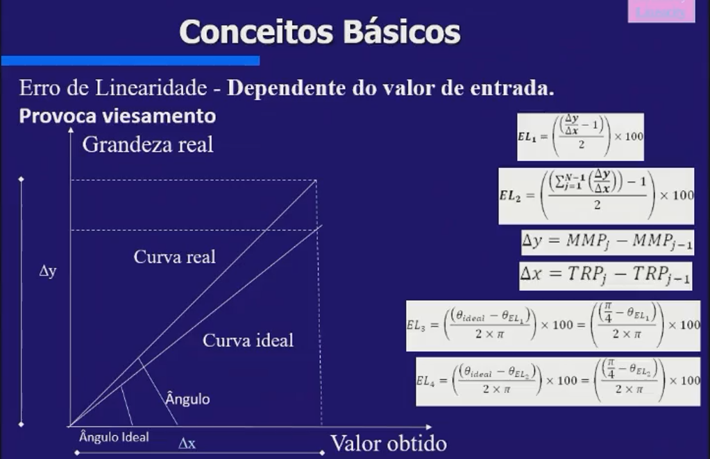
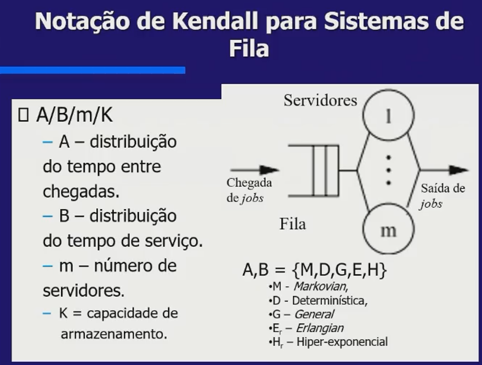

# Avaliação de Desempenho

:::tip Conceito
Conjunto de métodos que possibilita investigar o comportamento temporal de sistemas. 
:::

Os sistemas se classificam em duas clases:

1. Recursos Compartilhados
2. Tempo Ral

## Tempo Real

- Controle de Processo
- Robôs
- Sistemas de Controle de Aeronaves

Objetivos:
- Corretude
- Tolerância

Propriedades de Interesse:
- Liveness
- Safety

Nesse caso o tempo é deterministico.
Quando o recurso for demandado, ele esteja imediatamente disponível.

## Recursos Compartilhados

Maximizar o uso dos recursos (utilização, vação, reduzir retardo, reduzir probabilidade de perda). Utilizando sempre o bom uso dos recursos.
Busca de um bom **tradeoff entre desempenho vs financeiro**.
Para que não seja necessário adquirir novos recursos, quando a utilização dos recursos está baixa.

Os modelos utilizados, geralmente, são estocásticos. Utilizando valores médios e não mínimos e máximos como no de tempo real.

- Time-sharing computers
Arquiteturas cliente-servidor
Sistemas de telefonia, comunicação
Linhas de Produção

Objetivos:
- Uso econômico de recursos
- Tolerância à falhas
- Tradeoff entre desempenho e custo

Propriedades de Interesse:
- Throughput (Vazão)
- Utilização
- Retardo
- Probabilidade de Perda

## Classificação Técnica

### Medição

Se o sistema já existe, é possível que possamos medir o sistema.

### Modelos

Quando o sistema ainda não existe, não há medição. 
Nesse caso usamos modelos, exemplo:

|Equipe Projeto e Implementação (DIT) |Performance e Evaluation (PET)|
|-------------------------------|-----------------------------|
|Partir de espeficiação abastrata| Performance Model (PM) Gera um modelo de desempenho a partir da equipe de projeto |
|Deriva e gera especificações mais detalhadas|Resultados Geram Feedback à DIT|
|A medida que entra em detalhes, chga um ponto de escolha qual especificação usar |Quais alternativa é melhor que a outra|
|A partir da análise de performance, podemos gerar um outro nível de especificação|Gera um PM2, gera resultados e gera feedback à DIT|

Esse processo segue até que tenhamos a implementação do sistema.
Nas grandes empresas, não há uma divisão clara dos responsáveis por cada time e **em geral nem existe o time PET**.

Em caso de linha de produção, por exemplo, podemos mapear o modelo e avaliar diversos cenários.
Temos então resultados e podemos reconfigurar/atualizar o sistema existente para, por exemplo, atender uma demanda futura.

Nesse caso estamos falando de modelos etocásticos.

:::info
Um modelo estocástico é um modelo matemático que incorpora elementos de aleatoriedade ou incerteza em sua estrutura ou em suas entradas. Em outras palavras, é um modelo que leva em consideração o fato de que as coisas podem mudar de forma imprevisível e que existem várias possibilidades para o resultado.

Por exemplo, na arquitetura da AWS, um modelo estocástico pode ser usado para prever a demanda de tráfego em um site. O modelo pode incorporar elementos como a hora do dia, o dia da semana e eventos especiais (como feriados) para tentar prever quantos usuários irão visitar o site em um determinado período de tempo.

No entanto, como o comportamento humano é imprevisível, o modelo estocástico não pode prever com certeza exatamente quantos usuários irão visitar o site. Em vez disso, ele pode fornecer uma estimativa probabilística do número de usuários que irão acessar o site em um determinado momento. Essa estimativa pode ser usada para tomar decisões sobre como dimensionar os recursos da AWS (como servidores e bancos de dados) para atender à demanda esperada.
:::

Esses modelos podem ser solucionados de 3 formas:

- Soluções Analíticas
A partir do modelo, geramos um **conjunto de equações** que relacionam os parâmetros de entrada do sistema e as restrições estruturais do próprio modelo.
Nem sempre é possível encontrar equações.

- Soluções Numéricas
Baseadas em sistemas de equações diferenciais, onde vamos pegar o sistema e gerar um modelo. 
A partir daí, vamos gerar esse conjunto de equações e resolver.

Não vamos resolver os sistemas de equação na mão.
Existem ferramentas que resolvem essas equãções diferenciais.
É utilizado métodos numéricos para resolver.

- Simulação
Quando não é possível resolver nem com solução analítica nem com solução numérica.
Não devo criar um modelo com muitos detalhes porque quanto mais detalhes, maior a complexidade.

Simulação pode ser útil na arquitetura de dados da AWS para avaliar o desempenho de um sistema sob diferentes condições de carga ou tráfego. Por exemplo, suponha que você esteja projetando um banco de dados em nuvem para suportar um grande número de usuários simultâneos. Você pode usar simulação para avaliar como o sistema irá se comportar sob diferentes níveis de tráfego.

O primeiro passo é criar um modelo estocástico que represente a demanda do usuário e o comportamento do sistema. Isso pode incluir a definição de:

- **Variáveis de entrada**: as entradas que afetam o sistema, como o número de usuários, o tamanho dos dados e o número de consultas.

- **Variáveis de saída**: os resultados do sistema, como o tempo de resposta, a taxa de transferência e a utilização de recursos.

- **Distribuições de probabilidade**: para representar a aleatoriedade do sistema, você pode usar distribuições de probabilidade para modelar a variação nas variáveis de entrada e saída. Por exemplo, o número de usuários pode seguir uma distribuição Poisson e o tempo de resposta pode seguir uma distribuição normal.

Para fazer isso, você pode criar um modelo estocástico que represente a demanda do usuário e o comportamento do sistema. O modelo pode levar em conta fatores como o tamanho dos dados, a complexidade das consultas e o número de usuários acessando o sistema simultaneamente.

Em seguida, você pode usar software de simulação para executar o modelo várias vezes, variando os parâmetros do sistema para ver como ele se comporta sob diferentes condições. Isso pode ajudá-lo a identificar gargalos no desempenho do sistema e a determinar as configurações ideais de recursos (como o tamanho da instância do banco de dados ou a quantidade de capacidade de leitura/gravação) para atender à demanda esperada.

Ao usar simulação para avaliar o desempenho do sistema, você pode obter resultados mais precisos e confiáveis do que apenas estimar com base em suposições ou dados históricos limitados.

## Macro-Atividades de um Processo de Avaliação de Desempenho (com modelagem)

Para cada macro atividade, é importante usar o diagrama abaixo.

- Objetivo
- Responsável
- Pré-condições (ferramentas)
- Entradas
- Ações
- Entradas
- Saídas (relatório, modelo, conjunto de medidas)
- Pós-condições

Para cada macro atividade, é interessante, antes, gerar um texto como o diagrama acima.
É importante produzir algo sempre.
Se uma macro atividade não gerar resulta, ele não é necessário. 

Quando o sistema já existe:
1. Compreensão geral do problema/sistema a ser avaliado (medição)
Usando o AWS CloudTrail, você pode monitorar e registrar as atividades da sua conta da AWS e analisar esses dados para entender melhor como os recursos estão sendo usados e identificar problemas de desempenho.
O Amazon CloudWatch pode ser usado para monitorar e coletar métricas de desempenho de vários serviços da AWS, permitindo que você entenda melhor o desempenho geral do seu sistema.

2. Definição inicial dos critérios de desempenho a serem avaliados. (medição)
Com o AWS CloudFormation, você pode criar modelos de infraestrutura como código, permitindo que você defina e gerencie recursos da AWS de forma padronizada e escalável.
O AWS Service Catalog pode ser usado para definir e gerenciar catálogos de serviços e produtos da AWS, permitindo que você defina os critérios de desempenho necessários para cada serviço.

3. Identificação dos componentes. (medição)
O Amazon Elastic MapReduce (EMR) pode ser usado para processar grandes volumes de dados, permitindo que você identifique componentes críticos do seu sistema e monitore seu desempenho.

4. Refinamento dos critérios de avaliação (medição)
O Amazon Simple Storage Service (S3) pode ser usado para armazenar e recuperar dados de maneira escalável e segura, permitindo que você refine seus critérios de avaliação com base em dados precisos e confiáveis.

5. Geração do modelo abstrado (modelo)
O AWS Glue pode ser usado para criar e executar pipelines de dados, permitindo que você crie modelos abstratos para seus dados e sistemas.

6. Planejamento da medição (medição)
O Amazon Elastic Container Service (ECS) pode ser usado para orquestrar contêineres e aplicativos de maneira escalável e segura, permitindo que você planeje e gerencie suas medições de desempenho.

7. Coleta de Dados (medição)
O Apache Airflow pode ser usado para criar, programar e monitorar fluxos de trabalho complexos, permitindo que você colete dados de desempenho de vários serviços da AWS de maneira eficiente.

8. Análise dos dados coletados (medição) associados aos componentes (influentes) do sistema/problema
O Amazon Kinesis pode ser usado para coletar, processar e analisar streams de dados em tempo real, permitindo que você analise os dados coletados e identifique componentes críticos do seu sistema.

9. Geração do modelo refinado (modelo)
O AWS SageMaker pode ser usado para construir, treinar e implantar modelos de machine learning, permitindo que você refine seus modelos de desempenho com base em dados precisos e confiáveis.

10. Definição e mapeamento das métricas no modelo refinado (modelo)
O AWS Lambda pode ser usado para executar código sem servidor em resposta a eventos, permitindo que você defina e mapeie métricas específicas do modelo refinado.

11. Escolha dos métodos de avaliação dos modelos (modelo)
O AWS Step Functions pode ser usado para coordenar aplicativos distribuídos e serviços sem servidor, permitindo que você escolha e execute métodos de avaliação de modelos eficientes e escaláveis.

12. Desagregação do modelo refinado (modelo)
O AWS Glue DataBrew pode ser usado para limpar e preparar dados para análise, permitindo que você desagregue e refine ainda mais seu modelo refinado.

13. Avaliação (modelo)
O Amazon SageMaker Ground Truth pode ser usado para rotular dados de maneira eficiente e precisa, permitindo que você avalie seu modelo em dados precisos e confiáveis.

14. Agregação (modelo)
O Amazon Redshift pode ser usado para armazenar e analisar grandes volumes de dados, permitindo que você agregue e analise resultados de avaliação de modelos em grande escala.

15. Análise dos resultados e recomendações (medição)
O AWS QuickSight pode ser usado para criar e compartilhar visualizações de dados interativas, permitindo que você analise resultados de avaliação de modelos e faça recomendações para melhorar o desempenho do sistema.

## Conceitos Básicos

É possível observar o sistema entre um período inicial e final (período). 
Sendo assim, vamos obter a amostra (medição).

A partir disso, posso analisar de forma estatística. 
Gerar um conjunto de métricas.
Gerar uma inferência estatística.
Estimar os parâmetros do sistema.

### População

Conjunto de todas as medidas de interesse de um sistema. 
Medidas totais.

### Amostra

Porção da população através da qual as informações do sistema são obtidas.

### Inferência Estatística

Auxilia na estimativa de pârâmetros dos sistemas através da escolha adequada de uma amostra.

### Exatição (Accuracy)

Proximidade entre o resultado de uma medição e o valor referência correspondente.
Ausência de Viés e de Precisão.

Exemplo: Se uma balança está descalibrada.
Exemplo na arquitetura da AWS: O Amazon CloudWatch pode ser usado para medir a utilização de recursos em uma instância da Amazon EC2. Se a instância tiver um CPU de 2,5 GHz, a exatidão da medida dependerá de quão próxima a medição está dos 2,5 GHz reais. O CloudWatch pode ser configurado para fornecer alertas se a utilização de recursos estiver abaixo ou acima de um determinado valor, permitindo que você monitore a exatidão das medições e faça ajustes quando necessário.

### Precisão

É uma medida da dispersão do conjunto de dados obtidos na medição.
Está relacionada a repetibilidade.
Exemplo na arquitetura da AWS: O Amazon S3 pode ser usado para armazenar e recuperar dados de maneira consistente e precisa. Se você fizer o upload de um arquivo de 1 MB para o S3, poderá ter certeza de que o arquivo será armazenado com precisão e consistência, permitindo que você o recupere sempre que precisar.

### Resolução

Corresponde a menor alteração que pode ser detectada por ferramental de medição.
Exemplo na arquitetura da AWS: O Amazon Kinesis pode ser usado para coletar, processar e analisar streams de dados em tempo real. Se você estiver medindo a taxa de cliques em um site usando o Kinesis, a resolução da medida dependerá da precisão do sensor que está sendo usado. Se o sensor tiver uma resolução de 1 clique por segundo, só será possível detectar mudanças de cliques em incrementos de 1 segundo. Você pode melhorar a resolução aumentando a precisão do sensor ou adicionando mais sensores para coletar mais dados.

## Notação Kendall para Sistemas de Fila

Notação para tráfico de chegadas:
A/B/m/K

A,B = {M, D, G E, H}
M: Markovian
O gráfico de chegada Dist. exponencial (contínio) ou dist. geomética (discreta)
D: Determinística
Não são variáveis aleatórias e sim determinísticos
G: General
Não especificou a dist. do dado no gráfico de chegada
E: Erlangian
H: Hiper-exponencial

### Mais detalhes

A Notação Kendall é uma técnica matemática usada para analisar e modelar sistemas de fila. A notação consiste em três letras separadas por um "/" que representam diferentes características do sistema de fila: A/B/C, onde A representa o tipo de distribuição de chegada, B representa o tipo de distribuição de serviço e C representa o número de servidores.

Na arquitetura da AWS, é possível usar serviços como o Amazon Elastic Compute Cloud (EC2), o Amazon Elastic Container Service (ECS) e o Amazon Simple Queue Service (SQS) para implementar modelos de sistemas de fila que possam ser analisados com a Notação Kendall. Aqui estão alguns exemplos:

A: distribuição de chegada
Suponha que você esteja projetando um sistema de fila para lidar com solicitações de serviços web em uma aplicação da AWS. Você pode usar o Elastic Load Balancing (ELB) da AWS para distribuir as solicitações de chegada aos servidores EC2 que executam os serviços. A distribuição de chegada pode ser modelada com uma distribuição Poisson, que é uma distribuição comum para modelar a chegada de solicitações em sistemas de fila.

B: distribuição de serviço
Suponha que você esteja executando um cluster do ECS para executar contêineres que processam solicitações de uma fila SQS. O tempo de serviço pode ser modelado com uma distribuição exponencial, que é comumente usada para modelar tempos de serviço em sistemas de fila.

C: número de servidores
Suponha que você esteja executando um sistema de fila com múltiplos servidores EC2 que processam solicitações de uma fila SQS. O número de servidores pode ser modelado usando o valor numérico em C da Notação Kendall. Por exemplo, se houver 5 servidores EC2 processando as solicitações da fila, a notação seria A/B/5.

Com base na Notação Kendall, você pode usar técnicas de análise matemática para calcular métricas de desempenho do sistema de fila, como tempo médio de espera na fila, taxa de utilização do servidor e número médio de solicitações na fila. Essas métricas podem ser usadas para avaliar o desempenho do sistema de fila e fazer ajustes para melhorá-lo.

### Exemplos

- M/M/1
É uma fila em que o Tráfico de Entrada é exponencialmente distribuido
O tempo de serviço é markoviano e distribuido
1 servidor
Armazenamento infinito

- M/M/1/K
Tempo de chegada: Exponencialmente Distribuído
Tempo de serviço: Exponencialmente Distribuído
Servidores: 1 servidor
Capacidade do sistema: K

- M/G/2
Tempo de chegada: Markoviano
Tempo de serviço: Genérica
Servidores: 2 servidores
Capacidade do sistema: Infinito

### Exemplos do ChatGPT

Na teoria das filas, a Notação de Kendall é usada para descrever e modelar sistemas de fila. A notação consiste em três letras separadas por uma barra (/) que representam as características do sistema de fila: A/B/C, onde A representa a distribuição de chegada, B representa a distribuição de tempo de serviço e C representa o número de servidores.

Uma das principais diferenças entre a distribuição markoviana e a distribuição exponencial é que a distribuição markoviana é uma distribuição discreta de probabilidade, enquanto a distribuição exponencial é uma distribuição contínua de probabilidade.

Na arquitetura da AWS, você pode usar serviços como o Amazon Elastic Compute Cloud (EC2), o Amazon Elastic Container Service (ECS) e o Amazon Simple Queue Service (SQS) para implementar modelos de sistemas de fila que possam ser analisados com a Notação Kendall. Aqui estão alguns exemplos de como a distribuição markoviana e a distribuição exponencial podem ser usadas para modelar sistemas de fila na AWS:

Distribuição Markoviana
Suponha que você esteja projetando um sistema de fila para lidar com solicitações de serviços web em uma aplicação da AWS. Você pode usar o Amazon Elastic Load Balancing (ELB) para distribuir as solicitações de chegada aos servidores EC2 que executam os serviços. A distribuição de chegada pode ser modelada com uma distribuição de Poisson, que é comum para modelar a chegada de solicitações em sistemas de fila. A distribuição de tempo de serviço pode ser modelada com uma distribuição markoviana, que é uma distribuição discreta de probabilidade que descreve o tempo que um servidor leva para executar um serviço. Por exemplo, você pode usar a distribuição markoviana para modelar o tempo que um servidor leva para processar uma solicitação, com base em diferentes estados do servidor (como ocupado, livre ou em espera).

Distribuição exponencial
Suponha que você esteja executando um cluster do ECS para executar contêineres que processam solicitações de uma fila SQS. O tempo de serviço pode ser modelado com uma distribuição exponencial, que é comumente usada para modelar tempos de serviço em sistemas de fila. Por exemplo, você pode usar a distribuição exponencial para modelar o tempo que um contêiner leva para processar uma solicitação da fila. O número de servidores pode ser modelado usando o valor numérico em C da Notação Kendall. Por exemplo, se houver 5 servidores ECS processando as solicitações da fila, a notação seria A/Exponential/5.

Com base na Notação Kendall e na distribuição de tempo de serviço escolhida (markoviana ou exponencial), você pode calcular métricas de desempenho do sistema de fila, como o tempo médio de espera na fila, a taxa de utilização do servidor e o número médio de solicitações na fila. Essas métricas podem ser usadas para avaliar o desempenho do sistema de fila e fazer ajustes para melhorá-lo.

## Dúvidas:

Qual a diferença entre exponencialmente Distribuído e Markoviano ? É a mesma coisa correto ?
Porém como eu sei que é uma distribuição exponencial ou geométrica se eu não vi o tipo de dado ? 

Um exemplo do diagrama abaixo:
- Objetivo
- Responsável
- Pré-condições (ferramentas)
- Entradas
- Ações
- Entradas
- Saídas (relatório, modelo, conjunto de medidas)
- Pós-condições
