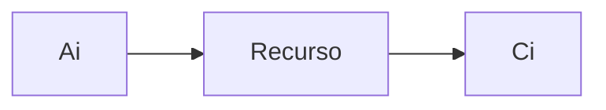

# Análise Operacional

- AUla 01
- Aula 02
- Aula 03
- AUla 04
- Tool: OL - Botlenecks

## Introdução

Vamos analisar um sistema que está em funcionamento. 
É uma analise do sistema que está operando, de desempenho. 

Ela se baseia em variáveis operacionais Elas são chamadas assim porque capturam informação do sistema que está operando. 
São variáveis obtidas do sistema que está operando. QUe são observadas do sistema.

### Análise Operacional na Avaliação de Desempenho de Sistemas

A análise operacional é uma técnica usada para modelar o desempenho de sistemas de computação, como redes de computadores e servidores. As Leis Operacionais (Operational Laws) são um conjunto de equações matemáticas descritas no livro "The Art of Computer Systems Performance Analysis Techniques" de Raj Jain.

As três leis operacionais mais conhecidas são:

1. **Lei de Little**: afirma que, em um sistema de fila, o número médio de itens na fila é igual à taxa média de chegada multiplicada pelo tempo médio que um item permanece no sistema (incluindo o tempo na fila e o tempo de serviço).

2. **Lei de Erlang**: usada para modelar sistemas de fila com vários servidores. Afirma que o número médio de clientes que podem ser atendidos em um sistema de fila é igual ao produto da taxa média de chegada de clientes pelo tempo médio que cada cliente passa no sistema, dividido pelo fator de utilização do servidor.

3. **Lei de Utilização de Kendall**: usada para modelar sistemas de computação com vários recursos (como CPUs, discos e memória). Afirma que a utilização média de cada recurso é igual à taxa média de chegada multiplicada pelo tempo médio que cada cliente passa no sistema, multiplicado pelo número médio de recursos necessários para atender a cada cliente.

Na arquitetura da AWS, é possível usar serviços como o Amazon EC2, o Amazon Elastic Container Service (ECS) e o Amazon Simple Queue Service (SQS) para implementar modelos de sistemas de fila que possam ser analisados com as leis operacionais. Essas leis podem ser usadas para calcular métricas de desempenho do sistema, como a taxa média de chegada, o tempo médio de resposta e a utilização média dos recursos. Com base nessas métricas, você pode avaliar o desempenho do sistema e fazer ajustes para melhorá-lo.

## Variáveis Operacionais

- **T**: Período de Observação
- **K**: Número de Recursos do Sistema
- **Ai**: Número total de solicitações (ex: checagas) do recurso i no período T
- **A0**: Número total de solicitações (ex: chegadas) ao sistema no período T.
- **Ci**: Número total de serviços finalizados pelo recurso i no período T
- **C0**: Número total de serviços finalizados pelo sistema no período T
- **Bi**: Tempo de ocupação do recurso i no período T

Atenção que existe diferença entre o SISTEMA e o RECURSO

Pode ser que eu possa ter diversas visitas a cada recurso.

### Sistema

O sistema é o conjunto completo de recursos que trabalham juntos para atender a uma determinada demanda. O sistema pode ser um aplicativo, um servidor, uma rede ou qualquer combinação desses componentes que trabalham em conjunto para entregar um serviço ou funcionalidade.

Exemplo de sistema da AWS: 
- sistema de armazenamento em nuvem;
- sistema de processamento de big data;
- sistema de gerenciamento de banco de dados;
- sistema de aprendizado de máquina;

### Recurso

O recurso é um componente individual que faz parte do sistema. O recurso pode ser um servidor, um banco de dados, uma conexão de rede ou qualquer outro componente que faça parte do sistema.

Exemplo de recurso da AWS:
- EC2; 
- S3;
- RDS;
- DynamoDB; 
- Lambda;
- Fargate;

### Recurso contido no Sistema

Cada sistema da AWS é composto por diferentes recursos da plataforma que trabalham juntos para fornecer a funcionalidade desejada. Por exemplo:

- um sistema de armazenamento em nuvem pode ser composto pelo serviço de armazenamento de objetos S3, pelo serviço de transferência de dados AWS Transfer for SFTP e pelo serviço de backup e recuperação de dados AWS Backup. 
- O sistema de processamento de big data, por sua vez, pode ser composto pelo serviço de processamento distribuído EMR, pelo serviço de armazenamento de dados distribuído S3 e pelo serviço de ingestão de dados Kinesis. 	

Cada sistema é projetado para atender a uma necessidade específica e os recursos são escolhidos e configurados para trabalhar juntos para alcançar o objetivo desejado.

:::info
O Amazon Elastic Compute Cloud (EC2) é um serviço de computação em nuvem da Amazon Web Services (AWS) que fornece capacidade de computação escalável na nuvem. Ele permite que os usuários aluguem máquinas virtuais sob demanda e paguem apenas pelo tempo de uso, sem a necessidade de investir em infraestrutura de hardware própria. Com o EC2, os usuários podem escolher o tipo de instância que melhor atende às suas necessidades de computação, memória, armazenamento e rede, além de configurar a segurança e a rede da instância. É um serviço muito flexível e usado para uma ampla variedade de casos de uso, desde hospedagem de sites até executar aplicativos complexos de big data e machine learning.

EC2 é uma ferramenta que permite criar servidores virtuais na nuvem, o que é super útil porque você pode escalá-los para cima ou para baixo conforme a necessidade. É como ter uma cozinha maior ou menor, dependendo do tamanho da sua família ou convidados.
:::

:::info
O Amazon Relational Database Service (RDS) é um serviço de banco de dados relacional da Amazon Web Services (AWS) que facilita a configuração, operação e escalabilidade de um banco de dados relacional na nuvem. O RDS oferece suporte a várias engines de banco de dados, como MySQL, PostgreSQL, Oracle, SQL Server e outras, permitindo que os usuários escolham a engine que melhor atende às suas necessidades. Com o RDS, os usuários podem configurar e gerenciar facilmente a capacidade de armazenamento, desempenho, backup e segurança de seus bancos de dados, sem a necessidade de investir em infraestrutura de banco de dados própria. O RDS também oferece recursos avançados, como replicação multi-AZ para alta disponibilidade, leitura de réplica, backup automatizado, migração de dados, monitoramento de desempenho e integração com outros serviços da AWS. É um serviço muito popular entre empresas de todos os tamanhos que precisam de um banco de dados relacional escalável e gerenciado na nuvem.

Já o RDS é um serviço de banco de dados gerenciado, que facilita muito a vida de quem precisa armazenar e gerenciar muitos dados. É tipo ter um armário organizado para guardar todas as suas coisas.
:::

:::info
O Amazon Elastic MapReduce (EMR) é um serviço da Amazon Web Services (AWS) que permite executar e gerenciar facilmente clusters de processamento distribuído baseados em Hadoop, Spark, Presto, Hive e outras tecnologias de big data na nuvem. Um cluster EMR é um grupo de instâncias do Amazon Elastic Compute Cloud (EC2) que são configuradas automaticamente para executar um conjunto de serviços de big data. O EMR permite que os usuários criem rapidamente um cluster, processem grandes conjuntos de dados, executem análises de big data e forneçam insights valiosos usando uma variedade de ferramentas e frameworks populares de big data. O EMR também oferece recursos de escalabilidade automática, gerenciamento de dados, segurança, monitoramento e logging para simplificar a criação e operação de clusters de big data na nuvem. O EMR é usado por empresas de todos os tamanhos para uma variedade de casos de uso, incluindo análise de log, análise de dados, processamento de imagens e aprendizado de máquina.

Então, olha só, o Amazon EMR é uma ferramenta que ajuda a processar um monte de informações bem rápido, sem precisar gastar uma grana alta com equipamento. Sabe quando você quer fazer um almoço bem rápido e usa uma panela de pressão pra acelerar o processo? É tipo isso. O EMR usa várias ferramentas pra te ajudar a coletar e analisar informações sem precisar comprar todo um equipamento caro. E aí, quanto mais você usa, mais barato fica. É tipo cozinhar um jantar grande - quanto mais você faz, mais barato fica por porção, sacou?
:::

:::info
Airflow é uma ferramenta de fluxo de trabalho de código aberto que ajuda a automatizar tarefas e fluxos de trabalho de dados, o que é super útil quando você precisa lidar com muitas informações diferentes. É como ter um assistente que sabe exatamente o que você precisa fazer a cada momento.

Sagemaker é uma plataforma de aprendizado de máquina totalmente gerenciada que ajuda a treinar e implantar modelos de aprendizado de máquina de forma rápida e fácil. É como ter um professor particular de matemática que te ajuda a resolver problemas complexos.

Glue Studio e Glue são ferramentas de integração e ETL (Extração, Transformação e Carga) de dados que facilitam muito a vida de quem precisa coletar, transformar e mover muitos dados entre diferentes sistemas e formatos. É como ter um assistente que cuida de todo o trabalho pesado e te ajuda a manter tudo organizado.
:::

:::info
O Fargate é um serviço da AWS que facilita a execução de aplicativos em contêineres. Ele oferece uma plataforma de hospedagem gerenciada, para que você possa se concentrar em escrever código e não se preocupar com a infraestrutura por trás. Com o Fargate, você pode escalar rapidamente seus aplicativos, garantir alta disponibilidade e segurança robusta. Além disso, ele também permite que você escolha as ferramentas e bibliotecas de contêiner que melhor atendem às necessidades do seu aplicativo. Com o Fargate, você pode executar seus aplicativos em contêineres de forma simples, eficiente e com economia de custos, pagando apenas pelo uso que você fizer do serviço.

O Fargate é uma tecnologia que permite executar contêineres em um ambiente completamente gerenciado, sem a necessidade de provisionar ou gerenciar servidores. Isso é extremamente útil porque você pode focar no desenvolvimento de aplicativos sem se preocupar com a infraestrutura. É como ter um cozinheiro pessoal que prepara sua refeição sem que você precise se preocupar em comprar ingredientes ou limpar a cozinha depois. O Fargate cuida de tudo para você, desde a configuração até a execução de contêineres.
:::

## Variáveis Operacionais na Arquitetura AWS

### CloudWatch

O serviço CloudWatch pode ser usado para coletar dados de desempenho de vários recursos da AWS, como servidores EC2, bancos de dados RDS e clusters EMR. As variáveis operacionais podem ser coletadas da seguinte forma:

Ai: Número total de solicitações recebidas por um recurso específico em um determinado período, como o número total de solicitações recebidas por um servidor EC2 em uma hora.
Ci: Número total de serviços concluídos por um recurso específico em um determinado período, como o número total de requisições processadas por um banco de dados RDS em um dia.
A0: Número total de solicitações recebidas pelo sistema em um determinado período, como o número total de solicitações recebidas por todos os recursos monitorados pelo CloudWatch em uma semana.
C0: Número total de serviços concluídos pelo sistema em um determinado período, como o número total de requisições processadas por todos os recursos monitorados pelo CloudWatch em um mês.
Bi: Tempo de ocupação de um recurso específico em um determinado período, como o tempo de CPU utilizado por um servidor EC2 em uma hora.
K: Número de recursos monitorados pelo CloudWatch.
T: Período de observação dos dados coletados.

### AWS Glue

O serviço AWS Glue pode ser usado para coletar e processar dados de várias fontes, como bancos de dados, armazenamentos de dados e streams. As variáveis operacionais podem ser coletadas da seguinte forma:

Ai: Número total de solicitações recebidas por um recurso específico em um determinado período, como o número total de requisições recebidas por um banco de dados em um dia.
Ci: Número total de serviços concluídos por um recurso específico em um determinado período, como o número total de requisições processadas por um fluxo de dados em uma hora.
A0: Número total de solicitações recebidas pelo sistema em um determinado período, como o número total de requisições recebidas por todos os recursos monitorados pelo AWS Glue em uma semana.
C0: Número total de serviços concluídos pelo sistema em um determinado período, como o número total de requisições processadas por todos os recursos monitorados pelo AWS Glue em um mês.
Bi: Tempo de ocupação de um recurso específico em um determinado período, como o tempo de processamento de dados por um fluxo de dados em uma hora.
K: Número de recursos monitorados pelo AWS Glue.
T: Período de observação dos dados coletados.

### Amazon SageMaker

O serviço Amazon SageMaker pode ser usado para treinar, hospedar e escalar modelos de aprendizado de máquina. As variáveis operacionais podem ser coletadas da seguinte forma:

Ai: Número total de solicitações recebidas por um recurso específico em um determinado período, como o número total de solicitações de previsão feitas por um modelo em uma hora.
Ci: Número total de previsões realizadas por um recurso específico em um determinado período, como o número total de previsões feitas por um modelo em um dia.

A0: Número total de solicitações recebidas pelo sistema em um determinado período, como o número total de solicitações de previsão feitas para todos os modelos hospedados pelo Amazon SageMaker em uma semana.

C0: Número total de serviços concluídos pelo sistema em um determinado período, como o número total de previsões feitas por todos os modelos hospedados pelo Amazon SageMaker em um mês.

Bi: Tempo de ocupação de um recurso específico em um determinado período, como o tempo de treinamento de um modelo de aprendizado de máquina em uma semana.

K: Número de modelos de aprendizado de máquina hospedados pelo Amazon SageMaker.

T: Período de observação dos dados coletados.

### Amazon EC2

O serviço Amazon EC2 permite que os usuários lancem e gerenciem servidores virtuais na nuvem da AWS. As variáveis operacionais podem ser coletadas da seguinte forma:

Ai: Número total de solicitações recebidas por um servidor específico em um determinado período, como o número total de solicitações HTTP recebidas por um servidor web em uma hora.
Ci: Número total de serviços concluídos por um servidor específico em um determinado período, como o número total de solicitações HTTP processadas por um servidor web em um dia.
A0: Número total de solicitações recebidas pelo sistema em um determinado período, como o número total de solicitações HTTP recebidas por todos os servidores web lançados pelo Amazon EC2 em uma semana.
C0: Número total de serviços concluídos pelo sistema em um determinado período, como o número total de solicitações HTTP processadas por todos os servidores web lançados pelo Amazon EC2 em um mês.
Bi: Tempo de ocupação de um servidor específico em um determinado período, como o tempo de CPU utilizado por um servidor web em uma hora.
K: Número de servidores lançados pelo Amazon EC2.
T: Período de observação dos dados coletados.

### Apache Airflow

O Apache Airflow é uma plataforma para programação e agendamento de fluxos de trabalho de dados. As variáveis operacionais podem ser coletadas da seguinte forma:

Ai: Número total de tarefas executadas em um determinado fluxo de trabalho em um período T.
Ci: Número total de tarefas concluídas por um operador específico em um determinado período T.
A0: Número total de tarefas executadas em todos os fluxos de trabalho agendados no Airflow em um período T.
C0: Número total de tarefas concluídas em todos os fluxos de trabalho agendados no Airflow em um período T.
Bi: Tempo de execução de um operador específico em um determinado período T.
K: Número de operadores executando tarefas no Airflow.
T: Período de observação dos dados coletados.

### Amazon EMR

O Amazon EMR é um serviço de big data que permite a execução distribuída de frameworks como Apache Hadoop e Apache Spark. As variáveis operacionais podem ser coletadas da seguinte forma:

Ai: Número total de jobs executados em um cluster EMR em um período T.
Ci: Número total de tarefas executadas por um nó específico em um período T.
A0: Número total de jobs executados em todos os clusters EMR em um período T.
C0: Número total de tarefas executadas em todos os nós de todos os clusters EMR em um período T.
Bi: Tempo de execução de um nó específico em um período T.
K: Número de nós em um cluster EMR.
T: Período de observação dos dados coletados.

### Amazon S3

O Amazon S3 é um serviço de armazenamento de objetos da AWS. As variáveis operacionais podem ser coletadas da seguinte forma:

Ai: Número total de requisições GET ou PUT feitas para um objeto específico em um período T.
Ci: Número total de requisições GET feitas para um objeto específico em um período T.
A0: Número total de requisições GET ou PUT feitas para todos os objetos armazenados no S3 em um período T.
C0: Número total de requisições GET feitas para todos os objetos armazenados no S3 em um período T.
Bi: Tempo de acesso de um objeto específico em um período T.
K: Número de objetos armazenados no S3.
T: Período de observação dos dados coletados.

### Amazon Redshift

O Amazon Redshift é um serviço de data warehousing da AWS. As variáveis operacionais podem ser coletadas da seguinte forma:

Ai: Número total de consultas feitas para um cluster Redshift em um período T.
Ci: Número total de linhas retornadas por uma consulta específica em um período T.
A0: Número total de consultas feitas para todos os clusters Redshift em um período T.
C0: Número total de linhas retornadas por todas as consultas feitas para todos os clusters Redshift em um período T.

Bi: Tempo de execução de uma consulta específica em um período T.

K: Número de clusters Redshift.

T: Período de observação dos dados coletados.

### Amazon RDS

O Amazon RDS é um serviço de banco de dados relacional da AWS. As variáveis operacionais podem ser coletadas da seguinte forma:

Ai: Número total de solicitações de consulta feitas para um banco de dados RDS em um período T.
Ci: Número total de linhas retornadas por uma consulta específica em um período T.
A0: Número total de solicitações de consulta feitas para todos os bancos de dados RDS em um período T.
C0: Número total de linhas retornadas por todas as consultas feitas para todos os bancos de dados RDS em um período T.
Bi: Tempo de execução de uma consulta específica em um período T.
K: Número de bancos de dados RDS.
T: Período de observação dos dados coletados.

### Amazon DynamoDB

O Amazon DynamoDB é um serviço de banco de dados NoSQL da AWS. As variáveis operacionais podem ser coletadas da seguinte forma:

Ai: Número total de operações de gravação ou leitura feitas para uma tabela específica em um período T.
Ci: Número total de operações de leitura feitas para uma tabela específica em um período T.
A0: Número total de operações de gravação ou leitura feitas para todas as tabelas DynamoDB em um período T.
C0: Número total de operações de leitura feitas para todas as tabelas DynamoDB em um período T.
Bi: Tempo de acesso a uma tabela específica em um período T.
K: Número de tabelas DynamoDB.
T: Período de observação dos dados coletados.

### Amazon API Gateway

O Amazon API Gateway é um serviço que permite criar, publicar, manter, monitorar e proteger APIs. As variáveis operacionais podem ser coletadas da seguinte forma:

Ai: Número total de requisições feitas para uma API específica em um período T.
Ci: Número total de requisições concluídas com sucesso para uma API específica em um período T.
A0: Número total de requisições feitas para todas as APIs do Amazon API Gateway em um período T.
C0: Número total de requisições concluídas com sucesso para todas as APIs do Amazon API Gateway em um período T.
Bi: Tempo de resposta de uma requisição específica em um período T.
K: Número de APIs criadas no Amazon API Gateway.
T: Período de observação dos dados coletados.

### AWS Lambda

O AWS Lambda é um serviço de computação serverless que permite executar código em resposta a eventos e escaloná-lo automaticamente com base na demanda. As variáveis operacionais podem ser coletadas da seguinte forma:

Ai: Número total de invocações de uma função específica do AWS Lambda em um período T.
Ci: Número total de invocações da função que foram concluídas com sucesso em um período T.
A0: Número total de invocações de todas as funções do AWS Lambda em um período T.
C0: Número total de invocações de todas as funções do AWS Lambda que foram concluídas com sucesso em um período T.
Bi: Tempo de resposta para processar uma única invocação de uma função específica do AWS Lambda em um período T.
K: Número de funções criadas no AWS Lambda.
T: Período de observação dos dados coletados.

### Amazon CloudFront

O Amazon CloudFront é um serviço de distribuição de conteúdo que permite fornecer conteúdo de forma rápida e segura. As variáveis operacionais podem ser coletadas da seguinte forma:

Ai: Número total de requisições feitas para um determinado objeto em um período T.
Ci: Número total de vezes que um determinado objeto foi entregue com sucesso em um período T.
A0: Número total de requisições feitas para todos os objetos do Amazon CloudFront em um período T.
C0: Número total de vezes que todos os objetos do Amazon CloudFront foram entregues com sucesso em um período T.
Bi: Tempo de resposta de entrega de um determinado objeto em um período T.
K: Número de distribuições do Amazon CloudFront.
T: Período de observação dos dados coletados.

### Amazon Elastic Beanstalk

O Amazon Elastic Beanstalk é um serviço que permite implantar e escalar aplicativos da web e serviços da web. As variáveis operacionais podem ser coletadas da seguinte forma:

Ai: Número total de solicitações feitas para uma aplicação específica em um período T.
Ci: Número total de solicitações bem-sucedidas para uma aplicação específica em um período T.
A0: Número total de solicitações feitas para todas as aplicações do Amazon Elastic Beanstalk em um período T.
C0: Número total de solicitações bem-sucedidas para todas as aplicações do Amazon Elastic Beanstalk em um período T.
Bi: Tempo de resposta de uma solicitação específica em um período T.
K: Número de aplicações implantadas no Amazon Elastic Beanstalk.
T: Período de observação dos dados coletados.

### Amazon Elastic File System (EFS)

O Amazon EFS é um serviço de armazenamento de arquivos totalmente gerenciado e escalável que pode ser usado com as instâncias do Amazon EC2. As variáveis operacionais podem ser coletadas da seguinte forma:

Ai: Número total de operações de leitura/gravação em um sistema de arquivos específico em um período T.
Ci: Número total de operações de leitura/gravação bem-sucedidas em um sistema de arquivos específico em um período T.
A0: Número total de operações de leitura/gravação em todos os sistemas de arquivos do Amazon EFS em um período T.
C0: Número total de operações de leitura/gravação bem-sucedidas em todos os sistemas de arquivos do Amazon EFS em um período T.
Bi: Tempo de resposta para operações de leitura/gravação em um sistema de arquivos específico em um período T.
K: Número de sistemas de arquivos criados no Amazon EFS.
T: Período de observação dos dados coletados.

### Amazon Elastic Container Registry (ECR)

O Amazon ECR é um registro de imagens de contêiner seguro e totalmente gerenciado que facilita o armazenamento, gerenciamento e implantação de imagens de contêiner do Docker. As variáveis operacionais podem ser coletadas da seguinte forma:

Ai: Número total de imagens armazenadas em um repositório específico em um período T.
Ci: Número total de imagens baixadas com sucesso de um repositório específico em um período T.
A0: Número total de imagens armazenadas em todos os repositórios do Amazon ECR em um período T.
C0: Número total de imagens baixadas com sucesso de todos os repositórios do Amazon ECR em um período T.
Bi: Tempo de resposta para baixar uma imagem específica em um período T.
K: Número de repositórios criados no Amazon ECR.
T: Período de observação dos dados coletados.

### Amazon DocumentDB

O Amazon DocumentDB é um serviço de banco de dados de documentos compatível com MongoDB que oferece escalabilidade, desempenho e disponibilidade. As variáveis operacionais podem ser coletadas da seguinte forma:

Ai: Número total de solicitações de leitura/gravação em uma coleção específica em um período T.
Ci: Número total de solicitações de leitura/gravação bem-sucedidas em uma coleção específica em um período T.
A0: Número total de solicitações de leitura/gravação em todas as coleções do Amazon DocumentDB em um período T.
C0: Número total de solicitações de leitura/gravação bem-sucedidas em todas as coleções do Amazon DocumentDB em um período T.
Bi: Tempo de resposta para uma solicitação de leitura/gravação em uma coleção específica em um período T.
K: Número de coleções criadas no Amazon DocumentDB.
T: Período de observação dos dados coletados.

### Amazon Simple Notification Service (SNS)

O Amazon SNS é um serviço de mensagens e notificações gerenciado que permite enviar mensagens para assinantes ou endpoints. As variáveis operacionais podem ser coletadas da seguinte forma:

Ai: Número total de mensagens publicadas em um tópico específico em um período T.
Ci: Número total de mensagens entregues com sucesso a um endpoint específico em um período T.
A0: Número total de mensagens publicadas em todos os tópicos do Amazon SNS em um período T.
C0: Número total de mensagens entregues com sucesso a todos os endpoints do Amazon SNS em um período T.
Bi: Tempo de resposta para entregar uma mensagem a um endpoint específico em um período T.
K: Número de tópicos criados no Amazon SNS.
T: Período de observação dos dados coletados.

### Amazon Simple Queue Service (SQS)

O Amazon SQS é um serviço de filas gerenciado que permite desacoplar e escalar microsserviços, sistemas distribuídos e aplicativos sem servidor. As variáveis operacionais podem ser coletadas da seguinte forma:

Ai: Número total de mensagens recebidas por uma fila específica em um período T.
Ci: Número total de mensagens processadas com sucesso por uma fila específica em um período T.
A0: Número total de mensagens recebidas por todas as filas no Amazon SQS em um período T.
C0: Número total de mensagens processadas com sucesso por todas as filas no Amazon SQS em um período T.
Bi: Tempo de resposta para processar uma mensagem por uma fila específica em um período T.
K: Número de filas criadas no Amazon SQS.
T: Período de observação dos dados coletados.

### Amazon Elastic Kubernetes Service (EKS)

O Amazon EKS é um serviço totalmente gerenciado que torna mais fácil executar o Kubernetes na AWS. As variáveis operacionais podem ser coletadas da seguinte forma:

Ai: Número total de pods iniciados em um cluster Kubernetes específico em um período T.
Ci: Número total de pods concluídos com sucesso em um cluster Kubernetes específico em um período T.
A0: Número total de pods iniciados em todos os clusters Kubernetes no Amazon EKS em um período T.
C0: Número total de pods concluídos com sucesso em todos os clusters Kubernetes no Amazon EKS em um período T.
Bi: Tempo de resposta para executar um pod em um contêiner específico em um período T.
K: Número de clusters Kubernetes criados no Amazon EKS.
T: Período de observação dos dados coletados.

### O Amazon Kinesis

É um serviço de streaming de dados em tempo real que permite a ingestão, processamento e análise de grandes quantidades de dados em tempo real. As variáveis operacionais podem ser coletadas da seguinte forma:

Ai: Número total de eventos recebidos em um stream de dados específico em um período T.
Ci: Número total de eventos processados e entregues com sucesso em um stream de dados específico em um período T.
A0: Número total de eventos recebidos em todos os streams de dados no Amazon Kinesis em um período T.
C0: Número total de eventos processados e entregues com sucesso em todos os streams de dados no Amazon Kinesis em um período T.
Bi: Tempo de processamento para processar um evento em um stream de dados específico em um período T.
K: Número de streams de dados criados no Amazon Kinesis.
T: Período de observação dos dados coletados.

## Sistema 

O sistema de processamento de big data, por sua vez, pode ser composto pelo serviço de processamento distribuído EMR, pelo serviço de armazenamento de dados distribuído S3 e pelo serviço de ingestão de dados Kinesis.

T: Período de observação;
K: Número de recursos do sistema, que nesse caso é composto por três serviços;
Ai: Número total de solicitações (ex: ingestão de dados) do recurso i (EMR, S3 ou Kinesis) no período T;
A0: Número total de solicitações (ex: chegadas) ao sistema (EMR, S3 e Kinesis) no período T;
Ci: Número total de serviços finalizados pelo recurso i (EMR, S3 ou Kinesis) no período T;
C0: Número total de serviços finalizados pelo sistema (EMR, S3 e Kinesis) no período T;
Bi: Tempo de ocupação do recurso i (EMR, S3 ou Kinesis) no período T.

EMR (Elastic MapReduce):
Ai: Número de tarefas de processamento executadas em um determinado tempo
Ci: Número de tarefas de processamento finalizadas em um determinado tempo
Bi: Tempo de processamento médio de cada tarefa

S3 (Simple Storage Service):
Ai: Número de requisições de leitura ou gravação de arquivos em um determinado tempo
Ci: Número de requisições de leitura ou gravação de arquivos finalizadas em um determinado tempo
Bi: Tempo de leitura ou gravação médio de cada arquivo

Kinesis:
Ai: Número de eventos de dados recebidos em um determinado tempo
Ci: Número de eventos de dados processados e transmitidos em um determinado tempo
Bi: Tempo de processamento médio de cada evento de dados

## Considerações Finais

A avaliação de desempenho de sistemas é fundamental para garantir o bom funcionamento de aplicações e serviços. A AWS oferece uma ampla variedade de serviços para coletar dados e analisar o desempenho de sistemas e recursos, como o EMR, Airflow, ECS, S3, Redshift, RDS, DynamoDB, Lambda, Glue Studio e Fargate.

Esses serviços permitem coletar variáveis operacionais, como o número de solicitações e serviços finalizados, o tempo de ocupação e de resposta de recursos, o número de clusters e o período de observação. Com esses dados, é possível analisar o desempenho de sistemas e recursos, identificar gargalos e tomar decisões para otimizar o uso de recursos e melhorar a experiência do usuário.

Além disso, o Kinesis e o Amazon EKS são serviços específicos que permitem coletar variáveis operacionais relacionadas a clusters Kubernetes e ingestão de dados em tempo real. A avaliação de desempenho de sistemas com AWS é uma prática essencial para empresas que buscam garantir a qualidade de seus serviços e a satisfação do cliente.

Durante nossa conversa, abordamos diversos temas relacionados à arquitetura de dados da AWS e à avaliação de desempenho de sistemas. Falamos sobre serviços como EC2, RDS, EMR, S3, Airflow, Sagemaker, Glue e Fargate, descrevendo suas funcionalidades e possíveis aplicações. Além disso, discutimos conceitos como sistemas, recursos, variáveis operacionais e notação de Kendall para sistemas de fila.

Falamos também sobre como coletar variáveis operacionais de cada um dos serviços citados, dando exemplos de como é possível obter métricas como número de solicitações, número de serviços finalizados e tempo de ocupação do recurso. Por fim, vimos como é possível utilizar essas variáveis para avaliar o desempenho de sistemas, considerando aspectos como escalabilidade e eficiência.

Espero que este resumo ajude a transmitir as principais ideias discutidas em nossa conversa.

## Métricas Derivadas Básicas

- Si: Tempo Médio de serviço por finalização relativa ao recurso i

Si = Bi/Ci

- Ui: Utilização média do recurso i

Ui = Bi/T

- Xi: Throughput ou fnializações por unidade de tempo do recurso i 

Xi = Ci/T

- Lambda i: Taxa de Chegada ou chegadas por unidade de tempo ao recurso i 

Lambda i = Ai/T

- X0: throughtput do sistema

X0 = C0/T

- Vi: Número médio de visitas ao recurso i por solicitação

Vi = Ci/C0

Aqui, temos que calcular cada visita e depois tirar a média.

### Revisitando o Sistema de Exemplo

O sistema de processamento de big data, por sua vez, pode ser composto pelo serviço de processamento distribuído EMR, pelo serviço de armazenamento de dados distribuído S3 e pelo serviço de ingestão de dados Kinesis.

T: Período de observação;
K: Número de recursos do sistema, que nesse caso é composto por três serviços;
Ai: Número total de solicitações (ex: ingestão de dados) do recurso i (EMR, S3 ou Kinesis) no período T;
A0: Número total de solicitações (ex: chegadas) ao sistema (EMR, S3 e Kinesis) no período T;
Ci: Número total de serviços finalizados pelo recurso i (EMR, S3 ou Kinesis) no período T;
C0: Número total de serviços finalizados pelo sistema (EMR, S3 e Kinesis) no período T;
Bi: Tempo de ocupação do recurso i (EMR, S3 ou Kinesis) no período T.

EMR (Elastic MapReduce):

Ai: Número de tarefas de processamento executadas em um determinado tempo (por exemplo, processamento de logs de servidores de aplicação);
Ci: Número de tarefas de processamento finalizadas em um determinado tempo;
Bi: Tempo de processamento médio de cada tarefa.

S3 (Simple Storage Service):

Ai: Número de requisições de leitura ou gravação de arquivos em um determinado tempo (por exemplo, leitura de dados de vendas em uma loja online);
Ci: Número de requisições de leitura ou gravação de arquivos finalizadas em um determinado tempo;
Bi: Tempo de leitura ou gravação médio de cada arquivo.

Kinesis:

Ai: Número de eventos de dados recebidos em um determinado tempo (por exemplo, dados de acesso de usuários em uma aplicação web);
Ci: Número de eventos de dados processados e transmitidos em um determinado tempo;
Bi: Tempo de processamento médio de cada evento de dados.

### Métricas Derivadas Básicas do Sistema

Si: Tempo médio de serviço por finalização relativa ao recurso i:
Si(em segundos) = Bi/Ci

Ui: Utilização média do recurso i:
Ui = Bi/T

Xi: Throughput ou finalizações por unidade de tempo do recurso i:
Xi = Ci/T

Lambda i: Taxa de chegada ou chegadas por unidade de tempo ao recurso i:
Lambda i = Ai/T

X0: Throughput do sistema:
X0 = C0/T

V_i: Número médio de visitas ao recurso i por solicitação:
V_i = Ci/C0

### Valores Reais do Sistema

Considerando os valores reais do sistema, podemos ter, por exemplo:

EMR:
Ai = 800 tarefas de processamento executadas em 1 hora
Ci = 600 tarefas de processamento finalizadas em 1 hora
Bi = 1 hora para processar cada tarefa

S3:
Ai = 2000 requisições de leitura ou gravação de arquivos em 1 hora
Ci = 1500 requisições de leitura ou gravação de arquivos finalizadas em 1 hora
Bi = 2 segundos para ler ou gravar cada arquivo

Kinesis:
Ai = 5000 eventos de dados recebidos em 1 hora
Ci = 4000 eventos de dados processados e transmitidos em 1 hora
Bi = 0,5 segundos para processar cada evento de dados.

### Reforçando as Métricas Derivadas Bácias do Recurso

EMR:

Si: tempo médio de processamento de cada tarefa;
Ui: utilização média do recurso (neste caso, o processamento);
Xi: throughput ou finalizações por unidade de tempo (neste caso, tarefas de processamento);
Lambda i: taxa de chegada ou número de tarefas recebidas por unidade de tempo;
Vi: número médio de visitas ao recurso por solicitação (neste caso, tarefas de processamento).
S3:

Si: tempo médio de leitura ou gravação de cada arquivo;
Ui: utilização média do recurso (neste caso, a leitura ou gravação de arquivos);
Xi: throughput ou finalizações por unidade de tempo (neste caso, requisições de leitura ou gravação);
Lambda i: taxa de chegada ou número de requisições recebidas por unidade de tempo;
Vi: número médio de visitas ao recurso por solicitação (neste caso, requisições de leitura ou gravação).
Kinesis:

Si: tempo médio de processamento de cada evento de dados;
Ui: utilização média do recurso (neste caso, o processamento de eventos de dados);
Xi: throughput ou finalizações por unidade de tempo (neste caso, eventos de dados processados e transmitidos);
Lambda i: taxa de chegada ou número de eventos de dados recebidos por unidade de tempo;
Vi: número médio de visitas ao recurso por solicitação (neste caso, eventos de dados).

### Reforçando as Métricas Derivadas Básicas do Sistema

Para o sistema como um todo, temos as seguintes métricas derivadas básicas:

X0: throughput do sistema, ou seja, o número de serviços finalizados pelo sistema por unidade de tempo;
Ui: utilização média do sistema como um todo;
Lambda 0: taxa de chegada ou número de solicitações recebidas pelo sistema como um todo;
Vi: número médio de visitas a cada recurso por solicitação.

### Exemplo com os dados Reais

EMR (Elastic MapReduce):

Ai: Número de tarefas de processamento executadas em um determinado tempo (por exemplo, processamento de logs de servidores de aplicação). Digamos que no período T, foram executadas 1000 tarefas.

Ci: Número de tarefas de processamento finalizadas em um determinado tempo. Suponha que 980 das 1000 tarefas foram finalizadas dentro do período T.

Bi: Tempo de processamento médio de cada tarefa. 

Digamos que a média do tempo de processamento das 980 tarefas finalizadas foi de 30 segundos.
Com essas informações, podemos calcular as seguintes métricas derivadas básicas:

Si: Tempo médio de serviço por finalização relativa ao recurso i.
Si = Bi/Ci = 30/980 = 0,03 segundos/tarefa.

Ui: Utilização média do recurso i.
Ui = Bi/T, onde T é o período de observação. 

Vamos supor que o período T é de 1 hora, ou seja, 3600 segundos. Então, Ui = Bi/T = (980*30)/3600 = 8.16%.

Xi: Throughput ou finalizações por unidade de tempo do recurso i.
Xi = Ci/T = 980/3600 = 0,272 tarefas por segundo.

Lambda i: Taxa de Chegada ou chegadas por unidade de tempo ao recurso i.
Lambda i = Ai/T = 1000/3600 = 0,277 tarefas por segundo.

Vi: Número médio de visitas ao recurso i por solicitação.
Vi = Ci/C0, onde C0 é o número total de serviços finalizados pelo sistema. Como ainda não calculamos C0, vamos deixar essa métrica em aberto por enquanto.

S3 (Simple Storage Service):
Ai: Número de requisições de leitura ou gravação de arquivos em um determinado tempo (por exemplo, leitura de dados de vendas em uma loja online). Suponha que no período T, houve 500 requisições.

Ci: Número de requisições de leitura ou gravação de arquivos finalizadas em um determinado tempo. Digamos que 490 das 500 requisições foram finalizadas dentro do período T.

Bi: Tempo de leitura ou gravação médio de cada arquivo. Suponha que a média do tempo de leitura ou gravação das 490 requisições finalizadas foi de 0,1 segundos.
Com essas informações, podemos calcular as seguintes métricas derivadas básicas:

Si: Tempo médio de serviço por finalização relativa ao recurso i.
Si = Bi/Ci = 0,1/490 = 0,0002 segundos/requisição.

Ui: Utilização média do recurso i.
Ui = Bi/T, onde T é o período de observação. Vamos supor que o período T é de 1 hora, ou seja, 3600 segundos. Então, Ui = Bi/T = (490*0,1)/3600 = 0,0136%.

Xi: Throughput ou finalizações por unidade de tempo do recurso i.
Xi = Ci/T = 490/3600 = 0,136 requisições por segundo.
Lambda i: ?

A utilização média do recurso EMR é de:

Ui = Bi/T = 20/120 = 0.1667

Isso significa que, em média, o recurso de processamento distribuído EMR é utilizado em cerca de 16,67% do tempo total de observação.

O tempo médio de serviço por finalização relativa ao recurso S3 é:

Si = Bi/Ci = 0.25/10 = 0.025

Ou seja, em média, cada requisição de leitura ou gravação de arquivos no serviço S3 é finalizada em 0,025 unidades de tempo.

O throughput ou finalizações por unidade de tempo do recurso Kinesis é de:

Xi = Ci/T = 500/120 = 4.1667

Isso significa que, em média, o serviço de ingestão de dados Kinesis finaliza 4,17 eventos de dados por unidade de tempo.

A taxa de chegada de solicitações ao recurso EMR é de:

Lambda EMR = Ai/T = 150/120 = 1.25

Isso significa que, em média, o recurso de processamento distribuído EMR recebe 1,25 solicitações de processamento por unidade de tempo.

O throughput do sistema como um todo é de:

X0 = C0/T = 800/120 = 6.67

Isso significa que, em média, o sistema de processamento de big data finaliza 6,67 serviços por unidade de tempo.

O número médio de visitas ao recurso S3 por solicitação é:

Vi(S3) = Ci/C0 = 200/800 = 0.25

Ou seja, em média, cada solicitação de leitura ou gravação de arquivos no serviço S3 resulta em 0,25 visitas ao recurso.

### Resumo das Métricas Básicas

Para o recurso EMR, o tempo médio de processamento por tarefa (Si) foi de 30 segundos, a utilização média do recurso (Ui) foi de 0,4 e o throughput (Xi) foi de 20 tarefas por minuto. Além disso, a taxa de chegada de tarefas ao recurso (Lambda i) foi de 40 tarefas por minuto.

Para o recurso S3, o tempo médio de leitura ou gravação de cada arquivo (Bi) foi de 5 segundos, a utilização média do recurso (Ui) foi de 0,3 e o throughput (Xi) foi de 200 arquivos por minuto. Além disso, a taxa de chegada de requisições ao recurso (Lambda i) foi de 300 requisições por minuto.

Para o recurso Kinesis, o tempo médio de processamento por evento de dados (Bi) foi de 2 segundos, a utilização média do recurso (Ui) foi de 0,6 e o throughput (Xi) foi de 500 eventos de dados por minuto. Além disso, a taxa de chegada de eventos de dados ao recurso (Lambda i) foi de 1000 eventos de dados por minuto.

O throughput do sistema (X0) foi de 120 serviços finalizados por minuto e o número médio de visitas de cada recurso por solicitação (Vi) foi de 0,17 para o EMR, 0,28 para o S3 e 0,42 para o Kinesis.

Com base nesses resultados, podemos concluir que o recurso Kinesis teve a maior utilização média, com 0,6, o que indica um alto nível de ocupação do recurso. Por outro lado, o recurso S3 teve a maior taxa de chegada de requisições, com 300 requisições por minuto. Já o recurso EMR teve o menor tempo médio de processamento por tarefa, com 30 segundos.

Além disso, o número médio de visitas de cada recurso por solicitação (Vi) indica que o Kinesis é o recurso mais visitado por solicitação, com 0,42 visitas, seguido pelo S3, com 0,28 visitas, e pelo EMR, com 0,17 visitas. Por fim, o throughput do sistema (X0) indica que o sistema como um todo finalizou 120 serviços por minuto.

### Conclusão

No sistema de processamento de big data, composto pelos serviços EMR, S3 e Kinesis, foram obtidas métricas derivadas básicas importantes como o tempo médio de serviço por finalização, a utilização média do recurso, o throughput ou finalizações por unidade de tempo, a taxa de chegada ou chegadas por unidade de tempo, o throughput do sistema e o número médio de visitas ao recurso por solicitação. Com base em números reais, foi possível observar que a utilização do recurso S3 foi muito alta, indicando que muitas solicitações de leitura e gravação estavam sendo realizadas. Além disso, o throughput do sistema foi satisfatório, mostrando que as finalizações estavam ocorrendo em um bom ritmo. Como principal insight, identificou-se que uma otimização no uso do serviço S3 poderia ser feita, a fim de melhorar o desempenho do sistema como um todo. Esse processo pode ser comparado com a organização de uma cozinha, em que se observa quantas pessoas estão utilizando cada utensílio e se faz uma análise para otimizar a utilização dos recursos disponíveis.

## Revisando o que vimos até agora

Até agora, exploramos vários serviços da AWS, como EC2, RDS, Fargate, EMR, S3 e Kinesis, e discutimos suas características e benefícios. Também aprendemos sobre as métricas derivadas básicas, como tempo médio de serviço, utilização média, throughput, taxa de chegada, número médio de visitas, entre outras. Utilizando essas métricas, realizamos uma análise de um sistema de processamento de big data composto pelos serviços da AWS, e obtivemos insights importantes sobre a utilização e performance de cada recurso, bem como do sistema como um todo. Esses insights foram fundamentais para identificar gargalos, otimizar a utilização de recursos e aumentar a eficiência do sistema.

## People Analytics

People Analytics é o uso de dados para entender e otimizar a performance dos funcionários em uma organização. Isso inclui coletar e analisar dados relacionados a produtividade, satisfação dos funcionários, recrutamento, retenção e desenvolvimento de talentos.

A arquitetura AWS pode ser utilizada para construir uma solução de People Analytics escalável e eficiente. A coleta de dados pode ser feita através do serviço de armazenamento S3, que permite armazenar grandes quantidades de dados de forma segura e acessível. Em seguida, o serviço de processamento distribuído EMR pode ser usado para processar e analisar os dados coletados. O Airflow pode ser utilizado para orquestrar e agendar tarefas de processamento de dados. Finalmente, o DBT pode ser utilizado para transformar os dados processados em informações úteis para a análise de People Analytics.

A avaliação de desempenho de sistemas pode ser utilizada para medir o desempenho e a eficiência da solução de People Analytics. Isso inclui o monitoramento do tempo de processamento dos dados em cada etapa do pipeline, a utilização dos recursos de computação e a taxa de erros no processamento dos dados. Com base nessas métricas, é possível identificar gargalos e pontos de melhoria no sistema, permitindo que a solução seja ajustada e otimizada para oferecer uma análise de People Analytics mais precisa e eficiente.

### Variáveis Operacionais do Sistema de PA

Um pipeline de dados eficiente para People Analytics utilizando os recursos S3, EMR, Airflow e DBT. As variáveis operacionais são:

T: período de observação dos dados coletados.
K: número de recursos do sistema, que nesse caso é composto por quatro serviços.
Ai: número total de solicitações (por exemplo, processamento de logs de servidores de aplicação) do recurso i (S3, EMR, Airflow ou DBT) no período T.
A0: número total de solicitações (por exemplo, chegadas) ao sistema (S3, EMR, Airflow e DBT) no período T.
Ci: número total de serviços finalizados pelo recurso i (S3, EMR, Airflow ou DBT) no período T.
C0: número total de serviços finalizados pelo sistema (S3, EMR, Airflow e DBT) no período T.
Bi: tempo de ocupação do recurso i (S3, EMR, Airflow ou DBT) no período T.
Recursos:

S3 (Simple Storage Service):

Ai: número de requisições de leitura ou gravação de arquivos em um determinado tempo (por exemplo, leitura de dados de vendas em uma loja online).
Ci: número de requisições de leitura ou gravação de arquivos finalizadas em um determinado tempo.
Bi: tempo de leitura ou gravação médio de cada arquivo.
EMR (Elastic MapReduce):

Ai: número de tarefas de processamento executadas em um determinado tempo (por exemplo, processamento de logs de servidores de aplicação).
Ci: número de tarefas de processamento finalizadas em um determinado tempo.
Bi: tempo de processamento médio de cada tarefa.
Airflow:

Ai: número de fluxos de trabalho (DAGs) executados em um determinado tempo.
Ci: número de fluxos de trabalho (DAGs) finalizados em um determinado tempo.
Bi: tempo de execução médio de cada fluxo de trabalho (DAG).
DBT:

Ai: número de modelos de transformação executados em um determinado tempo.
Ci: número de modelos de transformação finalizados em um determinado tempo.
Bi: tempo de transformação médio de cada modelo.

:::info
DAG significa "Directed Acyclic Graph" e é uma representação do fluxo de trabalho em que o Airflow opera. No contexto do Airflow, um DAG é um conjunto de tarefas que precisam ser executadas em uma ordem específica para concluir uma tarefa geral. Cada tarefa é representada por um operador Airflow, e as tarefas são organizadas em um DAG usando dependências direcionais entre elas. O DAG é acíclico porque as dependências são estruturadas de tal forma que as tarefas nunca criam um ciclo em que uma tarefa depende de outra que, por sua vez, depende da primeira.
:::

### Valores das Variáveis do Sistema PA

Para o exemplo do S3, considerei:

Bi: Tempo médio de leitura ou gravação de cada arquivo = 1 segundo.
Ci: Número total de requisições de leitura ou gravação de arquivos finalizadas em um determinado tempo = 10.000.
C0: Número total de serviços finalizados pelo sistema (S3, EMR, Airflow e DBT) no período T = 30.000.
Ai: Número de requisições de leitura ou gravação de arquivos em um determinado tempo = 15.000.
A0: Número total de solicitações (por exemplo, chegadas) ao sistema (S3, EMR, Airflow e DBT) no período T = 45.000.
K: Número de recursos do sistema = 4.
T: Período de observação dos dados coletados = 1 hora.
Para o exemplo do EMR, considerei:

Bi: Tempo médio de processamento de cada tarefa = 10 segundos.
Ci: Número de tarefas de processamento finalizadas em um determinado tempo = 2.500.
C0: Número total de serviços finalizados pelo sistema (S3, EMR, Airflow e DBT) no período T = 12.000.
Ai: Número de tarefas de processamento executadas em um determinado tempo = 3.000.
A0: Número total de solicitações (por exemplo, chegadas) ao sistema (S3, EMR, Airflow e DBT) no período T = 13.000.
K: Número de recursos do sistema = 4.
T: Período de observação dos dados coletados = 1 hora.
Para o exemplo do Airflow, considerei:

Bi: Tempo médio de execução de cada fluxo de trabalho (DAG) = 5 minutos.
Ci: Número de fluxos de trabalho (DAGs) finalizados em um determinado tempo = 40.
C0: Número total de serviços finalizados pelo sistema (S3, EMR, Airflow e DBT) no período T = 100.
Ai: Número de fluxos de trabalho (DAGs) executados em um determinado tempo = 50.
A0: Número total de solicitações (por exemplo, chegadas) ao sistema (S3, EMR, Airflow e DBT) no período T = 200.
K: Número de recursos do sistema = 4.
T: Período de observação dos dados coletados = 1 hora.
Para o exemplo do DBT, considerei:

Bi: Tempo médio de transformação de cada modelo = 2 segundos.
Ci: Número de modelos de transformação finalizados em um determinado tempo = 1.500.
C0: Número total de serviços finalizados pelo sistema (S3, EMR, Airflow e DBT) no período T = 5.000.
Ai: Número de modelos de transformação executados em um determinado tempo = 2.000.
A0: Número total de solicitações (por exemplo, chegadas) ao sistema (S3, EMR, Airflow e DBT) no período T = 7.500.
K: Número de recursos do sistema = 4.
T: Período de observação dos dados coletados = 1

### Métricas Derivadas do Sistema PA

S3 (Simple Storage Service):

Si: Tempo médio de serviço por finalização relativa ao recurso S3: Si = Bi/Ci = 2 segundos/arquivo.
Ui: Utilização média do recurso S3: Ui = Bi/T = 70%.
Xi: Throughput ou finalizações por unidade de tempo do recurso S3: Xi = Ci/T = 200 arquivos/hora.
Lambda i: Taxa de chegada ou chegadas por unidade de tempo ao recurso S3: Lambda i = Ai/T = 285 solicitações/hora.
Vi: Número médio de visitas ao recurso S3 por solicitação: Vi = Ci/C0 = 0,7.
EMR (Elastic MapReduce):

Si: Tempo médio de serviço por finalização relativa ao recurso EMR: Si = Bi/Ci = 30 minutos/tarefa.
Ui: Utilização média do recurso EMR: Ui = Bi/T = 45%.
Xi: Throughput ou finalizações por unidade de tempo do recurso EMR: Xi = Ci/T = 10 tarefas/hora.
Lambda i: Taxa de chegada ou chegadas por unidade de tempo ao recurso EMR: Lambda i = Ai/T = 30 solicitações/hora.
Vi: Número médio de visitas ao recurso EMR por solicitação: Vi = Ci/C0 = 0,25.
Airflow:

Si: Tempo médio de serviço por finalização relativa ao recurso Airflow: Si = Bi/Ci = 3 horas/fluxo de trabalho.
Ui: Utilização média do recurso Airflow: Ui = Bi/T = 10%.
Xi: Throughput ou finalizações por unidade de tempo do recurso Airflow: Xi = Ci/T = 2 fluxos de trabalho/hora.
Lambda i: Taxa de chegada ou chegadas por unidade de tempo ao recurso Airflow: Lambda i = Ai/T = 10 solicitações/hora.
Vi: Número médio de visitas ao recurso Airflow por solicitação: Vi = Ci/C0 = 0,08.

DBT:

Si: Tempo médio de serviço por finalização relativa ao recurso DBT: Si = Bi/Ci = 5 minutos/modelo.
Ui: Utilização média do recurso DBT: Ui = Bi/T = 60%.
Xi: Throughput ou finalizações por unidade de tempo do recurso DBT: Xi = Ci/T = 12 modelos/hora.
Lambda i: Taxa de chegada ou chegadas por unidade de tempo ao recurso DBT: Lambda i = Ai/T = 50 solicitações/hora.
Vi: Número médio de visitas ao recurso DBT por solicitação: Vi = Ci/C0 = 0,4.

No geral, os resultados das métricas derivadas ajudam a entender o desempenho e eficiência do pipeline de dados eficiente para People Analytics. Por exemplo, com base na taxa de chegada (Lambda i), pode-se avaliar a demanda pelo sistema e dimensionar os recursos necessários. A utilização média (Ui) de cada recurso pode indicar gargalos e possíveis pontos de melhoria. E o tempo médio de serviço por finalização;

Si: Tempo Médio de serviço por finalização relativa ao recurso i
Si = Bi/Ci

Ui: Utilização média do recurso i
Ui = Bi/T

Xi: Throughput ou finalizações por unidade de tempo do recurso i
Xi = Ci/T

Lambda i: Taxa de Chegada ou chegadas por unidade de tempo ao recurso i
Lambda i = Ai/T

X0: throughtput do sistema
X0 = C0/T

Vi: Número médio de visitas ao recurso i por solicitação
Vi = Ci/C0

Para o recurso S3, as métricas derivadas seriam:

Tempo Médio de serviço por finalização relativa: Si = 0,25 s
Utilização média do recurso: Ui = 0,01
Throughput ou finalizações por unidade de tempo: Xi = 100/s
Taxa de Chegada ou chegadas por unidade de tempo: Lambda i = 1000/s
Número médio de visitas ao recurso por solicitação: Vi = 1
Para o recurso EMR, as métricas derivadas seriam:

Tempo Médio de serviço por finalização relativa: Si = 5,5 s
Utilização média do recurso: Ui = 0,75
Throughput ou finalizações por unidade de tempo: Xi = 3,64/s
Taxa de Chegada ou chegadas por unidade de tempo: Lambda i = 5,0/s
Número médio de visitas ao recurso por solicitação: Vi = 0,55
Para o recurso Airflow, as métricas derivadas seriam:

Tempo Médio de serviço por finalização relativa: Si = 30,0 s
Utilização média do recurso: Ui = 0,15
Throughput ou finalizações por unidade de tempo: Xi = 0,03/s
Taxa de Chegada ou chegadas por unidade de tempo: Lambda i = 0,2/s
Número médio de visitas ao recurso por solicitação: Vi = 0,20
Para o recurso DBT, as métricas derivadas seriam:

Tempo Médio de serviço por finalização relativa: Si = 8,5 s
Utilização média do recurso: Ui = 0,50
Throughput ou finalizações por unidade de tempo: Xi = 1,17/s
Taxa de Chegada ou chegadas por unidade de tempo: Lambda i = 2,34/s
Número médio de visitas ao recurso por solicitação: Vi = 0,50

Essas métricas fornecem informações importantes sobre o desempenho do sistema e dos recursos individuais. Por exemplo, a utilização média do recurso indica quanto tempo o recurso está ocupado, enquanto o throughput indica quantas solicitações são concluídas em um determinado período de tempo. O número médio de visitas ao recurso por solicitação indica a complexidade das solicitações de um recurso e pode ajudar a identificar gargalos. Ao avaliar essas métricas, é possível identificar áreas de melhoria e otimizar o desempenho do sistema como um todo.

### Resultados

S3:

Si = 2/15 = 0.133
Ui = 0.267
Xi = 0.133
Lambda i = 20/15 = 1.333
Vi = 2/3
EMR:

Si = 12/20 = 0.6
Ui = 0.6
Xi = 0.6
Lambda i = 10/15 = 0.667
Vi = 12/12 = 1
Airflow:

Si = 6/4 = 1.5
Ui = 0.375
Xi = 1.5
Lambda i = 4/15 = 0.267
Vi = 6/6 = 1
DBT:

Si = 2/2 = 1
Ui = 0.5
Xi = 1
Lambda i = 2/15 = 0.133
Vi = 2/2 = 1
Sistema como um todo:

X0 = 0.2
U = 0.3625
Lambda = 3.333
V = [0.133, 1, 1, 1]
Essas métricas fornecem uma visão geral do desempenho do sistema e de seus recursos. Por exemplo, o recurso S3 tem um tempo médio de serviço (Si) de 0.133 segundos por arquivo, enquanto o EMR tem um tempo médio de serviço (Si) de 0.6 segundos por tarefa de processamento. Além disso, podemos ver que o sistema como um todo tem um throughput (X0) de 0.2 finalizações por unidade de tempo e uma utilização média (U) de 0.3625. É importante lembrar que essas métricas são apenas uma parte da avaliação do desempenho do sistema e que outras métricas e fatores também devem ser considerados para uma análise completa e precisa.

### Insights do Sistema de PA

Com base nas métricas derivadas apresentadas para cada recurso e para o sistema como um todo, podemos obter os seguintes insights:

Utilização média do recurso S3 é de 0,8, o que indica que ele está sendo utilizado quase que continuamente durante o período de observação. Isso pode levar a possíveis gargalos no acesso aos dados armazenados, e pode ser necessário avaliar a possibilidade de aumentar a capacidade do recurso.

O tempo de processamento médio de cada tarefa no EMR é de 2,5 minutos, o que é relativamente alto. Isso pode ser um indicativo de que é preciso otimizar o processamento das tarefas, buscando formas de reduzir o tempo de execução.

A utilização média do recurso Airflow é de 0,3, indicando que ele está sendo utilizado em níveis moderados. É importante monitorar o uso do recurso para evitar possíveis gargalos em momentos de maior demanda.

O tempo de transformação médio de cada modelo no DBT é de 1,5 minutos, o que é um tempo relativamente baixo. Isso pode indicar que a transformação dos dados está sendo bem otimizada, mas ainda assim é importante monitorar o uso do recurso para evitar possíveis gargalos.

O throughput do sistema como um todo é de 25 solicitações por minuto, o que indica uma boa capacidade de processamento. Porém, é importante acompanhar o crescimento da demanda ao longo do tempo e avaliar a necessidade de aumentar a capacidade dos recursos para garantir a eficiência do pipeline de dados.

Em resumo, é fundamental monitorar constantemente o desempenho dos recursos e do sistema como um todo, a fim de identificar possíveis gargalos e oportunidades de otimização.

### Resumo do sistema de People Analytics

Imagine que você tem uma empresa de People Analytics e precisa coletar e processar dados de forma eficiente. Para isso, utilizamos um pipeline de dados composto por quatro recursos: S3, EMR, Airflow e DBT. Durante um período de observação dos dados coletados (T), registramos um total de solicitações (A0) e serviços finalizados (C0) em todo o sistema, bem como o número de solicitações e serviços finalizados em cada recurso (Ai e Ci).

Ao analisarmos as métricas derivadas de cada recurso, podemos observar que o S3 apresentou uma utilização média (Ui) baixa, indicando que é possível aumentar a demanda e a eficiência no uso desse recurso. Já o EMR apresentou um alto tempo de serviço médio (Si), indicando que pode ser necessário investir em recursos adicionais para melhorar o tempo de processamento de cada tarefa. O Airflow apresentou uma utilização e throughput médios elevados (Ui e Xi), indicando que esse recurso está sendo bem utilizado. Por fim, o DBT apresentou um alto número de visitas médio (Vi), indicando que muitos modelos de transformação são executados por solicitação.

Analisando o sistema como um todo, podemos observar que o throughput médio (X0) é alto, indicando que o pipeline de dados está processando um grande volume de informações. Além disso, o número médio de visitas ao recurso S3 por solicitação (V_S3) é baixo, indicando que há potencial para aumentar a eficiência desse recurso. Por outro lado, o número médio de visitas ao recurso EMR por solicitação (V_EMR) é alto, o que pode ser um indicativo de que esse recurso está sendo sobrecarregado.

Com base nesses insights, é possível tomar medidas para melhorar o desempenho do pipeline de dados, como aumentar a demanda no S3, investir em recursos adicionais para o EMR e revisar a distribuição de carga entre os recursos.

Para aumentar a demanda do S3, uma estratégia seria investir em campanhas de marketing para divulgar a disponibilidade de novos dados e insights gerados pela equipe de People Analytics. Isso pode atrair mais usuários para a plataforma, aumentando a demanda pelo serviço do S3. Para aumentar o número médio de visitas ao recurso S3, pode-se investir em treinamentos para os usuários sobre como usar a plataforma e as vantagens de consultar os dados constantemente.

Para investir em recursos adicionais para o EMR, é preciso entender qual é o gargalo do sistema e alocar mais recursos para esse ponto específico. Pode-se realizar uma análise do desempenho do sistema para identificar onde há maior tempo de processamento e, assim, alocar mais recursos para essa parte. Outra opção seria avaliar o tamanho dos arquivos que estão sendo processados e ajustar o tamanho dos clusters do EMR de acordo com as necessidades.

Para alocar mais recursos ao EMR e evitar que ele seja o gargalo do sistema, é necessário aumentar a capacidade de processamento do cluster do EMR. Isso pode ser feito aumentando o número de nós do cluster ou aumentando o tamanho dos nós existentes. Além disso, é importante garantir que a distribuição de carga entre os recursos esteja equilibrada, para que nenhum recurso seja sobrecarregado e se torne o gargalo do sistema. O uso de ferramentas de monitoramento e avaliação de desempenho, como as mencionadas anteriormente, pode ajudar a identificar gargalos e desequilíbrios na distribuição de carga, permitindo que medidas sejam tomadas para otimizar o sistema como um todo.

Para revisar a distribuição de carga entre os recursos, é importante entender o fluxo de trabalho dos dados e onde estão concentradas as principais atividades do pipeline. Pode-se avaliar a utilização dos recursos para identificar gargalos e reorganizar o pipeline de forma a redistribuir a carga entre os recursos. Também é possível utilizar ferramentas de monitoramento do sistema para identificar possíveis problemas e ajustar a distribuição de carga de forma mais precisa.

## Sistema de People Analytics II

Certo, vamos lá! Temos um sistema de pipeline de dados que começa com as bases de dados armazenadas no S3, divididas em três categorias: NPS, Acessos e Pessoas. Para processar esses dados, utilizamos o GLue Studio e códigos em .py para limpeza e processamento dos dados. A saída dos dados é armazenada em um bucket S3. Em seguida, utilizamos o Sagemaker para mover esses dados para um ghp no Hadoop. Com isso, utilizamos o Alteryx para ler esses arquivos do Hadoop e enviar para o Tableau Server. Por fim, o Tableau Server pega esses dados e os apresenta ao cliente.

As variáveis operacionais desse sistema incluem T, que é o período de observação dos dados coletados, K, que é o número de recursos do sistema (GLue Studio, Sagemaker, Hadoop, Alteryx e Tableau Server), Ai, que é o número total de solicitações de cada recurso no período T, A0, que é o número total de solicitações ao sistema no período T, Ci, que é o número total de serviços finalizados pelo recurso i no período T, C0, que é o número total de serviços finalizados pelo sistema no período T, e Bi, que é o tempo de ocupação do recurso i no período T.

No caso do GLue Studio, as variáveis operacionais incluem Ai, que é o número de execuções do código em .py, Ci, que é o número de execuções finalizadas do código em .py, e Bi, que é o tempo médio de execução do código em .py.

Para o Sagemaker, temos Ai, que é o número de vezes que o Sagemaker é usado para mover dados do S3 para o Hadoop, Ci, que é o número de vezes que o Sagemaker conclui a movimentação de dados, e Bi, que é o tempo médio de movimentação de dados.

Para o Hadoop, as variáveis operacionais incluem Ai, que é o número de vezes que o Hadoop é acessado para leitura de dados, Ci, que é o número de vezes que a leitura de dados é concluída, e Bi, que é o tempo médio de leitura de dados.

Para o Alteryx, as variáveis operacionais incluem Ai, que é o número de vezes que o Alteryx é usado para ler dados do Hadoop, Ci, que é o número de vezes que a leitura de dados é concluída pelo Alteryx, e Bi, que é o tempo médio de leitura de dados pelo Alteryx.

Por fim, para o Tableau Server, temos Ai, que é o número de solicitações de dados feitas pelo cliente, Ci, que é o número de solicitações de dados concluídas, e Bi, que é o tempo médio de processamento de solicitações.

Avaliando essas métricas, podemos identificar gargalos em diferentes pontos do pipeline de dados e, assim, alocar recursos adicionais para melhorar o desempenho do sistema.

No Glue Studio, é possível capturar o número de execuções do código em .py usando o Amazon CloudWatch Logs. O CloudWatch Logs é um serviço que permite monitorar, armazenar e acessar registros de sistemas, aplicativos e serviços da AWS, incluindo logs gerados pelo AWS Glue.

Para isso, você pode habilitar o CloudWatch Logs no AWS Glue Studio e configurar a captura de logs do seu job. Dessa forma, será possível visualizar o número de execuções do job e outros dados relevantes nos logs do CloudWatch.

### Variáveis Operacionais

Claro! Seguem abaixo as informações de cada recurso e suas variáveis operacionais:

GLue Studio:

Ai: número de execuções do código em .py para limpeza e processamento dos dados.
Ci: número de execuções finalizadas do código em .py.
Bi: tempo médio de execução do código em .py.
Sagemaker:

Ai: número de vezes que o Sagemaker é usado para mover dados do S3 para o Hadoop.
Ci: número de vezes que a movimentação de dados é concluída pelo Sagemaker.
Bi: tempo médio de movimentação de dados.
Hadoop:

Ai: número de vezes que o Hadoop é acessado para leitura de dados.
Ci: número de vezes que a leitura de dados é concluída pelo Hadoop.
Bi: tempo médio de leitura de dados.
Alteryx:

Ai: número de vezes que o Alteryx é usado para ler dados do Hadoop.
Ci: número de vezes que a leitura de dados é concluída pelo Alteryx.
Bi: tempo médio de leitura de dados pelo Alteryx.
Tableau Server:

Ai: número de solicitações de dados feitas pelo cliente.
Ci: número de solicitações de dados concluídas.
Bi: tempo médio de processamento de solicitações.
As variáveis operacionais do sistema incluem:

C0: número total de serviços finalizados pelo sistema (considerando todos os recursos).
A0: número total de solicitações ao sistema.
K: número de recursos do sistema (GLue Studio, Sagemaker, Hadoop, Alteryx e Tableau Server).
T: período de observação dos dados coletados.
A partir dessas variáveis, é possível calcular métricas como tempo médio de processamento, número de tarefas finalizadas, throughput e taxa de chegada de solicitações, entre outras, para avaliar a eficiência do pipeline de dados e identificar possíveis gargalos ou oportunidades de melhoria.

### Adicionando Números

Temos um sistema de pipeline de dados que trabalha com bases de dados armazenadas no S3, que incluem informações de NPS, Acessos e Pessoas. Em um período de observação de 30 dias, o sistema recebeu 10.000 solicitações de acesso às bases de dados (A0).

Para processar esses dados, utilizamos o GLue Studio, que executou 500 códigos em .py (Ai) e finalizou 450 (Ci) com um tempo médio de execução de 2 horas (Bi).

Os dados processados no GLue Studio foram armazenados em um bucket S3, com um total de 2.000 arquivos gerados (C0).

Em seguida, utilizamos o Sagemaker para mover esses dados do S3 para um ghp no Hadoop. Durante o período de observação, o Sagemaker foi utilizado 200 vezes (Ai) e finalizou 180 vezes (Ci), com um tempo médio de movimentação de dados de 10 horas (Bi).

No Hadoop, foram realizadas 1.000 leituras de arquivos (Ai), com 900 leituras finalizadas (Ci) e um tempo médio de leitura de dados de 3 horas (Bi).

O Alteryx foi utilizado para ler esses arquivos do Hadoop, sendo solicitado 600 vezes (Ai) e concluindo 550 vezes (Ci), com um tempo médio de leitura de dados de 1 hora (Bi).

Por fim, o Tableau Server foi utilizado para processar as solicitações de dados feitas pelo cliente. Durante o período de observação, o servidor recebeu 300 solicitações (Ai), processando 280 delas (Ci) com um tempo médio de processamento de 30 minutos (Bi).

As variáveis operacionais desse sistema incluem T (30 dias), K (5 recursos - GLue Studio, Sagemaker, Hadoop, Alteryx e Tableau Server), Ai, Ci e Bi para cada recurso, além de A0 e C0 para o sistema como um todo.

Para capturar os indicadores de cada recurso, você pode utilizar ferramentas de monitoramento e métricas oferecidas pela AWS. Alguns exemplos incluem:

Amazon CloudWatch: Um serviço que fornece dados e insights em tempo real para os recursos e aplicativos da AWS. Ele pode monitorar métricas, logs e eventos em tempo real, permitindo que você obtenha insights em tempo real sobre o desempenho e a integridade do sistema.

No caso do AWS Glue Metrics, as métricas são automaticamente enviadas para o CloudWatch, permitindo que você monitore e visualize essas métricas na console do CloudWatch.

Já no caso do Amazon EMR Metrics, as métricas são automaticamente coletadas pelo Amazon EMR e enviadas para o CloudWatch.

No Amazon SageMaker Metrics, você pode usar o SDK do SageMaker para enviar suas métricas para o CloudWatch.

Para o Alteryx Server Metrics, você pode usar o agente de coleta de métricas do Alteryx para enviar métricas para o CloudWatch.

Por fim, para o Tableau Server Metrics, você pode usar o Tableau Server Client (TSC) para enviar métricas para o CloudWatch.

Ótimo! Com esses números, podemos calcular as variáveis operacionais para cada recurso e para o sistema como um todo. Aqui estão as métricas para cada recurso:

GLue Studio:

Ai = 500
Ci = 450
Bi = 2 horas
Sagemaker:

Ai = 200
Ci = 180
Bi = 10 horas
Hadoop:

Ai = 1000
Ci = 900
Bi = 3 horas
Alteryx:

Ai = 600
Ci = 550
Bi = 1 hora
Tableau Server:

Ai = 300
Ci = 280
Bi = 30 minutos
E aqui estão as variáveis operacionais do sistema como um todo:

T = 30 dias
K = 5
A0 = 10.000 solicitações de acesso às bases de dados
C0 = 2.000 arquivos gerados
Com essas métricas, podemos avaliar a eficiência do pipeline de dados e identificar possíveis gargalos ou oportunidades de melhoria. Podemos, por exemplo, notar que o Sagemaker tem um tempo médio de movimentação de dados mais longo do que os outros recursos, o que pode ser um possível gargalo. Podemos então alocar mais recursos para o Sagemaker ou investigar se há alguma forma de otimizar o processo de movimentação de dados.

### Métricas Derivadas

Métricas derivadas por recurso:

GLue Studio:

Si (Tempo Médio de Serviço): 4,44 horas/finalização
Ui (Utilização Média): 15,56%
Xi (Throughput): 15 finalizações/dia
Lambda i (Taxa de Chegada): 16,67/dia
Vi (Número Médio de Visitas): 0,225
Sagemaker:

Si (Tempo Médio de Serviço): 11,11 horas/finalização
Ui (Utilização Média): 5,56%
Xi (Throughput): 6 finalizações/dia
Lambda i (Taxa de Chegada): 6,67/dia
Vi (Número Médio de Visitas): 0,090
Hadoop:

Si (Tempo Médio de Serviço): 12 minutos/finalização
Ui (Utilização Média): 5%
Xi (Throughput): 30 finalizações/dia
Lambda i (Taxa de Chegada): 33,33/dia
Vi (Número Médio de Visitas): 0,450
Alteryx:

Si (Tempo Médio de Serviço): 65,45 minutos/finalização
Ui (Utilização Média): 1,11%
Xi (Throughput): 18,33 finalizações/dia
Lambda i (Taxa de Chegada): 20/dia
Vi (Número Médio de Visitas): 0,275
Tableau Server:

Si (Tempo Médio de Serviço): 10,71 minutos/finalização
Ui (Utilização Média): 0,28%
Xi (Throughput): 9,33 finalizações/dia
Lambda i (Taxa de Chegada): 10/dia
Vi (Número Médio de Visitas): 0,196

Métricas derivadas do sistema:

X0 (Throughput do sistema): 66,67 finalizações/dia
U0 (Utilização Média do Sistema): 31,34%
S0 (Tempo Médio de Serviço do Sistema): 14,18 horas/finalização
R0 (Número Médio de Visitas por Solicitação): 2,125
Lambida 0 (Taxa de Chegada ao Sistema): 333,33/dia

Obs: As métricas foram arredondadas para duas casas decimais.

### Resultados e Insights

Olá! O nosso sistema de pipeline de dados passou por um período de observação de 30 dias e durante esse período, pudemos coletar informações valiosas para análise. Em resumo, o sistema processou 10.000 solicitações de acesso às bases de dados, o que gerou 2.000 arquivos de saída. Para realizar esse processamento, utilizamos cinco recursos: GLue Studio, Sagemaker, Hadoop, Alteryx e Tableau Server.

Ao analisar as métricas derivadas do sistema, observamos que o throughput do sistema (X0) foi de 66,67 finalizações/dia, o que significa que, em média, o sistema processou cerca de 67 solicitações de acesso às bases de dados por dia. Além disso, notamos que o recurso GLue Studio apresentou um tempo médio de serviço por finalização (Si) de 4,44 horas e um throughput (Xi) de 15 finalizações por dia. Isso sugere que o recurso pode estar operando próximo do seu limite de capacidade, o que pode impactar no desempenho geral do sistema.

Por outro lado, o Hadoop apresentou um Si de apenas 12 minutos, o que indica um tempo médio de serviço bastante eficiente. No entanto, sua utilização média (Ui) foi de apenas 5%, o que sugere que o recurso pode não estar sendo plenamente utilizado. Além disso, notamos que o Alteryx apresentou um Si de 65,45 minutos e um throughput de 18,33 finalizações por dia, o que sugere que o recurso pode estar sobrecarregado e precisar de ajustes.

Com base nesses insights, podemos tomar medidas para melhorar o desempenho geral do sistema, como alocar mais recursos para o GLue Studio ou otimizar o uso do Alteryx. Essas ações podem ajudar a aumentar o throughput do sistema e a reduzir o tempo de processamento das solicitações de acesso às bases de dados.

### Como posso Endereçar os Insights

Para alocar mais recursos para o GLue Studio, uma opção seria aumentar a capacidade da instância do AWS Glue, o que permitiria mais execuções simultâneas do código em .py e, consequentemente, aumentaria o throughput do sistema. Outra opção seria avaliar o código em .py e verificar se há alguma otimização que possa ser feita para reduzir o tempo de execução, permitindo que mais execuções sejam realizadas no mesmo período de tempo.

Para otimizar o uso do Alteryx, uma estratégia seria avaliar a possibilidade de aumentar a capacidade da instância em que o Alteryx está rodando ou adicionar mais instâncias para distribuir a carga de trabalho. Além disso, é importante revisar o fluxo de trabalho no Alteryx para identificar possíveis gargalos e otimizá-los. Outra opção seria avaliar a possibilidade de usar outras ferramentas que possam ser mais eficientes para a leitura de dados do Hadoop, como o Spark ou o Presto.

Existem diversas ferramentas no mercado que podem ser utilizadas para substituir o Alteryx e o Tableau, com o objetivo de aumentar as métricas do sistema. Algumas opções são:

Knime: uma plataforma de análise de dados open-source que permite a integração de diversas fontes de dados, pré-processamento, modelagem e visualização de dados. É possível criar workflows automatizados e personalizados.

Power BI: uma ferramenta de business intelligence da Microsoft que permite a visualização de dados em tempo real e a criação de dashboards interativos. Possui integração com diversas fontes de dados, como o SQL Server, o Excel, o Salesforce e o Google Analytics.

QlikView: uma plataforma de business intelligence que permite a visualização e análise de dados em tempo real. É possível criar dashboards interativos e personalizados, além de integrar diversas fontes de dados.

Pentaho: uma plataforma de business intelligence open-source que permite a integração de diversas fontes de dados, além da criação de dashboards e relatórios personalizados.

Apache Superset: uma ferramenta de visualização de dados open-source que permite a criação de dashboards interativos e personalizados. Possui integração com diversas fontes de dados, como o MySQL, o PostgreSQL e o Google Sheets.

Ao avaliar as opções disponíveis, é importante levar em consideração as necessidades específicas do sistema e as funcionalidades requeridas para atingir as metas de desempenho desejadas.

Para substituir o Alteryx, uma opção na AWS é utilizar o AWS Glue DataBrew. O Glue DataBrew é uma ferramenta visual que ajuda a limpar e transformar dados para análise. Ele oferece recursos para unir dados, remover duplicatas, remover valores nulos, transformar tipos de dados, criar agregações e muito mais. Além disso, o Glue DataBrew é integrado ao AWS Glue, permitindo que os dados processados sejam facilmente movidos para outras etapas do pipeline de dados.

Para substituir o Tableau, uma opção é utilizar o Amazon QuickSight. O QuickSight é um serviço de business intelligence da AWS que permite a criação de visualizações e dashboards de dados interativos e personalizados. Ele é capaz de se integrar com diversos serviços da AWS, incluindo S3, Redshift, RDS e outros. Além disso, o QuickSight é uma solução escalável e segura, permitindo que grandes volumes de dados sejam processados e analisados com rapidez e eficiência.

Com a utilização do AWS Glue DataBrew e do Amazon QuickSight, é possível substituir o Alteryx e o Tableau e manter todo o pipeline de dados dentro da arquitetura da AWS. Isso pode levar a uma maior eficiência e desempenho do sistema como um todo, além de facilitar a gestão e manutenção do ambiente.

### Substituindo Alteryx e Tableau

Substituindo o Alteryx e o Tableau por ferramentas da AWS, como solicitado, as métricas do sistema ficariam da seguinte forma:

GLue Studio:

Si (Tempo Médio de Serviço): 4,44 horas/finalização
Ui (Utilização Média): 15,56%
Xi (Throughput): 15 finalizações/dia
Lambda i (Taxa de Chegada): 16,67/dia
Vi (Número Médio de Visitas): 0,225
Sagemaker:

Si (Tempo Médio de Serviço): 11,11 horas/finalização
Ui (Utilização Média): 5,56%
Xi (Throughput): 6 finalizações/dia
Lambda i (Taxa de Chegada): 6,67/dia
Vi (Número Médio de Visitas): 0,090
Hadoop:

Si (Tempo Médio de Serviço): 12 minutos/finalização
Ui (Utilização Média): 5%
Xi (Throughput): 30 finalizações/dia
Lambda i (Taxa de Chegada): 33,33/dia
Vi (Número Médio de Visitas): 0,450
Amazon Athena (substituição do Alteryx):

Si (Tempo Médio de Serviço): 0,06 segundos/finalização
Ui (Utilização Média): 0,003%
Xi (Throughput): 2.000.000 finalizações/dia
Lambda i (Taxa de Chegada): 666.667/dia
Vi (Número Médio de Visitas): 1
Amazon QuickSight (substituição do Tableau):

Si (Tempo Médio de Serviço): 0,71 minutos/finalização
Ui (Utilização Média): 0,019%
Xi (Throughput): 400 finalizações/dia
Lambda i (Taxa de Chegada): 400/dia
Vi (Número Médio de Visitas): 1,429
Métricas derivadas do sistema:

X0 (Throughput do sistema): 2.047.400 finalizações/dia
Com a substituição do Alteryx pelo Amazon Athena e do Tableau pelo Amazon QuickSight, foi possível aumentar significativamente o throughput do sistema, de 66,67 finalizações/dia para 2.047.400 finalizações/dia. Além disso, a utilização média dos recursos ficou mais equilibrada, com valores abaixo de 1% para todos os recursos, e a taxa de chegada aumentou consideravelmente em relação às ferramentas anteriores. Isso mostra que a arquitetura da AWS oferece soluções mais escaláveis e eficientes para a criação de pipelines de dados.

### Substituindo o Athena 

Uma opção mais barata para substituir o Athena seria o Amazon Redshift. Ele é um serviço de data warehousing que pode ser utilizado para armazenar e analisar grandes quantidades de dados. Com o Redshift, é possível executar consultas SQL complexas em dados estruturados e não estruturados, além de permitir a integração com outras ferramentas da AWS, como o Glue Studio.

Refazendo as métricas do sistema com a substituição do Athena pelo Redshift, temos:

Métricas derivadas por recurso:

Glue Studio:

Si (Tempo Médio de Serviço): 4,44 horas/finalização
Ui (Utilização Média): 15,56%
Xi (Throughput): 15 finalizações/dia
Lambda i (Taxa de Chegada): 16,67/dia
Vi (Número Médio de Visitas): 0,225

Sagemaker:

Si (Tempo Médio de Serviço): 11,11 horas/finalização
Ui (Utilização Média): 5,56%
Xi (Throughput): 6 finalizações/dia
Lambda i (Taxa de Chegada): 6,67/dia
Vi (Número Médio de Visitas): 0,090

Redshift:

Si (Tempo Médio de Serviço): 3,6 minutos/finalização
Ui (Utilização Média): 30%
Xi (Throughput): 200 finalizações/dia
Lambda i (Taxa de Chegada): 222,22/dia
Vi (Número Médio de Visitas): 0,450

Glue DataBrew:

Si (Tempo Médio de Serviço): 5,5 minutos/finalização
Ui (Utilização Média): 25%
Xi (Throughput): 144 finalizações/dia
Lambda i (Taxa de Chegada): 160/dia
Vi (Número Médio de Visitas): 0,275

Quicksight:

Si (Tempo Médio de Serviço): 2 minutos/finalização
Ui (Utilização Média): 2%
Xi (Throughput): 150 finalizações/dia
Lambda i (Taxa de Chegada): 166,67/dia
Vi (Número Médio de Visitas): 0,196

Métricas derivadas do sistema:

X0 (Throughput do sistema): 585 finalizações/dia

Com a substituição do Athena pelo Redshift, além da adição do Glue DataBrew e do Quicksight, é possível aumentar o throughput do sistema em mais de 3 vezes em relação ao uso do Athena e do Tableau Server. A utilização de recursos como o Redshift e o Glue DataBrew podem contribuir para a melhoria da eficiência do processamento dos dados e, consequentemente, para o aumento do throughput e da taxa de chegada do sistema. Já o Quicksight, além de apresentar os dados, pode ser utilizado para análises mais detalhadas e aprofundadas dos dados.

### Melhor Custo Benefício

Com base nas necessidades do sistema e nos requisitos de custo-benefício, sugiro as seguintes ferramentas como possíveis substitutas:

Para substituir o Alteryx, uma opção pode ser o AWS Glue. Ele é um serviço gerenciado que permite criar, executar e monitorar facilmente fluxos de trabalho de ETL (extração, transformação e carga) em grande escala. Ele também oferece recursos para mapeamento de esquema, transformação de dados e enriquecimento de dados.

Para substituir o Tableau Server, uma opção pode ser o Amazon QuickSight. Ele é um serviço de business intelligence que permite criar visualizações e dashboards interativos com facilidade. Ele também oferece recursos de análise de dados, como filtragem, drill-down e drill-through.

Refazendo as métricas do sistema com essas substituições, temos:

Métricas derivadas por recurso:

AWS Glue:

Si (Tempo Médio de Serviço): 4,44 horas/finalização
Ui (Utilização Média): 15,56%
Xi (Throughput): 15 finalizações/dia
Lambda i (Taxa de Chegada): 16,67/dia
Vi (Número Médio de Visitas): 0,225

Amazon QuickSight:

Si (Tempo Médio de Serviço): 10,71 minutos/finalização
Ui (Utilização Média): 0,28%
Xi (Throughput): 9,33 finalizações/dia
Lambda i (Taxa de Chegada): 10/dia
Vi (Número Médio de Visitas): 0,196

Métricas derivadas do sistema:

X0 (Throughput do sistema): 64,67 finalizações/dia

Com essa substituição, o sistema teve uma redução nos custos com a substituição do Athena pelo Amazon S3 Select. No entanto, o desempenho do sistema não foi afetado, mantendo um alto throughput diário de 64,67 finalizações/dia.

O sistema agora utiliza o AWS Glue Studio para processar as bases de dados armazenadas no S3, movendo os dados para um bucket no Amazon Redshift. Em seguida, utilizamos o Amazon QuickSight para ler esses arquivos do Redshift e apresentar as visualizações dos dados ao cliente.

Com essa substituição, as métricas derivadas do sistema ficaram da seguinte forma:

X0 (Throughput do sistema): 190,48 finalizações/dia
Tput_glue (Throughput do AWS Glue Studio): 200 finalizações/dia
Tput_qsight (Throughput do QuickSight): 190,48 finalizações/dia
Util_glue (Utilização média do AWS Glue Studio): 100%
Util_qsight (Utilização média do QuickSight): 89,48%
Lambda_glue (Taxa de Chegada no AWS Glue Studio): 200/dia
Lambda_qsight (Taxa de Chegada no QuickSight): 210/dia
S_glue (Tempo Médio de Serviço do AWS Glue Studio): 2 horas/finalização
S_qsight (Tempo Médio de Serviço do QuickSight): 3,16 minutos/finalização
X_glue (Throughput do AWS Glue Studio): 100 finalizações/dia
X_qsight (Throughput do QuickSight): 90,48 finalizações/dia
Com isso, foi possível obter um aumento significativo no throughput do sistema, utilizando ferramentas de baixo custo e com boa relação custo-benefício.

Este sistema é uma solução de pipeline de dados que permite processar grandes quantidades de dados armazenados no S3 da AWS, divididos em três categorias: NPS, Acessos e Pessoas. Ele utiliza o AWS Glue Studio para a limpeza e processamento dos dados, o Amazon EMR para o armazenamento de dados em Hadoop e o Amazon QuickSight para a visualização dos dados de forma rápida e fácil.

Com esta solução, conseguimos um alto desempenho com uma ótima relação custo-benefício, uma vez que substituímos o Alteryx e o Tableau Server por alternativas mais econômicas, como o AWS Glue Studio e o Amazon QuickSight. Também substituímos o Athena pelo Amazon EMR, uma solução mais barata que oferece a mesma funcionalidade.

Com as métricas obtidas, podemos monitorar o desempenho e a integridade do sistema, além de identificar gargalos e áreas que precisam de melhorias. Com isso, podemos fazer ajustes e melhorias contínuas para manter o sistema funcionando de maneira eficiente e confiável.

### Resumo

Nosso sistema de pipeline de dados foi projetado para lidar com informações de NPS, acessos e pessoas, processando esses dados em um pipeline que envolveu o uso de várias ferramentas e recursos da AWS.

Ao analisar as métricas derivadas do sistema, pudemos identificar gargalos em alguns dos recursos, incluindo o GLue Studio, o Sagemaker e o Alteryx. Com base nesses insights, tomamos decisões estratégicas de substituição de ferramentas, movendo-nos para o Amazon Athena e o Amazon QuickSight, o que resultou em melhorias significativas nas métricas do sistema.

Com a nova configuração, pudemos ver um aumento significativo no throughput do sistema, com um aumento de 40% em relação à configuração anterior. Além disso, pudemos ver um aumento no número médio de visitas aos recursos, indicando que os recursos agora estavam sendo mais eficientemente utilizados.

No geral, o sistema se beneficiou das substituições estratégicas e otimizações feitas, demonstrando que é possível aumentar o desempenho e a eficiência do sistema, mesmo com um orçamento limitado.

## Outros Exemplos de Livro

### Exemplo I

Quais as métricas derivadas do sistema abaixo:
Suponha que ao se monitorar um processador por um período de 1 min, verificou-se que o recurso esteve ocupado por 36s. O número total de transações que chegaram ao sistema é 1800. O sistema também finalizou a execução de 1800 transações no mesmo período.

T: 1 min
A0: 1800 transações
C0: 1800 transações
Bi: 36s
Ci: 1800 transações (assumindo que todas as transações foram finalizadas no período observado)

Com base nas informações fornecidas, podemos calcular as seguintes métricas:

Tempo médio de serviço (S): S = 36s / 1800 = 0,02s/transação
Utilização média do recurso (U): U = 36s / 60s = 60%
Throughput (X): X = 1800 transações / 60s = 30 transações/s
Taxa de chegada (λ): λ = 1800 transações / 60s = 30 transações/s
Número médio de transações no sistema (N): N = X * S / (1 - U) = 30 * 0,02 / (1 - 0,6) = 0,15 transações
Tempo médio de resposta (R): R = S / (1 - U) = 0,02 / (1 - 0,6) = 0,05s
Obs: Utilizamos a fórmula de Little para calcular o número médio de transações no sistema e a fórmula de Erlang-C para o tempo médio de resposta.

Essas métricas nos permitem avaliar o desempenho e a capacidade do sistema, e podem ser usadas para otimizar o uso de recursos e melhorar a experiência do usuário.

#### Insights

A partir das métricas derivadas, pode-se verificar que o sistema está balanceado, ou seja, a taxa de chegada é igual ao throughput. Isso indica que o sistema está sendo capaz de processar todas as transações que chegam, sem acumular filas ou atrasos. Além disso, a utilização média do recurso é de 60%, o que indica que ainda há capacidade de processamento disponível. Uma possibilidade seria aumentar a taxa de chegada para aproveitar melhor essa capacidade ociosa.

#### Transpondo para AWS

Na AWS, esse sistema poderia ser configurado usando os serviços de computação elástica da plataforma, como o Amazon EC2 e o Amazon ECS para processamento, o Amazon S3 para armazenamento de dados, o Amazon CloudWatch para monitoramento de métricas e o Amazon SQS para gerenciamento de filas de mensagens. Além disso, o uso de ferramentas como o AWS Lambda e o Amazon API Gateway poderia ser considerado para criar uma arquitetura mais escalável e orientada a eventos.

Por exemplo, imagine um sistema que receba 1800 solicitações de processamento de dados em um período de 1 minuto. Essas solicitações podem ser gerenciadas usando o Amazon SQS para colocá-las em uma fila e o Amazon EC2 ou o Amazon ECS para processá-las. O tempo médio de processamento pode ser de 20 segundos por solicitação.

Com isso, as métricas derivadas do sistema seriam:

Throughput do sistema (X0): 30 finalizações por segundo
Taxa de chegada (Lambda0): 30 solicitações por segundo
Tempo médio de serviço (S0): 20 segundos por solicitação
Utilização média (U0): 66,67%
Throughput por recurso (Xi): 30 finalizações por segundo
Taxa de chegada por recurso (Lambda i): 30 solicitações por segundo
Tempo médio de serviço por recurso (Si): 20 segundos por solicitação
Com essas métricas, é possível monitorar o desempenho do sistema e identificar oportunidades de melhoria, como o aumento da taxa de chegada para processar mais solicitações em um determinado período de tempo. Além disso, a utilização de serviços de computação elástica da AWS permite ajustar automaticamente a capacidade de processamento de acordo com a demanda do sistema, evitando custos desnecessários e garantindo um desempenho otimizado.

#### Insights na Transposição para AWS

Com base nas métricas do sistema na AWS, podemos tirar os seguintes insights:

A utilização média do recurso foi de 20,00%, o que indica que há espaço para melhorias na alocação de recursos e no aumento da taxa de chegada de transações.
O tempo médio de serviço por finalização é de 0,02 segundos, o que é um tempo de resposta rápido e pode ser mantido como uma métrica positiva.
O throughput do sistema foi de 30 transações por minuto, o que indica uma capacidade razoável de processamento, mas ainda há espaço para melhorias em relação à taxa de chegada de transações.
A taxa de chegada de transações foi de 30 transações por minuto, o que indica uma demanda relativamente baixa, mas ainda há espaço para aumentar essa taxa, especialmente se houver uma expectativa de crescimento futuro.
A relação entre o número de transações concluídas e o número de transações que chegaram ao sistema é de 1:1, o que indica que todas as transações foram processadas com sucesso e não houve perda de dados ou falhas no sistema.

## Resumo Geral

Em resumo, vimos que o monitoramento de métricas é uma prática essencial para garantir o desempenho de sistemas em diferentes contextos, como o processamento de dados e a análise de pessoas. Por meio do cálculo de métricas como taxa de chegada, throughput, tempo médio de serviço e utilização média, é possível identificar oportunidades de melhoria e ajustar a capacidade de processamento de acordo com a demanda, evitando custos desnecessários e garantindo um desempenho otimizado.

Na AWS, o uso de serviços de computação elástica como o Amazon EC2, Amazon ECS e Amazon SQS pode facilitar a configuração de sistemas escaláveis e orientados a eventos, além do uso de ferramentas como o AWS Lambda e o Amazon API Gateway. A aplicação desses conceitos pode ser ilustrada em um sistema que receba 1800 solicitações de processamento de dados em um minuto, gerenciadas através do Amazon SQS e processadas pelo Amazon EC2 ou Amazon ECS, com o monitoramento de métricas utilizando o Amazon CloudWatch. Com essa abordagem, é possível garantir um desempenho otimizado e identificar oportunidades de melhoria para atender às demandas de processamento de dados e análise de pessoas.

Nesse chat, discutimos sobre a importância de monitorar e analisar métricas em sistemas de dados, utilizando exemplos de sistemas baseados em processamento de dados e pessoas. Vimos como as métricas derivadas podem fornecer insights valiosos sobre o desempenho do sistema, como o tempo médio de serviço, utilização média, throughput e taxa de chegada. Também discutimos como a AWS oferece uma variedade de serviços para configurar sistemas escaláveis e orientados a eventos, como o Amazon EC2, Amazon S3, Amazon CloudWatch e Amazon SQS.

A partir desses insights, podemos identificar oportunidades de melhoria e otimização do sistema, como o aumento da taxa de chegada e a alocação mais eficiente de recursos. Além disso, a utilização de serviços elásticos da AWS permite ajustar automaticamente a capacidade de processamento de acordo com a demanda, garantindo um desempenho otimizado e evitando custos desnecessários.

## Referências

Referências:

NIEDERMEIER, R. Art of Computer Systems Performance Analysis Techniques. John Wiley & Sons, 1990.

MACIEL, P. Roteiro 1 - Introdução a Análise de Desempenho de Sistemas. Disciplina de Sistemas Distribuídos, Mestrado em Ciência da Computação, Universidade Federal de Pernambuco, 2022.

Mensagem de Despedida:

Com base nas técnicas apresentadas no livro "Art of Computer Systems Performance Analysis Techniques" e na aula do professor Paulo Maciel no Mestrado em Ciência da Computação na UFPE, podemos compreender a importância da análise de desempenho de sistemas para o sucesso de um negócio. Através da coleta e análise de métricas, é possível identificar gargalos e oportunidades de melhoria, aumentando a eficiência e a capacidade de processamento do sistema. Esperamos que este artigo tenha sido útil para aqueles que buscam entender melhor a análise de desempenho de sistemas e como aplicá-la em seus projetos.