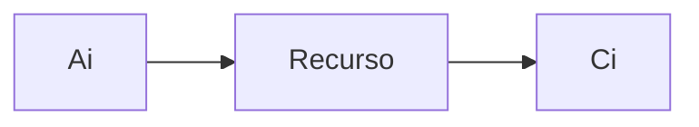

# Variáveis Operacionais 

## Introdução

Nesta análise, será avaliado um sistema em pleno funcionamento, focando em seu desempenho e performance. 
Para isso, serão utilizadas **variáveis operacionais**, que têm o objetivo de **capturar informações relevantes do sistema em operação**. Tais variáveis são obtidas por meio da observação direta do sistema e têm o intuito de oferecer uma visão mais completa sobre seu desempenho.

### Análise Operacional na Avaliação de Desempenho de Sistemas

A **análise operacional** é uma técnica usada para **modelar o desempenho de sistemas de computação**, como redes de computadores e servidores. 
**As Leis Operacionais** (Operational Laws) são um conjunto de equações matemáticas descritas no livro "The Art of Computer Systems Performance Analysis Techniques" de Raj Jain.

:::info Book
JAIN, Raj. The Art of Computer Systems Performance Analysis Techniques. John Wiley & Sons, 1991.
:::

#### As três leis operacionais

1. **Lei de Little**: afirma que, em um sistema de fila, o número médio de itens na fila é igual à taxa média de chegada multiplicada pelo tempo médio que um item permanece no sistema (incluindo o tempo na fila e o tempo de serviço).

2. **Lei de Erlang**: usada para modelar sistemas de fila com vários servidores. Afirma que o número médio de clientes que podem ser atendidos em um sistema de fila é igual ao produto da taxa média de chegada de clientes pelo tempo médio que cada cliente passa no sistema, dividido pelo fator de utilização do servidor.

3. **Lei de Utilização de Kendall**: usada para modelar sistemas de computação com vários recursos (como CPUs, discos e memória). Afirma que a utilização média de cada recurso é igual à taxa média de chegada multiplicada pelo tempo médio que cada cliente passa no sistema, multiplicado pelo número médio de recursos necessários para atender a cada cliente.

Na arquitetura da AWS, é possível usar serviços como o Amazon EC2, o Amazon Elastic Container Service (ECS) e o Amazon Simple Queue Service (SQS) para implementar modelos de sistemas de fila que possam ser analisados com as leis operacionais. Essas leis podem ser usadas para calcular **métricas de desempenho do sistema**, como a **taxa média de chegada**, o **tempo médio de resposta** e a **utilização média dos recursos**. Com base nessas métricas, você pode **avaliar o desempenho do sistema** e fazer ajustes para melhorá-lo.

## Variáveis Operacionais

São aquelas utilizadas para medir e avaliar o desempenho de um recurso ou de um sistema. 
São elas:

- **T**: Período de Observação
- **K**: Número de Recursos do Sistema
- **Ai**: Número total de solicitações (ex: checagas) do recurso i no período T
- **A0**: Número total de solicitações (ex: chegadas) ao sistema no período T.
- **Ci**: Número total de serviços finalizados pelo recurso i no período T
- **C0**: Número total de serviços finalizados pelo sistema no período T
- **Bi**: Tempo de ocupação do recurso i no período T

i: Representa as variáveis de recurso
0: Representa as variáveis de sistema

### Sistema

O **sistema** é o **conjunto completo de recursos** que trabalham juntos para atender a uma determinada demanda. O sistema pode ser um aplicativo, um servidor, uma rede ou qualquer combinação desses componentes que trabalham em conjunto para entregar um serviço ou funcionalidade.

Exemplo de sistema da AWS: 
- sistema de armazenamento em nuvem;
- sistema de processamento de big data;
- sistema de gerenciamento de banco de dados;
- sistema de aprendizado de máquina;

### Recurso

O **recurso** é um **componente individual que faz parte do sistema**. O recurso pode ser um servidor, um banco de dados, uma conexão de rede ou qualquer outro componente que faça parte do sistema.

Exemplo de recurso da AWS:
- EC2; 
- S3;
- RDS;
- DynamoDB; 
- Lambda;
- Fargate;

### Recurso contido no Sistema

Cada sistema da AWS é composto por diferentes recursos da plataforma que trabalham juntos para fornecer a funcionalidade desejada. Por exemplo:

- um sistema de armazenamento em nuvem pode ser composto pelo serviço de armazenamento de objetos S3, pelo serviço de transferência de dados AWS Transfer for SFTP e pelo serviço de backup e recuperação de dados AWS Backup. 
- O sistema de processamento de big data, por sua vez, pode ser composto pelo serviço de processamento distribuído EMR, pelo serviço de armazenamento de dados distribuído S3 e pelo serviço de ingestão de dados Kinesis. 	

Cada sistema é projetado para atender a uma necessidade específica e os recursos são escolhidos e configurados para trabalhar juntos para alcançar o objetivo desejado.

:::info
O Amazon Elastic Compute Cloud (EC2) é um serviço de computação em nuvem da Amazon Web Services (AWS) que fornece capacidade de computação escalável na nuvem. Ele permite que os usuários aluguem máquinas virtuais sob demanda e paguem apenas pelo tempo de uso, sem a necessidade de investir em infraestrutura de hardware própria. Com o EC2, os usuários podem escolher o tipo de instância que melhor atende às suas necessidades de computação, memória, armazenamento e rede, além de configurar a segurança e a rede da instância. É um serviço muito flexível e usado para uma ampla variedade de casos de uso, desde hospedagem de sites até executar aplicativos complexos de big data e machine learning.

EC2 é uma ferramenta que permite criar servidores virtuais na nuvem, o que é super útil porque você pode escalá-los para cima ou para baixo conforme a necessidade. É como ter uma cozinha maior ou menor, dependendo do tamanho da sua família ou convidados.
:::

:::info
O Amazon Relational Database Service (RDS) é um serviço de banco de dados relacional da Amazon Web Services (AWS) que facilita a configuração, operação e escalabilidade de um banco de dados relacional na nuvem. O RDS oferece suporte a várias engines de banco de dados, como MySQL, PostgreSQL, Oracle, SQL Server e outras, permitindo que os usuários escolham a engine que melhor atende às suas necessidades. Com o RDS, os usuários podem configurar e gerenciar facilmente a capacidade de armazenamento, desempenho, backup e segurança de seus bancos de dados, sem a necessidade de investir em infraestrutura de banco de dados própria. O RDS também oferece recursos avançados, como replicação multi-AZ para alta disponibilidade, leitura de réplica, backup automatizado, migração de dados, monitoramento de desempenho e integração com outros serviços da AWS. É um serviço muito popular entre empresas de todos os tamanhos que precisam de um banco de dados relacional escalável e gerenciado na nuvem.

Já o RDS é um serviço de banco de dados gerenciado, que facilita muito a vida de quem precisa armazenar e gerenciar muitos dados. É tipo ter um armário organizado para guardar todas as suas coisas.
:::

:::info
O Amazon Elastic MapReduce (EMR) é um serviço da Amazon Web Services (AWS) que permite executar e gerenciar facilmente clusters de processamento distribuído baseados em Hadoop, Spark, Presto, Hive e outras tecnologias de big data na nuvem. Um cluster EMR é um grupo de instâncias do Amazon Elastic Compute Cloud (EC2) que são configuradas automaticamente para executar um conjunto de serviços de big data. O EMR permite que os usuários criem rapidamente um cluster, processem grandes conjuntos de dados, executem análises de big data e forneçam insights valiosos usando uma variedade de ferramentas e frameworks populares de big data. O EMR também oferece recursos de escalabilidade automática, gerenciamento de dados, segurança, monitoramento e logging para simplificar a criação e operação de clusters de big data na nuvem. O EMR é usado por empresas de todos os tamanhos para uma variedade de casos de uso, incluindo análise de log, análise de dados, processamento de imagens e aprendizado de máquina.

Então, olha só, o Amazon EMR é uma ferramenta que ajuda a processar um monte de informações bem rápido, sem precisar gastar uma grana alta com equipamento. Sabe quando você quer fazer um almoço bem rápido e usa uma panela de pressão pra acelerar o processo? É tipo isso. O EMR usa várias ferramentas pra te ajudar a coletar e analisar informações sem precisar comprar todo um equipamento caro. E aí, quanto mais você usa, mais barato fica. É tipo cozinhar um jantar grande - quanto mais você faz, mais barato fica por porção, sacou?
:::

:::info
Airflow é uma ferramenta de fluxo de trabalho de código aberto que ajuda a automatizar tarefas e fluxos de trabalho de dados, o que é super útil quando você precisa lidar com muitas informações diferentes. É como ter um assistente que sabe exatamente o que você precisa fazer a cada momento.

Sagemaker é uma plataforma de aprendizado de máquina totalmente gerenciada que ajuda a treinar e implantar modelos de aprendizado de máquina de forma rápida e fácil. É como ter um professor particular de matemática que te ajuda a resolver problemas complexos.

Glue Studio e Glue são ferramentas de integração e ETL (Extração, Transformação e Carga) de dados que facilitam muito a vida de quem precisa coletar, transformar e mover muitos dados entre diferentes sistemas e formatos. É como ter um assistente que cuida de todo o trabalho pesado e te ajuda a manter tudo organizado.
:::

:::info
O Fargate é um serviço da AWS que facilita a execução de aplicativos em contêineres. Ele oferece uma plataforma de hospedagem gerenciada, para que você possa se concentrar em escrever código e não se preocupar com a infraestrutura por trás. Com o Fargate, você pode escalar rapidamente seus aplicativos, garantir alta disponibilidade e segurança robusta. Além disso, ele também permite que você escolha as ferramentas e bibliotecas de contêiner que melhor atendem às necessidades do seu aplicativo. Com o Fargate, você pode executar seus aplicativos em contêineres de forma simples, eficiente e com economia de custos, pagando apenas pelo uso que você fizer do serviço.

O Fargate é uma tecnologia que permite executar contêineres em um ambiente completamente gerenciado, sem a necessidade de provisionar ou gerenciar servidores. Isso é extremamente útil porque você pode focar no desenvolvimento de aplicativos sem se preocupar com a infraestrutura. É como ter um cozinheiro pessoal que prepara sua refeição sem que você precise se preocupar em comprar ingredientes ou limpar a cozinha depois. O Fargate cuida de tudo para você, desde a configuração até a execução de contêineres.
:::

## Variáveis Operacionais na Arquitetura AWS

### CloudWatch

O serviço CloudWatch pode ser usado para coletar dados de desempenho de vários recursos da AWS, como servidores EC2, bancos de dados RDS e clusters EMR. As variáveis operacionais podem ser coletadas da seguinte forma:

Ai: Número total de solicitações recebidas por um recurso específico em um determinado período, como o número total de solicitações recebidas por um servidor EC2 em uma hora.
Ci: Número total de serviços concluídos por um recurso específico em um determinado período, como o número total de requisições processadas por um banco de dados RDS em um dia.
A0: Número total de solicitações recebidas pelo sistema em um determinado período, como o número total de solicitações recebidas por todos os recursos monitorados pelo CloudWatch em uma semana.
C0: Número total de serviços concluídos pelo sistema em um determinado período, como o número total de requisições processadas por todos os recursos monitorados pelo CloudWatch em um mês.
Bi: Tempo de ocupação de um recurso específico em um determinado período, como o tempo de CPU utilizado por um servidor EC2 em uma hora.
K: Número de recursos monitorados pelo CloudWatch.
T: Período de observação dos dados coletados.

### AWS Glue

O serviço AWS Glue pode ser usado para coletar e processar dados de várias fontes, como bancos de dados, armazenamentos de dados e streams. As variáveis operacionais podem ser coletadas da seguinte forma:

Ai: Número total de solicitações recebidas por um recurso específico em um determinado período, como o número total de requisições recebidas por um banco de dados em um dia.
Ci: Número total de serviços concluídos por um recurso específico em um determinado período, como o número total de requisições processadas por um fluxo de dados em uma hora.
A0: Número total de solicitações recebidas pelo sistema em um determinado período, como o número total de requisições recebidas por todos os recursos monitorados pelo AWS Glue em uma semana.
C0: Número total de serviços concluídos pelo sistema em um determinado período, como o número total de requisições processadas por todos os recursos monitorados pelo AWS Glue em um mês.
Bi: Tempo de ocupação de um recurso específico em um determinado período, como o tempo de processamento de dados por um fluxo de dados em uma hora.
K: Número de recursos monitorados pelo AWS Glue.
T: Período de observação dos dados coletados.

### Amazon SageMaker

O serviço Amazon SageMaker pode ser usado para treinar, hospedar e escalar modelos de aprendizado de máquina. As variáveis operacionais podem ser coletadas da seguinte forma:

Ai: Número total de solicitações recebidas por um recurso específico em um determinado período, como o número total de solicitações de previsão feitas por um modelo em uma hora.
Ci: Número total de previsões realizadas por um recurso específico em um determinado período, como o número total de previsões feitas por um modelo em um dia.

A0: Número total de solicitações recebidas pelo sistema em um determinado período, como o número total de solicitações de previsão feitas para todos os modelos hospedados pelo Amazon SageMaker em uma semana.

C0: Número total de serviços concluídos pelo sistema em um determinado período, como o número total de previsões feitas por todos os modelos hospedados pelo Amazon SageMaker em um mês.

Bi: Tempo de ocupação de um recurso específico em um determinado período, como o tempo de treinamento de um modelo de aprendizado de máquina em uma semana.

K: Número de modelos de aprendizado de máquina hospedados pelo Amazon SageMaker.

T: Período de observação dos dados coletados.

### Amazon EC2

O serviço Amazon EC2 permite que os usuários lancem e gerenciem servidores virtuais na nuvem da AWS. As variáveis operacionais podem ser coletadas da seguinte forma:

Ai: Número total de solicitações recebidas por um servidor específico em um determinado período, como o número total de solicitações HTTP recebidas por um servidor web em uma hora.
Ci: Número total de serviços concluídos por um servidor específico em um determinado período, como o número total de solicitações HTTP processadas por um servidor web em um dia.
A0: Número total de solicitações recebidas pelo sistema em um determinado período, como o número total de solicitações HTTP recebidas por todos os servidores web lançados pelo Amazon EC2 em uma semana.
C0: Número total de serviços concluídos pelo sistema em um determinado período, como o número total de solicitações HTTP processadas por todos os servidores web lançados pelo Amazon EC2 em um mês.
Bi: Tempo de ocupação de um servidor específico em um determinado período, como o tempo de CPU utilizado por um servidor web em uma hora.
K: Número de servidores lançados pelo Amazon EC2.
T: Período de observação dos dados coletados.

### Apache Airflow

O Apache Airflow é uma plataforma para programação e agendamento de fluxos de trabalho de dados. As variáveis operacionais podem ser coletadas da seguinte forma:

Ai: Número total de tarefas executadas em um determinado fluxo de trabalho em um período T.
Ci: Número total de tarefas concluídas por um operador específico em um determinado período T.
A0: Número total de tarefas executadas em todos os fluxos de trabalho agendados no Airflow em um período T.
C0: Número total de tarefas concluídas em todos os fluxos de trabalho agendados no Airflow em um período T.
Bi: Tempo de execução de um operador específico em um determinado período T.
K: Número de operadores executando tarefas no Airflow.
T: Período de observação dos dados coletados.

### Amazon EMR

O Amazon EMR é um serviço de big data que permite a execução distribuída de frameworks como Apache Hadoop e Apache Spark. As variáveis operacionais podem ser coletadas da seguinte forma:

Ai: Número total de jobs executados em um cluster EMR em um período T.
Ci: Número total de tarefas executadas por um nó específico em um período T.
A0: Número total de jobs executados em todos os clusters EMR em um período T.
C0: Número total de tarefas executadas em todos os nós de todos os clusters EMR em um período T.
Bi: Tempo de execução de um nó específico em um período T.
K: Número de nós em um cluster EMR.
T: Período de observação dos dados coletados.

### Amazon S3

O Amazon S3 é um serviço de armazenamento de objetos da AWS. As variáveis operacionais podem ser coletadas da seguinte forma:

Ai: Número total de requisições GET ou PUT feitas para um objeto específico em um período T.
Ci: Número total de requisições GET feitas para um objeto específico em um período T.
A0: Número total de requisições GET ou PUT feitas para todos os objetos armazenados no S3 em um período T.
C0: Número total de requisições GET feitas para todos os objetos armazenados no S3 em um período T.
Bi: Tempo de acesso de um objeto específico em um período T.
K: Número de objetos armazenados no S3.
T: Período de observação dos dados coletados.

### Amazon Redshift

O Amazon Redshift é um serviço de data warehousing da AWS. As variáveis operacionais podem ser coletadas da seguinte forma:

Ai: Número total de consultas feitas para um cluster Redshift em um período T.
Ci: Número total de linhas retornadas por uma consulta específica em um período T.
A0: Número total de consultas feitas para todos os clusters Redshift em um período T.
C0: Número total de linhas retornadas por todas as consultas feitas para todos os clusters Redshift em um período T.

Bi: Tempo de execução de uma consulta específica em um período T.

K: Número de clusters Redshift.

T: Período de observação dos dados coletados.

### Amazon RDS

O Amazon RDS é um serviço de banco de dados relacional da AWS. As variáveis operacionais podem ser coletadas da seguinte forma:

Ai: Número total de solicitações de consulta feitas para um banco de dados RDS em um período T.
Ci: Número total de linhas retornadas por uma consulta específica em um período T.
A0: Número total de solicitações de consulta feitas para todos os bancos de dados RDS em um período T.
C0: Número total de linhas retornadas por todas as consultas feitas para todos os bancos de dados RDS em um período T.
Bi: Tempo de execução de uma consulta específica em um período T.
K: Número de bancos de dados RDS.
T: Período de observação dos dados coletados.

### Amazon DynamoDB

O Amazon DynamoDB é um serviço de banco de dados NoSQL da AWS. As variáveis operacionais podem ser coletadas da seguinte forma:

Ai: Número total de operações de gravação ou leitura feitas para uma tabela específica em um período T.
Ci: Número total de operações de leitura feitas para uma tabela específica em um período T.
A0: Número total de operações de gravação ou leitura feitas para todas as tabelas DynamoDB em um período T.
C0: Número total de operações de leitura feitas para todas as tabelas DynamoDB em um período T.
Bi: Tempo de acesso a uma tabela específica em um período T.
K: Número de tabelas DynamoDB.
T: Período de observação dos dados coletados.

### Amazon API Gateway

O Amazon API Gateway é um serviço que permite criar, publicar, manter, monitorar e proteger APIs. As variáveis operacionais podem ser coletadas da seguinte forma:

Ai: Número total de requisições feitas para uma API específica em um período T.
Ci: Número total de requisições concluídas com sucesso para uma API específica em um período T.
A0: Número total de requisições feitas para todas as APIs do Amazon API Gateway em um período T.
C0: Número total de requisições concluídas com sucesso para todas as APIs do Amazon API Gateway em um período T.
Bi: Tempo de resposta de uma requisição específica em um período T.
K: Número de APIs criadas no Amazon API Gateway.
T: Período de observação dos dados coletados.

### AWS Lambda

O AWS Lambda é um serviço de computação serverless que permite executar código em resposta a eventos e escaloná-lo automaticamente com base na demanda. As variáveis operacionais podem ser coletadas da seguinte forma:

Ai: Número total de invocações de uma função específica do AWS Lambda em um período T.
Ci: Número total de invocações da função que foram concluídas com sucesso em um período T.
A0: Número total de invocações de todas as funções do AWS Lambda em um período T.
C0: Número total de invocações de todas as funções do AWS Lambda que foram concluídas com sucesso em um período T.
Bi: Tempo de resposta para processar uma única invocação de uma função específica do AWS Lambda em um período T.
K: Número de funções criadas no AWS Lambda.
T: Período de observação dos dados coletados.

### Amazon CloudFront

O Amazon CloudFront é um serviço de distribuição de conteúdo que permite fornecer conteúdo de forma rápida e segura. As variáveis operacionais podem ser coletadas da seguinte forma:

Ai: Número total de requisições feitas para um determinado objeto em um período T.
Ci: Número total de vezes que um determinado objeto foi entregue com sucesso em um período T.
A0: Número total de requisições feitas para todos os objetos do Amazon CloudFront em um período T.
C0: Número total de vezes que todos os objetos do Amazon CloudFront foram entregues com sucesso em um período T.
Bi: Tempo de resposta de entrega de um determinado objeto em um período T.
K: Número de distribuições do Amazon CloudFront.
T: Período de observação dos dados coletados.

### Amazon Elastic Beanstalk

O Amazon Elastic Beanstalk é um serviço que permite implantar e escalar aplicativos da web e serviços da web. As variáveis operacionais podem ser coletadas da seguinte forma:

Ai: Número total de solicitações feitas para uma aplicação específica em um período T.
Ci: Número total de solicitações bem-sucedidas para uma aplicação específica em um período T.
A0: Número total de solicitações feitas para todas as aplicações do Amazon Elastic Beanstalk em um período T.
C0: Número total de solicitações bem-sucedidas para todas as aplicações do Amazon Elastic Beanstalk em um período T.
Bi: Tempo de resposta de uma solicitação específica em um período T.
K: Número de aplicações implantadas no Amazon Elastic Beanstalk.
T: Período de observação dos dados coletados.

### Amazon Elastic File System (EFS)

O Amazon EFS é um serviço de armazenamento de arquivos totalmente gerenciado e escalável que pode ser usado com as instâncias do Amazon EC2. As variáveis operacionais podem ser coletadas da seguinte forma:

Ai: Número total de operações de leitura/gravação em um sistema de arquivos específico em um período T.
Ci: Número total de operações de leitura/gravação bem-sucedidas em um sistema de arquivos específico em um período T.
A0: Número total de operações de leitura/gravação em todos os sistemas de arquivos do Amazon EFS em um período T.
C0: Número total de operações de leitura/gravação bem-sucedidas em todos os sistemas de arquivos do Amazon EFS em um período T.
Bi: Tempo de resposta para operações de leitura/gravação em um sistema de arquivos específico em um período T.
K: Número de sistemas de arquivos criados no Amazon EFS.
T: Período de observação dos dados coletados.

### Amazon Elastic Container Registry (ECR)

O Amazon ECR é um registro de imagens de contêiner seguro e totalmente gerenciado que facilita o armazenamento, gerenciamento e implantação de imagens de contêiner do Docker. As variáveis operacionais podem ser coletadas da seguinte forma:

Ai: Número total de imagens armazenadas em um repositório específico em um período T.
Ci: Número total de imagens baixadas com sucesso de um repositório específico em um período T.
A0: Número total de imagens armazenadas em todos os repositórios do Amazon ECR em um período T.
C0: Número total de imagens baixadas com sucesso de todos os repositórios do Amazon ECR em um período T.
Bi: Tempo de resposta para baixar uma imagem específica em um período T.
K: Número de repositórios criados no Amazon ECR.
T: Período de observação dos dados coletados.

### Amazon DocumentDB

O Amazon DocumentDB é um serviço de banco de dados de documentos compatível com MongoDB que oferece escalabilidade, desempenho e disponibilidade. As variáveis operacionais podem ser coletadas da seguinte forma:

Ai: Número total de solicitações de leitura/gravação em uma coleção específica em um período T.
Ci: Número total de solicitações de leitura/gravação bem-sucedidas em uma coleção específica em um período T.
A0: Número total de solicitações de leitura/gravação em todas as coleções do Amazon DocumentDB em um período T.
C0: Número total de solicitações de leitura/gravação bem-sucedidas em todas as coleções do Amazon DocumentDB em um período T.
Bi: Tempo de resposta para uma solicitação de leitura/gravação em uma coleção específica em um período T.
K: Número de coleções criadas no Amazon DocumentDB.
T: Período de observação dos dados coletados.

### Amazon Simple Notification Service (SNS)

O Amazon SNS é um serviço de mensagens e notificações gerenciado que permite enviar mensagens para assinantes ou endpoints. As variáveis operacionais podem ser coletadas da seguinte forma:

Ai: Número total de mensagens publicadas em um tópico específico em um período T.
Ci: Número total de mensagens entregues com sucesso a um endpoint específico em um período T.
A0: Número total de mensagens publicadas em todos os tópicos do Amazon SNS em um período T.
C0: Número total de mensagens entregues com sucesso a todos os endpoints do Amazon SNS em um período T.
Bi: Tempo de resposta para entregar uma mensagem a um endpoint específico em um período T.
K: Número de tópicos criados no Amazon SNS.
T: Período de observação dos dados coletados.

### Amazon Simple Queue Service (SQS)

O Amazon SQS é um serviço de filas gerenciado que permite desacoplar e escalar microsserviços, sistemas distribuídos e aplicativos sem servidor. As variáveis operacionais podem ser coletadas da seguinte forma:

Ai: Número total de mensagens recebidas por uma fila específica em um período T.
Ci: Número total de mensagens processadas com sucesso por uma fila específica em um período T.
A0: Número total de mensagens recebidas por todas as filas no Amazon SQS em um período T.
C0: Número total de mensagens processadas com sucesso por todas as filas no Amazon SQS em um período T.
Bi: Tempo de resposta para processar uma mensagem por uma fila específica em um período T.
K: Número de filas criadas no Amazon SQS.
T: Período de observação dos dados coletados.

### Amazon Elastic Kubernetes Service (EKS)

O Amazon EKS é um serviço totalmente gerenciado que torna mais fácil executar o Kubernetes na AWS. As variáveis operacionais podem ser coletadas da seguinte forma:

Ai: Número total de pods iniciados em um cluster Kubernetes específico em um período T.
Ci: Número total de pods concluídos com sucesso em um cluster Kubernetes específico em um período T.
A0: Número total de pods iniciados em todos os clusters Kubernetes no Amazon EKS em um período T.
C0: Número total de pods concluídos com sucesso em todos os clusters Kubernetes no Amazon EKS em um período T.
Bi: Tempo de resposta para executar um pod em um contêiner específico em um período T.
K: Número de clusters Kubernetes criados no Amazon EKS.
T: Período de observação dos dados coletados.

### O Amazon Kinesis

É um serviço de streaming de dados em tempo real que permite a ingestão, processamento e análise de grandes quantidades de dados em tempo real. As variáveis operacionais podem ser coletadas da seguinte forma:

Ai: Número total de eventos recebidos em um stream de dados específico em um período T.
Ci: Número total de eventos processados e entregues com sucesso em um stream de dados específico em um período T.
A0: Número total de eventos recebidos em todos os streams de dados no Amazon Kinesis em um período T.
C0: Número total de eventos processados e entregues com sucesso em todos os streams de dados no Amazon Kinesis em um período T.
Bi: Tempo de processamento para processar um evento em um stream de dados específico em um período T.
K: Número de streams de dados criados no Amazon Kinesis.
T: Período de observação dos dados coletados.

## Sistema 

O **sistema de processamento de big data**, por sua vez, pode ser composto pelo serviço de processamento distribuído **EMR**, pelo serviço de armazenamento de dados distribuído **S3** e pelo serviço de ingestão de dados **Kinesis**.

T: Período de observação;
K: Número de recursos do sistema, que nesse caso é composto por três serviços;
Ai: Número total de solicitações (ex: ingestão de dados) do recurso i (EMR, S3 ou Kinesis) no período T;
A0: Número total de solicitações (ex: chegadas) ao sistema (EMR, S3 e Kinesis) no período T;
Ci: Número total de serviços finalizados pelo recurso i (EMR, S3 ou Kinesis) no período T;
C0: Número total de serviços finalizados pelo sistema (EMR, S3 e Kinesis) no período T;
Bi: Tempo de ocupação do recurso i (EMR, S3 ou Kinesis) no período T.

EMR (Elastic MapReduce):
Ai: Número de tarefas de processamento executadas em um determinado tempo
Ci: Número de tarefas de processamento finalizadas em um determinado tempo
Bi: Tempo de processamento médio de cada tarefa

S3 (Simple Storage Service):
Ai: Número de requisições de leitura ou gravação de arquivos em um determinado tempo
Ci: Número de requisições de leitura ou gravação de arquivos finalizadas em um determinado tempo
Bi: Tempo de leitura ou gravação médio de cada arquivo

Kinesis:
Ai: Número de eventos de dados recebidos em um determinado tempo
Ci: Número de eventos de dados processados e transmitidos em um determinado tempo
Bi: Tempo de processamento médio de cada evento de dados

## Considerações Finais

A avaliação de desempenho de sistemas é fundamental para garantir o bom funcionamento de aplicações e serviços. A AWS oferece uma ampla variedade de serviços para coletar dados e analisar o desempenho de sistemas e recursos, como o EMR, Airflow, ECS, S3, Redshift, RDS, DynamoDB, Lambda, Glue Studio e Fargate.

Esses **serviços permitem coletar variáveis operacionais**, como o **número de solicitações** e **serviços finalizados**, o **tempo de ocupação** e de **resposta de recursos**, o **número de clusters** e o **período de observação**. Com esses dados, é possível analisar o desempenho de sistemas e recursos, identificar gargalos e tomar decisões para otimizar o uso de recursos e melhorar a experiência do usuário.

Além disso, o **Kinesis** e o **Amazon EKS** são serviços específicos que permitem **coletar variáveis operacionais relacionadas a clusters Kubernetes e ingestão de dados em tempo real**. A avaliação de desempenho de sistemas com AWS é uma prática essencial para empresas que buscam garantir a qualidade de seus serviços e a satisfação do cliente.

Durante nossa conversa, abordamos diversos temas relacionados à arquitetura de dados da AWS e à avaliação de desempenho de sistemas. Falamos sobre serviços como EC2, RDS, EMR, S3, Airflow, Sagemaker, Glue e Fargate, descrevendo suas funcionalidades e possíveis aplicações. Além disso, discutimos conceitos como sistemas, recursos, variáveis operacionais e notação de Kendall para sistemas de fila.

Falamos também sobre como coletar variáveis operacionais de cada um dos serviços citados, dando exemplos de como é possível obter métricas como número de solicitações, número de serviços finalizados e tempo de ocupação do recurso. Por fim, vimos como é possível utilizar essas variáveis para avaliar o desempenho de sistemas, considerando aspectos como escalabilidade e eficiência.

Espero que este resumo ajude a transmitir as principais ideias discutidas em nossa conversa.

## Referências

:::info Book
JAIN, Raj. The Art of Computer Systems Performance Analysis Techniques. John Wiley & Sons, 1991.
:::

:::info Video
MACIEL, Paulo. Avaliação de Desempenho de Sistemas. Aula 01 [gravada em vídeo]. Professor responsável: Paulo Maciel. Pós-Graduação em Ciências da Computação, Universidade Federal de Pernambuco, Recife, 2023. Disponível em: <https://drive.google.com/file/d/1oTxjZDky_QA34pMkCn56yH5BjEI3m11d/view?usp=share_link>. Acesso em: 07/03/2023.
:::

Mensagem de Despedida:

Com base nas técnicas apresentadas no livro "Art of Computer Systems Performance Analysis Techniques" e na aula do professor Paulo Maciel no Mestrado em Ciência da Computação na UFPE, podemos compreender a importância da análise de desempenho de sistemas para o sucesso de um negócio. Através da coleta e análise de métricas, é possível identificar gargalos e oportunidades de melhoria, aumentando a eficiência e a capacidade de processamento do sistema. Esperamos que este artigo tenha sido útil para aqueles que buscam entender melhor a análise de desempenho de sistemas e como aplicá-la em seus projetos.