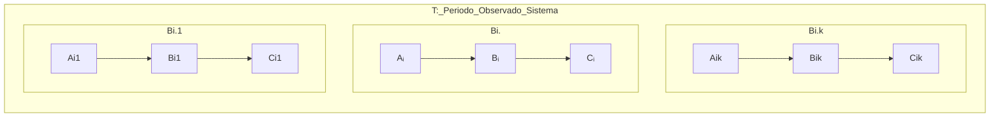

# Operational Analysis


:::info Book
MACIEL, Paulo. Operational Analysis. In: Performance, Reliability and Availability of Computational Systems Volume I. 1. ed. New York: Springer, 2018. p. 169-190.
:::

**Análise Operacional** é um método para **estimar o desempenho de sistemas computacionais** através da medição e análise das medidas de desempenho, como o tempo de resposta, a utilização dos recursos e a taxa de chegada de solicitações.

A Análise Operacional é uma técnica muito **utilizada em sistemas computacionais em que o modelo analítico é mais preciso** e eficiente do que a simulação ou a experimentação. Ela é particularmente útil para **sistemas em que os dados históricos de desempenho estão disponíveis** ou **quando a simulação é impraticável devido à complexidade do sistema**.

A Análise Operacional geralmente envolve a utilização de fórmulas matemáticas e modelos estatísticos para estimar o desempenho do sistema em diferentes cenários de uso, permitindo que os engenheiros de sistemas otimizem o desempenho do sistema e **dimensionem corretamente os recursos necessários para atender às demandas de uso.**

```mermaid
graph LR 
subgraph T,B0
A0 --> System --> C0
end
```	

**T**: A medição T é dada por um período **finito** de observação, dado em **segundos**.

O sistema pode possuir **K componentes**, como mostrado abaixo:



## Operational Variables

São variáveis básicas medidas de um sistema durante um período de observação T.

- **Aᵢ**: Número de chegadas, pode ser transações, operações, pacotes.
- **Cᵢ**: Número de finalizações, pode ser transações, operações, pacotes;
- **A₀**: Número de chegadas (total) pelo sistema durante o período T; 
- **C₀**: Número de finalizações (total) do sistema durante o período T;
- **Bᵢ**: Tempo Ocupado (Busy Time) do recurso i

O sistema deve ter um fluxo balanceado para que as fórmulas sejam válidas. 

## Sistema Balanceado

Número de chegadas de um recurso deve ser próximo ao número de saídas do recurso, ou seja:

Aᵢ ~ Cᵢ

Ou seja, 

(Cᵢ - Aᵢ)/Cᵢ → 0

## Métricas Derivadas Básicas

Para os recursos mensuráveis, podemos calcular diretamente as quantidades abaixo:

### Taxa de Chegada (Arrival Rate)

- **λᵢ**= Aᵢ/T

#### SI Taxa de Chegada

A unidade de medida "chegadas por unidade de tempo" não é uma unidade do SI (Sistema Internacional de Unidades). No entanto, é comum expressá-la utilizando as unidades do SI, como por exemplo:

- Chegadas por segundo (cps)
- Chegadas por minuto (cpm)
- Chegadas por hora (cph)

Observe que essas unidades são compostas por uma unidade básica do SI (segundo, minuto ou hora) combinada com a unidade "chegadas", que é uma unidade adimensional.

- pacotes por segundo (pps)
- transações por segundo (tps)
- operações por segundo (ops)

### Throughput (Vazão de Entrada)

- **Xᵢ**= Cᵢ/T

### SI da Vazão

Xᵢ: A unidade de medida de Xᵢ **depende da natureza da variável X.** Por exemplo, se X representar o tempo de resposta de um sistema, a unidade de medida de Xᵢ seria expressa em segundos (s) ou milissegundos (ms). Se X representar a largura de banda de uma rede, a unidade de medida de Xᵢ seria expressa em bits por segundo (bps) ou megabits por segundo (Mbps), por exemplo.

- segundos (s)
- milissegundos (ms)
- bits por segundo (bts)
- megabits por segundo (Mbps)

### Utilization (Utilização do Recurso)

- **Uᵢ**= Bᵢ/T

#### SI da Utilização

Uᵢ: A unidade de medida de Uᵢ é uma porcentagem, já que representa a utilização de um recurso em relação ao seu máximo.

- Porcentagem (%)

### Mean Service Time (Tempo Médio de Serviço do componente i)

- **Sᵢ**= Bᵢ/Cᵢ

#### SI do Service Time

Sᵢ: A unidade de medida de Cᵢ seria o tempo que o recurso leva por finalização.

É o tempo que aquele recurso ficou em operação sobre o número de finalizações que ele fez.

- segundos por finalização

Lembrando que Bᵢ é o tempo que o recurso ficou ocupdo para atender determinada finalização, em segundos.

Exemplo: **Se o recurso teve 50 transações de vazão durante 10 segundos (Bᵢ), então Sᵢ é 0.25s por finalização, que é o tempo em serviço para atender 1 finalização.**

### System Arrival Rate (Taxa de CHegada do Sistema)

- **λ₀**= A₀/T

#### SI da Taxa de Chegada Sistema

λ₀: A unidade de medida de λ₀ é a mesma que a de λᵢ, ou seja, chegadas por unidade de tempo (cps, cpm, cph, etc.).

- chegadas por segundo (cps)
- pacotes por segundo (pps)
- transações por segnudo (tps)

### System Throughput (Vazão do Sistema)

- **X₀**= C₀/T

#### SI da Vazão do Sistema

X₀: A unidade de medida de X₀ é a mesma que a de Xᵢ, dependendo da natureza da variável X.

- bits por segundo (bps)
- Bytes por segundo (Bps)
- megabits por segundo (Mbps)

Por exemplo, suponha que um **sistema de armazenamento em nuvem é capaz de transferir 1 terabyte (TB) de dados por hora**. Isso significa que a **vazão do sistema é de 1 TB/hora ou aproximadamente 277,78 megabytes por segundo (MBps)**.

1 TB/h = 1/3600 TB/s
1/3600 TB/s * 1000 MB/TB = 0,277778 MB/s
0,277778 MB/s * 1000000 = 277,778 MBps

Portanto, 1 TB/h equivale a 277,778 MBps.

Essa métrica é importante para avaliar a capacidade do sistema de processar e transmitir dados em tempo hábil, garantindo uma boa performance e experiência do usuário.

Já que **1 byte é igual a 8 bits**. Então:

1 byte = 8 bits
277,778 M(Bytes)ps = x M(bits)ps

Se multiplicarmos a vazão de 277,778 MBps por 8, obtemos:

277,778 MBps * 8 = 2222,224 Mbps

Portanto, a vazão de 277,778 MBps equivale a aproximadamente 2222,224 Mbps.

277,778 MBps = 2222,224 Mbps

## Exemplo de Métricas Derivadas Básicas

:::info Book
Maciel, Paulo Romero Martins. Performance, Reliability, and Availability Evaluation of Computational Systems, Volume I (p. 367). CRC Press. Edição do Kindle.
:::

Um processador foi monitorado por 1 min. Observou-se que ele esteve ocupado por 36s. O número total de transações que chegaram ao processador foi de 1800 e ele também executou 1800 transações no mesmo período. a) Qual é a taxa de chegada do processador, λ_CPU = A_CPU T? b) Qual é a taxa de transferência do processador, X_CPU = C_CPU T? c) Qual é a utilização do processador, U_CPU = B_CPU T? d) Qual é o tempo médio de serviço das transações servidas pelo processador, S_CPU = B_CPU/C_CPU?

Aqui, o sistema só tem 1 recurso então i = 1

T = 1 min = 60s
Bi = 36s
Ai = 1800 transações
Ci = 1800 transações

Como (Ai-Ci)/Ci ~ 0 então o sistema é balanceado.

a) λᵢ = Ai/T = 1800/60
λᵢ = 30 tps (transações por segundo)

b) Xᵢ = Cᵢ/T = 1800/60
Xᵢ = 30 tps

c) Uᵢ = Bᵢ/T = 36/60
Uᵢ = 60%

d) Sᵢ = Bᵢ/Cᵢ = 36/1800
Sᵢ = 0.02 s por transação

- O sistema está balanceado, ou seja, a taxa de chegada de transações é igual à taxa de processamento das transações.
- A taxa de chegada de transações (λ) e a taxa de processamento de transações (X) são iguais a 30 transações por segundo.
- A utilização do processador (U) é de 60%, ou seja, o processador está sendo utilizado em média 60% do tempo.
- O tempo médio de serviço (S) é de 0.02 segundos por transação, ou seja, o tempo médio que uma transação leva para ser processada pelo sistema é de 0.02 segundos.

Para aumentar a utilização (U) desse exemplo, é possível aumentar o tempo de serviço (Sᵢ) do componente em questão. Isso pode ser feito de várias maneiras, como por exemplo:

Aumentar o número de operações que o componente realiza durante o seu tempo de serviço, o que aumentaria a complexidade do processamento e, consequentemente, aumentaria o tempo de serviço.

Aumentar a carga de trabalho do sistema, fazendo com que o componente tenha que processar mais transações no mesmo período de tempo, o que aumentaria a utilização.

Aumentar o número de threads ou processos que executam no componente, o que pode melhorar o desempenho geral do sistema e, consequentemente, aumentar o tempo de serviço e a utilização do componente.

É importante lembrar que qualquer alteração no tempo de serviço pode ter um impacto significativo em outras métricas de desempenho do sistema, como a taxa de chegada de transações (λ) e a taxa de processamento (X). Por isso, é necessário avaliar cuidadosamente os possíveis efeitos colaterais de qualquer mudança antes de implementá-la.