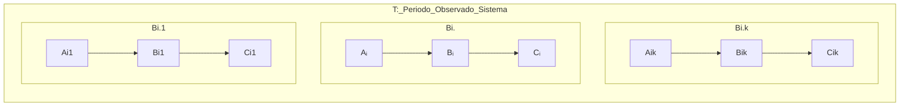

# Operational Analysis


:::info Book
MACIEL, Paulo. Operational Analysis. In: Performance, Reliability and Availability of Computational Systems Volume I. 1. ed. New York: Springer, 2018. p. 169-190.
:::

**Análise Operacional** é um método para **estimar o desempenho de sistemas computacionais** através da medição e análise das medidas de desempenho, como o tempo de resposta, a utilização dos recursos e a taxa de chegada de solicitações.

A Análise Operacional é uma técnica muito **utilizada em sistemas computacionais em que o modelo analítico é mais preciso** e eficiente do que a simulação ou a experimentação. Ela é particularmente útil para **sistemas em que os dados históricos de desempenho estão disponíveis** ou **quando a simulação é impraticável devido à complexidade do sistema**.

A Análise Operacional geralmente envolve a utilização de fórmulas matemáticas e modelos estatísticos para estimar o desempenho do sistema em diferentes cenários de uso, permitindo que os engenheiros de sistemas otimizem o desempenho do sistema e **dimensionem corretamente os recursos necessários para atender às demandas de uso.**

```mermaid
graph LR 
subgraph T,B0
A0 --> System --> C0
end
```	

**T**: A medição T é dada por um período **finito** de observação, dado em **segundos**.

O sistema pode possuir **K componentes**, como mostrado abaixo:



## Operaional Variables

São variáveis básicas medidas de um sistema durante um período de observação T.

**Aᵢ**: Número de chegadas, pode ser transações, operações, pacotes.
**Cᵢ**: Número de finalizações, pode ser transações, operações, pacotes;
**A₀**: Número de chegadas (total) pelo sistema durante o período T; 
**C₀**: Número de finalizações (total) do sistema durante o período T;
**Bᵢ**: Tempo Ocupado (Busy Time) do recurso i

