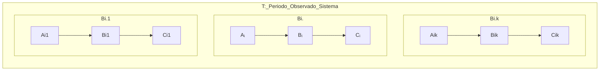
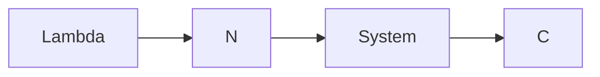
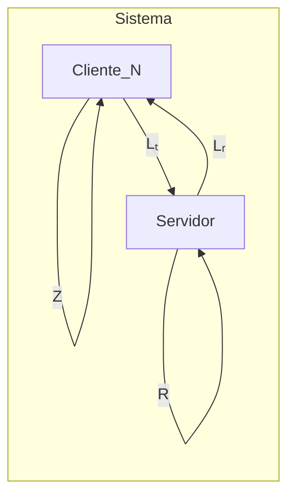

# Operational Analysis


:::info Book
MACIEL, Paulo. Operational Analysis. In: Performance, Reliability and Availability of Computational Systems Volume I. 1. ed. New York: Springer, 2018. p. 169-190.
:::

**Análise Operacional** é um método para **estimar o desempenho de sistemas computacionais** através da medição e análise das medidas de desempenho, como o tempo de resposta, a utilização dos recursos e a taxa de chegada de solicitações.

A Análise Operacional é uma técnica muito **utilizada em sistemas computacionais em que o modelo analítico é mais preciso** e eficiente do que a simulação ou a experimentação. Ela é particularmente útil para **sistemas em que os dados históricos de desempenho estão disponíveis** ou **quando a simulação é impraticável devido à complexidade do sistema**.

A Análise Operacional geralmente envolve a utilização de fórmulas matemáticas e modelos estatísticos para estimar o desempenho do sistema em diferentes cenários de uso, permitindo que os engenheiros de sistemas otimizem o desempenho do sistema e **dimensionem corretamente os recursos necessários para atender às demandas de uso.**

```mermaid
graph LR 
subgraph T,B0
A0 --> System --> C0
end
```	

**T**: A medição T é dada por um período **finito** de observação, dado em **segundos**.

O sistema pode possuir **K componentes**, como mostrado abaixo:



## Operational Variables

São variáveis básicas medidas de um sistema durante um período de observação T.

- **Aᵢ**: Número de chegadas, pode ser transações, operações, pacotes.
- **Cᵢ**: Número de finalizações, pode ser transações, operações, pacotes;
- **A₀**: Número de chegadas (total) pelo sistema durante o período T; 
- **C₀**: Número de finalizações (total) do sistema durante o período T;
- **Bᵢ**: Tempo Ocupado (Busy Time) do recurso i

O sistema deve ter um fluxo balanceado para que as fórmulas sejam válidas. 

## Sistema Balanceado

Número de chegadas de um recurso deve ser próximo ao número de saídas do recurso, ou seja:

Aᵢ ~ Cᵢ

Ou seja, 

(Cᵢ - Aᵢ)/Cᵢ → 0

## Métricas Derivadas Básicas

Para os recursos mensuráveis, podemos calcular diretamente as quantidades abaixo:

### Taxa de Chegada (Arrival Rate)

- **λᵢ**= Aᵢ/T

#### SI Taxa de Chegada

A unidade de medida "chegadas por unidade de tempo" não é uma unidade do SI (Sistema Internacional de Unidades). No entanto, é comum expressá-la utilizando as unidades do SI, como por exemplo:

- Chegadas por segundo (cps)
- Chegadas por minuto (cpm)
- Chegadas por hora (cph)

Observe que essas unidades são compostas por uma unidade básica do SI (segundo, minuto ou hora) combinada com a unidade "chegadas", que é uma unidade adimensional.

- pacotes por segundo (pps)
- transações por segundo (tps)
- operações por segundo (ops)

### Throughput (Vazão de Entrada)

- **Xᵢ**= Cᵢ/T

### SI da Vazão

Xᵢ: A unidade de medida de Xᵢ **depende da natureza da variável X.** Por exemplo, se X representar o tempo de resposta de um sistema, a unidade de medida de Xᵢ seria expressa em segundos (s) ou milissegundos (ms). Se X representar a largura de banda de uma rede, a unidade de medida de Xᵢ seria expressa em bits por segundo (bps) ou megabits por segundo (Mbps), por exemplo.

- segundos (s)
- milissegundos (ms)
- bits por segundo (bts)
- megabits por segundo (Mbps)

### Utilization (Utilização do Recurso)

- **Uᵢ**= Bᵢ/T

#### SI da Utilização

Uᵢ: A unidade de medida de Uᵢ é uma porcentagem, já que representa a utilização de um recurso em relação ao seu máximo.

- Porcentagem (%)

### Mean Service Time (Tempo Médio de Serviço do componente i)

- **Sᵢ**= Bᵢ/Cᵢ

#### SI do Service Time

Sᵢ: A unidade de medida de Cᵢ seria o tempo que o recurso leva por finalização.

É o tempo que aquele recurso ficou em operação sobre o número de finalizações que ele fez.

- segundos por finalização

Lembrando que Bᵢ é o tempo que o recurso ficou ocupdo para atender determinada finalização, em segundos.

Exemplo: **Se o recurso teve 50 transações de vazão durante 10 segundos (Bᵢ), então Sᵢ é 0.25s por finalização, que é o tempo em serviço para atender 1 finalização.**

### System Arrival Rate (Taxa de CHegada do Sistema)

- **λ₀**= A₀/T

#### SI da Taxa de Chegada Sistema

λ₀: A unidade de medida de λ₀ é a mesma que a de λᵢ, ou seja, chegadas por unidade de tempo (cps, cpm, cph, etc.).

- chegadas por segundo (cps)
- pacotes por segundo (pps)
- transações por segnudo (tps)

### System Throughput (Vazão do Sistema)

- **X₀**= C₀/T

#### SI da Vazão do Sistema

X₀: A unidade de medida de X₀ é a mesma que a de Xᵢ, dependendo da natureza da variável X.

- bits por segundo (bps)
- Bytes por segundo (Bps)
- megabits por segundo (Mbps)

Por exemplo, suponha que um **sistema de armazenamento em nuvem é capaz de transferir 1 terabyte (TB) de dados por hora**. Isso significa que a **vazão do sistema é de 1 TB/hora ou aproximadamente 277,78 megabytes por segundo (MBps)**.

1 TB/h = 1/3600 TB/s
1/3600 TB/s * 1000 MB/TB = 0,277778 MB/s
0,277778 MB/s * 1000000 = 277,778 MBps

Portanto, 1 TB/h equivale a 277,778 MBps.

Essa métrica é importante para avaliar a capacidade do sistema de processar e transmitir dados em tempo hábil, garantindo uma boa performance e experiência do usuário.

Já que **1 byte é igual a 8 bits**. Então:

1 byte = 8 bits
277,778 M(Bytes)ps = x M(bits)ps

Se multiplicarmos a vazão de 277,778 MBps por 8, obtemos:

277,778 MBps * 8 = 2222,224 Mbps

Portanto, a vazão de 277,778 MBps equivale a aproximadamente 2222,224 Mbps.

277,778 MBps = 2222,224 Mbps

## Exemplo de Métricas Derivadas Básicas

:::info Book
Maciel, Paulo Romero Martins. Performance, Reliability, and Availability Evaluation of Computational Systems, Volume I (p. 367). CRC Press. Edição do Kindle.
:::

Um processador foi monitorado por 1 min. Observou-se que ele esteve ocupado por 36s. O número total de transações que chegaram ao processador foi de 1800 e ele também executou 1800 transações no mesmo período. a) Qual é a taxa de chegada do processador, λ_CPU = A_CPU T? b) Qual é a taxa de transferência do processador, X_CPU = C_CPU T? c) Qual é a utilização do processador, U_CPU = B_CPU T? d) Qual é o tempo médio de serviço das transações servidas pelo processador, S_CPU = B_CPU/C_CPU?

Aqui, o sistema só tem 1 recurso então i = 1

T = 1 min = 60s
Bi = 36s
Ai = 1800 transações
Ci = 1800 transações

Como (Ai-Ci)/Ci ~ 0 então o sistema é balanceado.

a) λᵢ = Ai/T = 1800/60
λᵢ = 30 tps (transações por segundo)

b) Xᵢ = Cᵢ/T = 1800/60
Xᵢ = 30 tps

c) Uᵢ = Bᵢ/T = 36/60
Uᵢ = 60%

d) Sᵢ = Bᵢ/Cᵢ = 36/1800
Sᵢ = 0.02 s por transação

- O sistema está balanceado, ou seja, a taxa de chegada de transações é igual à taxa de processamento das transações.
- A taxa de chegada de transações (λ) e a taxa de processamento de transações (X) são iguais a 30 transações por segundo.
- A utilização do processador (U) é de 60%, ou seja, o processador está sendo utilizado em média 60% do tempo.
- O tempo médio de serviço (S) é de 0.02 segundos por transação, ou seja, o tempo médio que uma transação leva para ser processada pelo sistema é de 0.02 segundos.

Para aumentar a utilização (U) desse exemplo, é possível aumentar o tempo de serviço (Sᵢ) do componente em questão. Isso pode ser feito de várias maneiras, como por exemplo:

Aumentar o número de operações que o componente realiza durante o seu tempo de serviço, o que aumentaria a complexidade do processamento e, consequentemente, aumentaria o tempo de serviço.

Aumentar a carga de trabalho do sistema, fazendo com que o componente tenha que processar mais transações no mesmo período de tempo, o que aumentaria a utilização.

Aumentar o número de threads ou processos que executam no componente, o que pode melhorar o desempenho geral do sistema e, consequentemente, aumentar o tempo de serviço e a utilização do componente.

É importante lembrar que qualquer alteração no tempo de serviço pode ter um impacto significativo em outras métricas de desempenho do sistema, como a taxa de chegada de transações (λ) e a taxa de processamento (X). Por isso, é necessário avaliar cuidadosamente os possíveis efeitos colaterais de qualquer mudança antes de implementá-la.

## Utilization Law

Reacptulando, durante um período de observação **T**, temos a utilização de um componente **i** como sendo **Bᵢ**, onde o a **utilização**, dado em percentual, é **Uᵢ = Bᵢ/T**.

Se observarmos o número de operações finalizadas **Cᵢ**, podemos ajustar a fórmula da utilização e obter a lei da utilização.

**Uᵢ** = (Bᵢ/T)x(Cᵢ/Cᵢ)
**Uᵢ** = (Bᵢ/Cᵢ)x(Cᵢ/T)

Recaptulando mais uma vez, temos que o número de finalizações de um recurso, **Cᵢ** sobre o período observado **T**, dá a vazão desse recurso, **Xᵢ**. E o tempo de ocupação de um recurso, **Bᵢ**, sobre o número de finalizações desse recurso **Cᵢ** nos dá o **tempo de serviço**, que é o tempo que um recurso leva para finalizar uma transação.

Ou seja, a **lei da utilização** é:

**Uᵢ** = Sᵢ x Xᵢ

O gargalo de um sistema é aquele componente que apresenta a maior utilização. 
Quando uma carga excessiva é aplicada em um sistema, o primeiro componente que atingir 100% de utilização será o componente gargalo.

## Forced Flow Law

A vazão de um sistema, como dito anteriormente, é dado pelo número de finalizações do sistema sobre o período de tempo observado. 

Se aplicarmos o número de finalizações do sistema, podemos obter a lei forçada de fluxo, que representa a relação entre o número de visitas de um sistema e a vazão do sistema. OU seja, 

**Xᵢ** = (Cᵢ/T)x(C₀/C₀)
**Xᵢ** = (Cᵢ/C₀)x(C₀/T)

**A Forced Flow Law** é:

**Xᵢ** = Vᵢ x X₀

## Demand Law

O conceito de **tempo demandado** ou **serviço demandado** está relacionado ao conjunto de requisições que um recurso precisa dado o sistema.

É um conceito importante para a noção de performance de um modelo.

O **tempo demandado que uma transação requer de um recurso** é o tempo que a transação  leva sendo processada.

Dado a **lei da utilização** e a **lei do fluxo forçado**, temos que:

**Uᵢ** = Sᵢ x Xᵢ
**Xᵢ** = Vᵢ x X₀

Substituindo,

Uᵢ = Sᵢ x **Xᵢ** = Sᵢ x Vᵢ x X₀

Dado que **Dᵢ** = Sᵢ x Vᵢ, temos então que a **lei da demanda** é:

**Dᵢ** = Uᵢ/X₀

Lembrando, o que buscamos aqui é o **tempo que uma transação demanda de um recurso**, em outras palavras **é o tempo requerido por uma transação para ser executava por um recurso**.

O **gargalo** do sistema, além de ser o recurso com o maior tempo de utilização, é também aquele componente com o **maior tempo demandado por uma transação**.

## Little's Law

A lei de Little lida com itens em um sistema de fila. Esses itens podem variar desde pessoas, pacotes, requisições, linha de produção, etc. 



**N**: Número de itens (transações, pessoas, pacotes) no sistema, em fila. 
**R**: Response Time (ou Residence Time)

O **Response Time** pode ser decomposto pelo **tempo de espera** e pelo tempo **demandado pela transação**.

**R**= W + D

**W**: Tempo de Espera
**D**: Tempo Demandado pela Transação

N = λ x (W + D)

Considedre agora que o **sistema tem apenas 1 recurso** (como se fosse 1 servidor apenas):

O número de visitas do sistema, **V = 1**. Já que Cᵢ/C₀ = 1. Além disso temos que **W = 0**, ou seja, não temos tempo de espera. Com essas considerações, podedmos falar que:

Se R = W + D e W=0, termos que **R = D**.

O tempo de demanda, ou **Demand Time** é Dᵢ = Uᵢ/X₀ ou Dᵢ = Sᵢ x Vᵢ.
Então,

R = S x V mas como V = 1 então **R = S**.

Ou esja, o tempo de resposta, ou residence time, é o tempo de serviço do sistema (caso tenha 1 recurso).

Voltando a fórmula de N, temos que N = λ x (W + D), W = 0 e D = S, então N = λ x S, que é a **Lei de Utilização onde N = U = λ x S** que é uma simplificação da lei de utilização, que para sistemas balanceados X = λ.

### E quando tem fila ?

Quando existe **fila, W**, temos que levar em consideração a **Little's Law** onde **N = λ x R** e **R = (W + S)**.

Geralmente, eu preciso calcular:
1. **Rate Input do sistema, λ₀**
2. **Residence Time, R**, que é **uma média das amostras de N** pelo Rate Input, λ₀, do sistema, ou seja, **R = N̄ / λ₀**.
3. **Tempo de Espera, W**, que é **uma média das amostras de Nₕ da fila** pelo Rate Input, λ₀, do sistema, ou seja, **W = N̄ₕ / λ₀**. 
4. Calcular o tempo de serviço do sistema, **Service Time, S** que é **S = R - W**, ou seja, o tempo de serviço do sistema é o residence time menos o tempo de espera. 

Geralmente eu quero aumentar o Service Time, até que lim(R - W) → 0.

## General Response Time Law

Em um **sistema distribuído, temos vários recursos, k**. Então temos que aplicar o Little's Law em cada recurso k para obter a lei geral de resposta.

Em um sistema, o **número de transações (ou requisições), N**, é á **soma de Nᵢ onde i vai de 1 a k**.

**N₀** = ∑Nᵢ = ∑N₁₋ₖ 

Dado que, para um sistema balanceado, temos que **X₀ = λ₀ e pela Little's Law**:

N₀ = λ₀ x R = X₀ x R

N₀ = X₀ x R

Eu quero saber o **Residence Time** então

R = N₀/X₀, ou seja, 

**R = ∑N₁₋ₖ/X₀**

Dado que Nᵢ = Xᵢ x Rᵢ e que **Vᵢ = Xᵢ/X₀** temos que, para **sistemas distribuidos com k recursos**:

**R = ∑Vᵢ x Rᵢ = ∑V₁₋ₖ x Rᵢ**

onde

**∑Vᵢ = ∑V₁₋ₖ = ∑(Xᵢ/X₀)₁₋ₖ**

## Interactive Response Time Law

Em um sistema interatico, os usuários (clientes) geram requisições para um servidor ou um conjunto de servidores, como um sistema em cloud. 

Depois de um período de tempo **Z** que representa o **tempo que o usuário pensa para que a transação seja executada**, temos a **Littles's Law considerando o comportamento do usuário**.

Considere que:

**R'** = R + Lₜ + Lᵣ

Que é o tempo de resposta que o usuário tem considerando o **tempo de resposta do sistema, R**, o **tempo de resposta da requisição, L** e o **tempo de resposta do resultado, Lᵣ**. 

**Lₜ**: Request Time
**Lᵣ**: Result Time

O usuário então precisa de **Z tempo** para pensar, **antes de executar a próxima transação**.

Então, o **período entre duas tansições** é:

Zthinking = R' + Z

Então, pensando nisso, tenho que o número de requisições é o total de tempo observado sobre o tempo entre as transições (dado que esse tempo é o tempo que uma transição leva desde que o usuário começou a pensar até o momento que ele recebeu a resposta). Se desconsiderarmos o os tempos de requisição e de resposta (Lₜ + Lᵣ = 0), temos que o **Número de Requisições Processadas, Cᵢ**:

**Cᵢ** = T/(R + Z)

Considerando que **N clientes participam do sistema**:

**C₀** = N x Cᵢ = N x [T/(R + Z)]



Lembrado a **vazão do sistema, X₀**:


X₀ = C₀/T = (N x Cᵢ)/T = { N x [T/(R + Z)] } / T

Que, simplificando, temos:

**R** = (N/X) - Z

Ou seja, o tempo de resposta do sistema é o número de clientes sobre a vazão, subtraindo o tempo de resposta.

Se desconsiderarmos o tempo de espera do sistema, W = 0, temos que:

**X** = N/(D+Z)

Lembrando que R = D + W, quando W = 0 então R = D. Então R = (N/X) - Z ⇒ D = (N/X) - Z ⇒ D + Z = N/X ⇒ X = N/(D+Z)

Observe também que, se Z = 0, ou seja, lim(z) → 0, temos que:

X = N/D, ou, D = N/X

Dado que **para sistemas balanceado, X = λ então temos a Little's Law: D = N/λ = N/X**.

## Bottleneck Analysis and Bounds

Lembre que da lei de utilização, temos a lei da demanda, que é:

**Dᵢ** = Uᵢ/X₀

Para k recursos, temos que aquele **k que tiver a maior demanda, Dₖ, é o recurso mais demandado**

Para analisarmos o gargalo de um sistema, temos que modelar ele de duas formas:

1. Considerando que cada nó executa apenas 1 transação e essa transação é completamente executada por 1 recurso apenas. Então em um cenário com k recursos, eu não sei qual k aquela única transação vai ser executada, podendo ser executada no recurso 1,2,3...n;

2. Consideramos o cenário oposto, onde uma transação é completada por todos os k recursos do sistema. Ou seja, eu tenho que passar por todos os k recursos para considerar uma transação completa do sistema.

### Cenário #1

Nesse cenário, temos que o **gargalo do sistema é D_gargalo = Dₘₐₓ = max(D₁₋ₖ) = max(D1,D2,D3...Dn)**.

Dado um sistema, **o recurso com utilização máxima é Uₘₐₓ = 1**, posso garantir que o Dmáximo que um recurso pode atingir é:

Dₘₐₓ ≤ Uₘₐₓ/X₀

**X₀** ≤ 1/Dₘₐₓ

Então, voltando ao **Interactive Response Time Law onde R = (N/X) - Z**:

**R** ≥  (N x Dₘₐₓ) - Z

Onde eu posso garantir que nesse sistema, o tempo de resposta é maior ou igual a quantidade de transações do sistema, vezes o Dₘₐₓ menos o thinking time. Caso Z = 0, R >= N x Dmax, ou seja, o tempo de resposta é pelo menos o Dmax.

Caso Z=0, caso desse cenário:

**R** ≥ (N x Dₘₐₓ)

### Cenário #2

Fazendo o mesmo exercício para o cenário #2, temos que o tempo de resposta é o somátorio do tempo de resposta de todos os k recursos, logo: R₀ = R1 + R2 + ... + Rk

Dado que Rᵢ = Wᵢ + Sᵢ, R = ∑Vᵢ x Rᵢ e Dᵢ = Vᵢ x Sᵢ:

**R** ≥ D1 + D2 + ... Dn

Onde eu posso garantir que o residence time do sistema é pelo menos a somatória dos residence time, desconsiderando o tempo de espera,  lim(W) → 0 e R ≥ S e R ≥ ∑V₁₋ₖ x S₁₋ₖ então R ≥ ∑D₁₋ₖ

ou seja:

**D** = ∑D₁₋ₖ

e

Quando lim(W) → 0

**R** ≥ ∑D₁₋ₖ

O tempo de demanda do sistema é o somatório dos tempos de demanda de cada recurso.

Considerando agora a **Lei Geral R = (N/X) - Z** temos que:

X = N / (R+Z) e que para N=1, do cenário 2 e considerando que R=D (pelo menos) temos que:

Dado que, geralmente, Z = 0
**X** ≤ N/D

Ou seja, a vazão do sistema é no máximo o número de clientes que eu tenho sobre o tempo de demanda do sistema. 

Levando em consideração o cenário #2 onde N = 1, temos que:

**R₀** ≤ 1/Dₘₐₓ

### Sistema completo

Então dado que:

1. Para o cenário 1: **R₀** ≥ (N x Dₘₐₓ) - Z
2. Para o cenário 2: **R₀** ≤ 1/Dₘₐₓ

Então, temos que:

**X** ≤ Min(1/Dmax, N/D)

e

**R** ≥ Max[D, (N x Dₘₐₓ) - Z]

O ponto de intersecção de duas curvas, o Knee (joelho), é então: 

**Knee** = (D + Z)/Dₘₐₓ

Considerando Z = 0 temos:

**Knee** = D/Dₘₐₓ

## Gráficos de BottleNeck no Python

