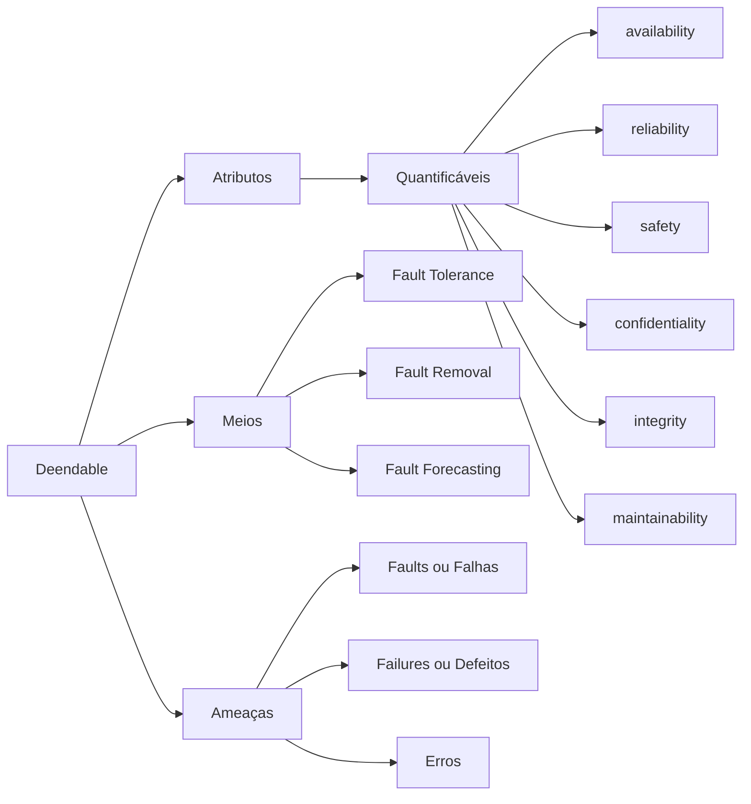

# Aula 01 | Avaliação de Sistemas Críticos

Avaliar a disponibilidade e confiabilidade de sistemas.

## Dependability

Existem definições formais e matemáticas para:

### Reliability
A confiabilidade de um sistema pode ser formalmente definida como a probabilidade de que o sistema execute suas funções requeridas sem falhas durante um intervalo de tempo específico.

&space;=&space;e^{-\lambda&space;t})

Onde:
- \( R(t) \) é a confiabilidade do sistema no tempo \( t \).
- \( \lambda \) é a taxa de falha do sistema.
- \( t \) é o tempo transcorrido.

### Availlability
A disponibilidade de um sistema é formalmente definida como a proporção de tempo em que o sistema está operacional e pronto para executar suas funções, em relação ao tempo total.

Onde:
- \( A \) é a disponibilidade do sistema.
- \( T_{\text{op}} \) é o tempo em que o sistema está operacional.
- \( T_{\text{total}} \) é o tempo total.

### Maintenability
A mantibilidade (ou manutenibilidade) de um sistema é formalmente definida como a facilidade e eficiência com que o sistema pode ser mantido, reparado ou modificado após uma falha ou para atender a novos requisitos.

Não existe uma fórmula matemática única para a mantibilidade, pois ela envolve várias métricas subjetivas e objetivas, como tempo médio de reparo, tempo médio entre falhas, facilidade de diagnóstico, documentação, etc.

## Conceituação

O primeiro que trouxe o termo foi Jean Claude Laprie em **Dependable Computing and FAult Tolerance: Concepts and terminology.** No livro texto, segundo capítulo do volume 2, tem a parte histórica.

O termo **dependable system** é um sistema que realiza o que ele se propõe a fazer. Ele tem um proposito e realiza determinadas tarefas para aquilo em que foi projetado.

É diferente do termo **confiável**. O sistema **dependable** é aquele que entrega aquilo para qual o sistema em que foi concebido. 

São produtos em que acreditamos que esteja de acordo com a especificação do sistema.

Dependability tem 3 itens básicos:

