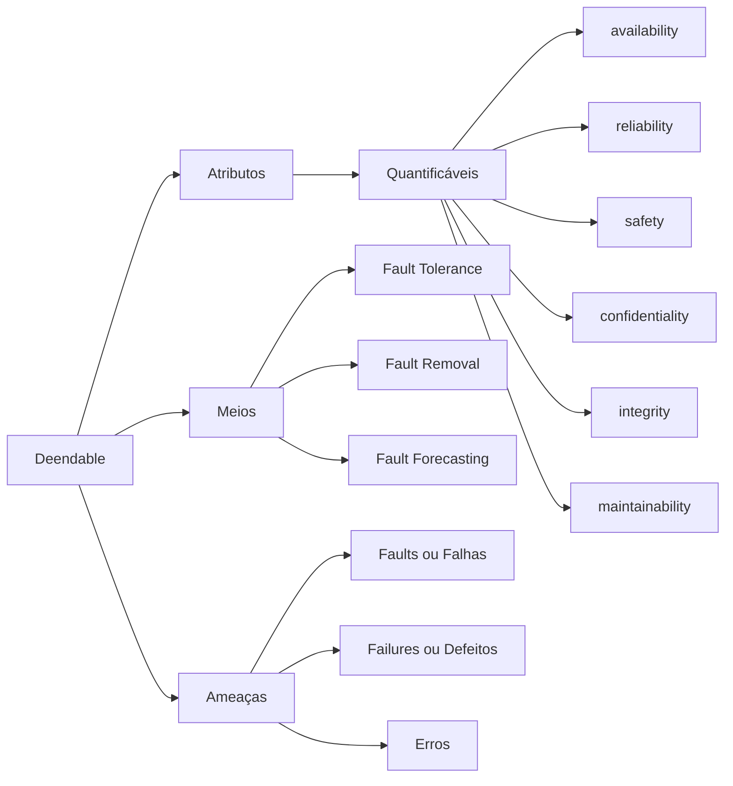
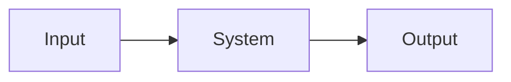
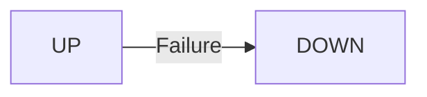
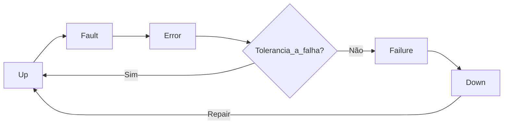

# Aula 01 - Avaliação de Sistemas Críticos

Avaliar a disponibilidade e confiabilidade de sistemas.

## Dependability

Existem definições formais e matemáticas para:

#### Reliability
A confiabilidade de um sistema pode ser formalmente definida como a probabilidade de que o sistema execute suas funções requeridas sem falhas durante um intervalo de tempo específico.

#### Availlability
A disponibilidade de um sistema é formalmente definida como a proporção de tempo em que o sistema está operacional e pronto para executar suas funções, em relação ao tempo total.

#### Maintenability
A mantibilidade (ou manutenibilidade) de um sistema é formalmente definida como a facilidade e eficiência com que o sistema pode ser mantido, reparado ou modificado após uma falha ou para atender a novos requisitos.

## Conceituação

O primeiro que trouxe o termo foi **Jean Claude Laprie** em **Dependable Computing and FAult Tolerance: Concepts and terminology.** No livro texto, segundo capítulo do volume 2, tem a parte histórica.

O termo **dependable system** é um sistema que realiza o que ele se propõe a fazer. Ele tem um proposito e realiza determinadas tarefas para aquilo em que foi projetado.

É diferente do termo **confiável**. O sistema **dependable** é aquele que entrega aquilo para qual o sistema em que foi concebido. 

São produtos em que acreditamos que esteja de acordo com a especificação do sistema.

Dependability tem 3 itens básicos:



Em 1907 o **Andrei A. Markov** começou um trabalho osbre a probabilidade de ocorrÊncia de eventos a partir de um estado presente. Esse estudo foi estudado em transporte de trêns.

Desse estudo surgiu as **Cadeias de Markov**, em meados de 1926. 

Em 1910, **A. K. Erlang** estudou problemas no tráfico em telefones e foi um dos pioneros para sistemas iniciais de filas e probabilisticos.

Em 1930, **Weibull, Waloddi** e **Gumbel, Emil Julius** estudara a fadiga em sistemas mecanicos.

Em 1933, **Kolmogorov** formalizou de forma completa os modelos de Markov. Aqui que entra **Chapman-Kolmogorov**.

> O teorema de Chapman-Kolmogorov é um conceito fundamental na teoria das cadeias de Markov, uma ferramenta matemática usada para modelar sistemas estocásticos que exibem propriedades de dependência de estado. Ele descreve a evolução das probabilidades de transição em uma cadeia de Markov ao longo do tempo, permitindo calcular as probabilidades de chegar a um estado futuro a partir de estados anteriores.

Em 1940, durante a segunda guerra mundial (Blischke, W. R. & Murthy, D. N. P. (Ed.) (2003)), temos alguns milestones, como:

- Escolas de verão para disseminar o conhecimento sobre os primeiros computadores (programas armazenados em memória, etc);
- Na alemanha temos o **Konrad Zuse** onde tem os computadores do tipo Z na década de 30, antes de **Alan Turing**.

Com essas e outras várias ações e projetos, 3 americanos imporantes ajudaram no assunto de avaliação de sistemas críticos: **C. E. Shanon**, **John von Neumann** e **Edward Forrest Moore**. Contribuiram para diversas áreas para matemática, códigos, entropia, entre outros. Sâo os predecessores de técnicas estatísticas e probabilísticas.

Eles conceberam um tipo de modelo que usamos até hoje, **Reliability Block Diagrams** ou **RBD**. USando a notação de chaves e relés para especificar e modelar sistemas. 

> O Diagrama de Blocos de Confiabilidade (RBD, do inglês "Reliability Block Diagram") é uma representação gráfica utilizada na engenharia de confiabilidade para ilustrar a estrutura de um sistema em termos de seus componentes e suas interconexões. Nesse diagrama, os componentes são representados por blocos e as interconexões entre eles por setas ou linhas. O RBD permite analisar a confiabilidade global do sistema, avaliando como as falhas em componentes individuais afetam a confiabilidade do sistema como um todo. É uma ferramenta útil para modelar a redundância, interdependências e possíveis pontos de falha em sistemas complexos, ajudando na tomada de decisões relacionadas ao projeto, manutenção e melhoria da confiabilidade do sistema.

EM 1950, temos diversas iniciativas em função da guerra fria, guerra da Korea, corrida espacial, problemas que aconteceram com os primeiros jatos comerciais. As pessoas começaram a ter mais preocupações com a confiabilidade de sistemas. Em 1956 que surge o artigo de RBD de E.F. Moore. 

Em 1953, **Milton Sobel** utilizou a distribuição exponencial no atigo **Life TEsting. Jornaul of the American Statistical Association**. 

Em 1958, temos **Gnedenjo Boris V.** aluno de Kolmogorov, importante na União Soviética em relação a confiabilidade de sistemas. 

Em 1961, aparece **Zygmunt William Birnbaum** em estudos de sistemas de confiabilidade. Existem métricas chamadas distribuições de Birmaum e métricas de Birbaum. 

As cadeias de Markov, do início do século, só por volta da segunda metáde do século que começam a aplicar na prática em modelos para avaliar sistemas.

Em 1962, **Bell Laboratoryes** propoe a árvores de falha, ou **FTA (Fault Tree Analysis)**, que é uma maneira equivalente à RBD para analisar sistemas. Notação de alto nível em notação de porta lógica.

> A Análise de Árvore de Falhas (FTA, do inglês "Fault Tree Analysis") é uma metodologia de engenharia de confiabilidade que visa compreender as causas subjacentes de falhas em sistemas complexos. Por meio de uma representação gráfica hierárquica, a FTA identifica eventos de falha como nós da árvore e as combinações lógicas desses eventos como ramificações. Começando com um evento de falha indesejado, a análise segue os caminhos de causalidade reversa, desagregando o problema em eventos primários até as causas fundamentais. A FTA é uma ferramenta valiosa para avaliar riscos, identificar pontos críticos de falha, entender a interdependência entre eventos e orientar ações de mitigação e melhoria da confiabilidade do sistema.

Em 1966, Carl Adams Petri propós o que chamamos hoje **Petro NEts**. Inicialmente foi para estudos em sistemas concorrentes, onde não tinha noção de tempos. Depois foi incorporado noção de tempo e posteriormente noção de tempo como variável aleatória, o que chamamos **SPN ou Sthocastic Pretri Nets**, com **Natkin and Molloy**.

> As Redes de Petri Estocásticas (SPN, do inglês "Stochastic Petri Nets") são uma extensão das Redes de Petri clássicas que incorporam a aleatoriedade em processos de sistemas. Nessa modelagem, os estados e transições da rede podem ter associações probabilísticas, permitindo a representação de incertezas e variabilidades nos tempos de execução das transições e nas condições de disparo. As SPNs são usadas para analisar sistemas em que a natureza estocástica dos eventos é crucial, permitindo a avaliação de medidas de desempenho, como tempos de espera, probabilidade de ocorrência de eventos e capacidade do sistema sob condições de incerteza. Elas encontram aplicação em áreas como sistemas de comunicação, manufatura, redes de computadores e processos de negócios, onde a aleatoriedade desempenha um papel importante na modelagem e análise

Em 1967, **A. Avizienis** estudou os sistemas tolerantes à falha. Foi um trabalho utilizado na década de 70 e que veio a cunhar os fundamentos da **Dependabilidade** junto com **Laprie**.

## Conceitus Básicos



### Failure 



É um defeito. Um defeito em um sistema é quando o sistema deixa de executar as atividades de acordo com sua especificação. Quando ele deixa de executar as atividades daquilo que ele deveria executar.

### Fault

É a **causa básica** que provoce o desvio do comportamento do sistema. Essa causa básica gera uma mudança no estado do sistema, saindo de um estado operacional e vá para um estado errônio. Se esse estado não for contido, ele pode se propagar ao ponto de que nas interfaces do sistema, ou seja, no output, a gente detecte que um problema interno ocorreu. 

```mermaid
graph LR
Operational Status->|Fault| Estado Errôneo
```

### Error 

O **Estado Errôneo** deve ser contigo para que eu não propage a falha. Eu preciso ter um **sitema tolerante à falha** para que, mesmo que um **Fault** ocorra, não há a propagação do **Error** e não chegaria na **Failure**. Pois o **Error** fosse contido.

## Sistemas Tolerantes a Falha

```mermaid
graph LR
Fault ->|Error| Failure
```

Então eu tenho que ter um **Sistema Tolerante a Falha** para que eu não propage o **Erro** e mantenha o sistema **Up**.



Aqui vamos precisar de **Time to Repair** e **Time to Failure**. 

