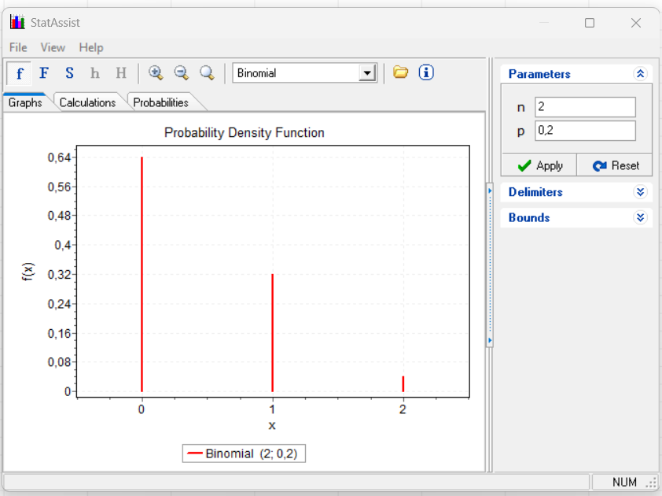
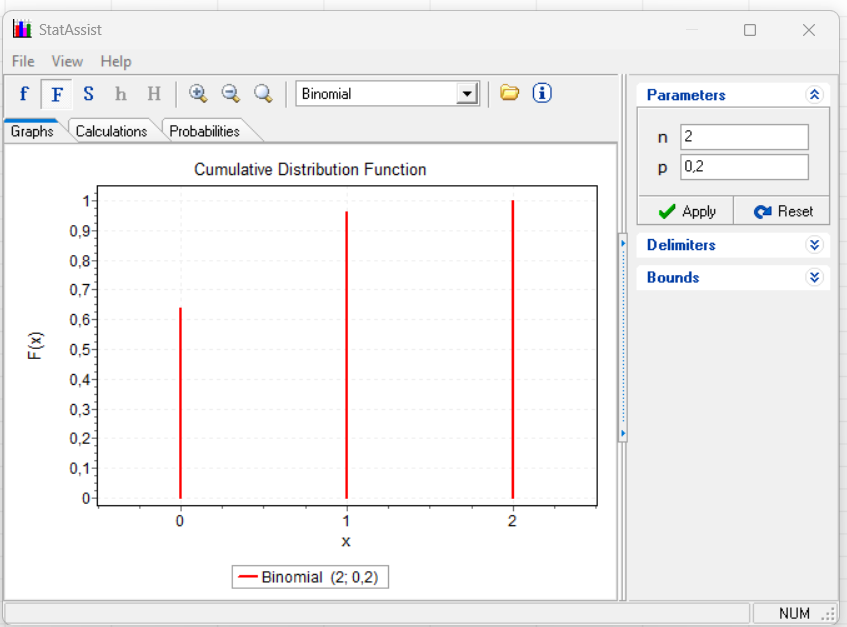
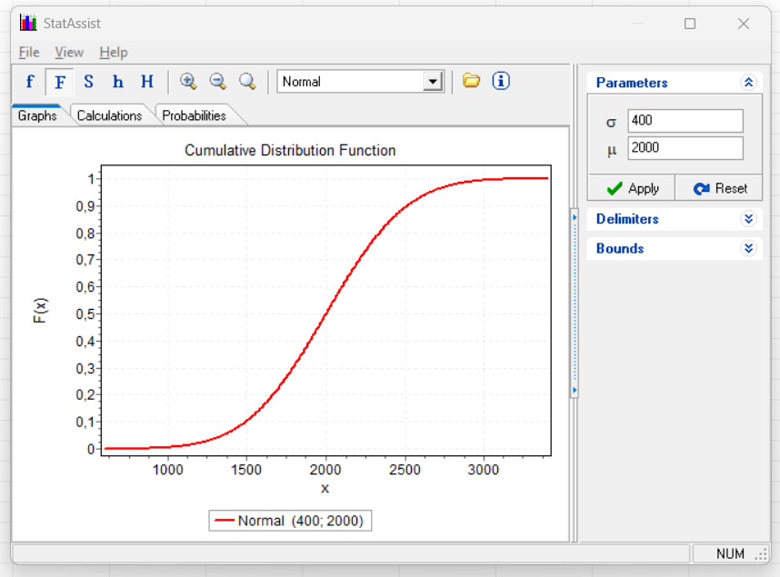
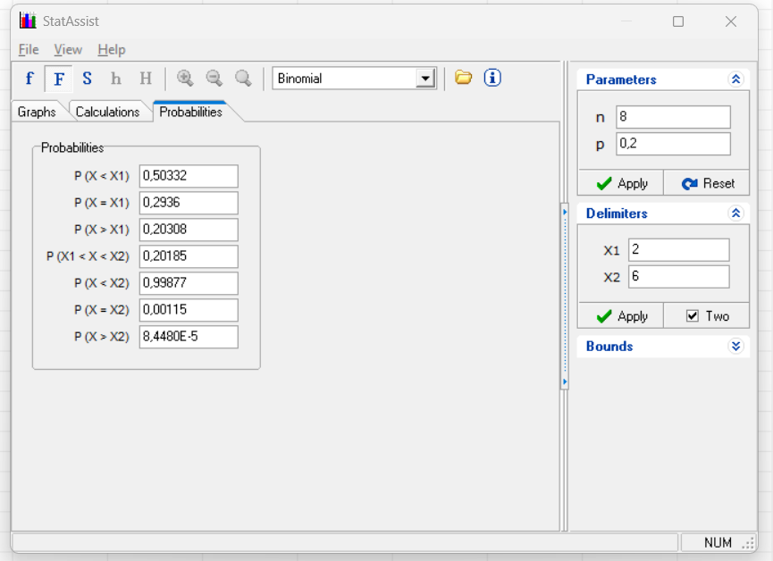

# Aula 02 - Time to Failure

Avaliar a disponibilidade e confiabilidade de sistemas.

## Espaço Amostral de Defeito e Falha

Variável aleatória discreta, números inteiros.

X: Espaço Amostral vai para {0, 1, 2}

Por quê?

Porque, tendo duas máquinas C1 e C2, eu posso ter as seguintes possibilidades:

C1 = {D, U}
C2 = {D, U}

Então tenho a matriz

| C1 | C2 |
|:-------------:|:-------------:|
|       D       |       D       |
|       D       |       U       |
|       U       |       D       |
|       U       |       U       |

Se a probabilidade de ocorrer uma falha é 0.2, então temos

| P(C1) | P(C2) |
|:----------------:|:----------------:|
|       0.2        |       0.2        |
|       0.2        |       0.8        |
|       0.8        |       0.2        |
|       0.8        |       0.8        |

Logo,

| P(C1,C2) |
|:-----------------------------:|
|             0.64              |
|             0.16              |
|             0.16              |
|             0.04              |

Então, no espaço amostral, para ocorrer nenhuma, 1 ou 2 falhas, temos as seguintes probabilidades:

| Domínio | Probabilidade |
|:-------:|:-------------:|
|    0    |      0.64     |
|    1    |      0.32     |
|    2    |      0.04     |

Como dito, esse experimento tem variáveis aleatórias discretas. Podemos ter variáveis aleatórias contínuas.
Qualquer variável aleatória é definida pela sua função acumulada de distribuição.

## Conceito de Variável Aleatória

Notas importantes:

- **Variáveis Aleatórias Discretas:** São representadas por conjuntos finitos ou enumeráveis de valores. No caso aqui, a contagem de falhas nas máquinas C1 e C2 é um exemplo de variável aleatória discreta.

- **Probabilidade Conjunta:** A probabilidade de ocorrência simultânea de eventos em um espaço amostral. A tabela de probabilidades conjuntas P(C1,C2) descreve essas ocorrências conjuntas.

- **Variáveis Aleatórias Contínuas:** Referem-se a valores dentro de um intervalo contínuo. Elas são definidas por sua função acumulada de distribuição, que descreve a probabilidade de a variável assumir um valor menor ou igual a um certo ponto.

A variável aleatória mapeia um domínio em um contra domínio, que são números reais. 

Dado um experimento amostral, eu tenho um conjunto de probabilidades desses eventos, que variam entre 0 e 1. 
Agora eu tenho outro conjunto, realizando esse mapeamento com os números em si do experimento, no caso acima foi 0,1 e 2 e outro conjunto contendo as probabilidades, também nos números reais, que vai de 0 a 1 nos números reais. 

Espaço Amosrtal > Mapear em número real > Probabilidade de Ocorrência dos eventos

Seguindo esse passo-a-passo, eu posso obter o gráfico das probabilidades com o eixo X sendo os números reais possíveis do espaço amostral e no eixo Y a probabilidade de ocorrência dos eventos.

## Função de Probabilidade 

> O Gráfico abaixo não é Função de Densidade de Probabilidade, porque a variável não é contínua.

## Função de Distribuição Acumulada

Chamando de Fx ou **distribuction function**.
Quando x tende para menos infinito, Fx tende para 0.
QUando x tende para infinito, Fx tende para 1.

Sendo assim:
Fx(x) = Somatório onde i vai do menor valor até o maior valor de Fx(i).

Em outras palavras, para o nosso exemplo:

Fx(0) = 0.64

Fx(1) = Fx(0)+Fx(1) = 0.96

Fx(2) = Fx(0)+Fx(1)+Fx(2) = 1

## Distribuição Binomial

Número de sucesso, defeitos, onde cada evento só tem 2 situações (evento, operando), (defeito, sucesso), entre outros.

### Variável Aleatória Contínua

O domínio, ao invés de discreto (0,1,2,3....), são números contínuos. 

Exemplo de uma variável contínua:

Voltando ao exemplo anterior, como eu calculo a probabilidade entre 3 e 5 considerando n = 8 e p = 0.2 ?

É fácil, é só eu fazer a conta:

P(3<=X<=5) = Fx(X=5) - Fx(X=2)

Ou, em outras palavras:

> A função de probabilidade só existe para distribuição discreta. Porém, existe a função de densidade, derivada da função de distribuição acumulada, onde conseguimos calcular as probabilidades de variável contínua.

## Função de Densidade

Pego a função de dsitribuição acumulada contínua e derivo:

f(x) = dF(x)/dx

Se eu integrar de menos infinito até infinito, temos que a área abaixo dessa curva é 1.

Um ponto importante, se eu pegar a integral e usar t_1 = t_2 onde P(t_1 < T < T_2) é 0, porque como a área é base x altura, a base é 0. 

Como no exemplo abaixo, se eu for calcular um intervalo com a função de distribuição acumulada, temos que pegar Fx(t2) - Fx(t1) (Cum. Density).

Agora, se for calcular usando a função de densidade, abaixo, calculamos 0.39435.

## Desvio Padrão

Nos delimitadores, se eu colocar 1 desvio padrão pra baixo e 1 para cima, tenho uma área de 68%. Se colocar 2 desvios para baixo e 2 desvios para cima, tenho 95%. 

Se eu considerar 2,5% da área, eu tenho o ponto, em uma função de distribuição normal, onde a média é 0 e o desvio é 1, tenho que o delimitador, ou ponto crítico, é -1,96. EM que ele separa a área, que é 1, do lado esquerdo em 2,5% e do lado direito 97,5%.

## Revisão

