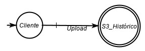
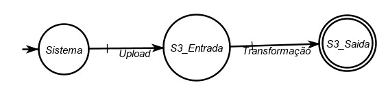
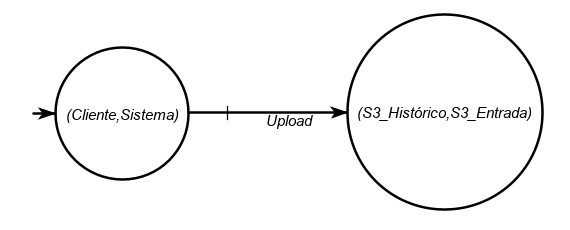
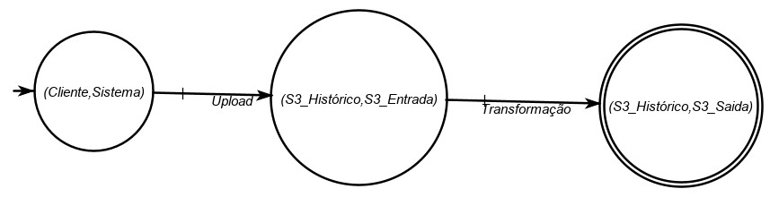
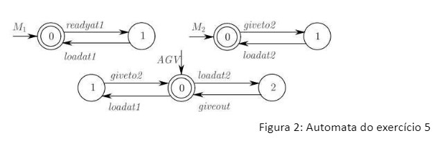

# Human Solution #1 List
## Human Solutions in English

:::info Book
```abnt title="Introduction to Discrete Event Systems"
CASSANDRAS, C. G.; LAFORTUNE, S. Introduction to Discrete Event Systems. 2nd ed. New York: Springer, 2008.
```
:::


1. **What do you understand by DES model?**

2. **Explain the following concept:**

    a. **reachable language of an automaton**

    b. **marked language generated by an automaton**

    c. **prefix-closure and**

    d. **Kleene-closure.**

    What do you understand by

    e. **Reachable (Accessible) operation**

    f. **Coaccessible operation, and**

    g. **Trim operation.**

3. **Adopt the two automata of Figure 1 and tell you about eventual equivalence based on languages and equivalence based on bisimulation.**

    
    <p align="center">Figura 1: Automata do exercício 3</p>

    Da **Figura 1** temos os seguintes automatas, $H$ e $G$, sendo que o automata $H$ é **determinístico** e o automata $G$ é **não determiniístico**. Sendo assim, suas linguagens são, respectivamente: 

    $L=(X_H,E_H,f_H,x_{0H},X_{mH})\\$
    $X_H={A,B,C,D}\\$
    $E_H={a,b,c}\\$
    $x_{0H}=A\\$
    f is definided by $f(A,a)=B, f(B,b)=C, f(B,c)=D\\$
    $X_{mH}=\{ \epsilon \}\\$

    $G=(X_G,E_G,f_G,x_{0G},X_{mG})\\$
    $X_G={1,2,3,2',4}\\$
    $E_G={a,b,c}\\$
    $x_{0G}=1\\$
    f is definided by $f(1,a)=2, f(2,b)=3, f(1,a)=2', f(2',c)=4'\\$
    $X_{mG}=\{ \epsilon \}\\$

    Dado que uma linguagem equivalente é aquela em que $\mathcal{L}(H)=\mathcal{L}(G)$ e $\mathcal{L}_m(H)=\mathcal{L}_m(G)$, ou seja, que a concatenação de suas linguagens são iguais e a concatenação de suas linguagens marcadas também são iguais. 

    No caso dos automatos acima, temos que as linguagens $\mathcal{L}(H)=\{a,ab,ac\}$ e $\mathcal{L}(G)=\{a,ab,ac\}$. Como não temos estados finais, então $\mathcal{L}_m(H)=\{ \epsilon \}=\mathcal{L}_m(G)$. Sendo assim, os dois automatas tem linguagens equivalentes.

    Porém, existe uma diferença entre os dois, como dito anteriormente. $H$ é **determinístico** e $G$ é **não-determinístico**. Dado que em $G$ eu tenho duas funções, $f(1,a)=2$ e $f(1,a)=2'$, que, estando no estado 1 tem 50%, probabilidade, de me levar a estados diferentes, 2 ou 2'. Ou seja, o evento b só acontece se eventualmente eu estiver no estado 2 e o evento c só acontece se eventualmente eu estiver no estado 2'. Dito isso, esse automata é diferente do automata H, em que eu posso, a partir de um evento a, ir para o evento b ou c. QUando esse comportamento acontece, chamamos essa análise de **equivalência em bisimulação**.

    No caso em questão, eu preciso analisar a bissimiliraridade entre os automatas. Eu preciso verificar se **cada par de estados dos dois autômatos tem o mesmo comportamento em relação a cada evento**. Então, no exemplo acima, dado o **evento a**, temos que os pares **(B,2) e (B,2')**. Esses pares me levam a resultados diferentes, pois **(B,2) não tem o mesmo comportamente em relação ao evento c**. Dado que quando eu estou em $2$, não consigo alcançar o $c$. E para o par **(B,2'), ele não tem o mesmo comportamento em relação ao evento b** dado que estando em $2'$ eu não consigo alcançar o evento $b$. Sendo assim eles **não são bissimilares**. Se só existisse o evento $a$ onde $E={a}$ para os dois automatas, eles seriam bissimilares, dado que estando em $2$ eu conseguiria acessar o evento $a$ e estando em $2'$ eu consiguiria acessar o evento $a$ também.


4. **Explain the operations**

    Dando uma introdução geral, as operações de composição podem ser em produto ou em paralelo, ou chamadas de composições sincronas e completamente sincronas. Vou explicar na prática usando as figuras 1 e 2 abaixo.

    
    <p align="left">Figura R1: G1 Sistema de Upload de Cliente em Base Histórica</p>

    
    <p align="left">Figura R2: G2 Sistema salvando dados em Base de Entrada e gerando trnasformação pra saída</p>


a. **Product**

QUando falamos de produto, temos que, dado dois automatas $G1$ e $G2$, o produto entre eles é a **interseção** entre os eventos $E1$ e $E2$.
Dado dois automatas $G_1 = (X_1,E_1, f_1, \Gamma_1, x_{01},X_{m1})$ e $G_2 = (X_2,E_2, f_2, \Gamma_2, x_{02},X_{m2})$, temos que $L(G1 \times G2) = L(G1) \cap L(G2)$ e $Lm(G1 \times G2) = Lm(G1) \cap Lm(G2)$.

Em termos práticos, em um produto eu tenho, geralmente, um automata menor com as interseções dos eventos.
Dados os exemplos das figuras R1 e R2 acima e usando o aplicativo IDES 3.1.3, temos que o produto dos dois, ou seja, aqueles em que temos a interseção entre os eventos, nos retorna a figura R3 abaixo. Essa figura nos mostra que, estando no par (Cliente, Sistema), que é o par após o evento inicial, eu posso ir ao par (S3_Histórico,S3_Entrada) dado o evento em comum de Upload.


<p align="center">Figura R3: Produto de G1 e G2</p>

b. **Parallel composition of automata.**

QUando falamos de paralelismo, temos que, dado dois automatas $G1$ e $G2$, a composição paralela entre eles é a **uniao** entre os eventos $E1 e E2$.

Em termos práticos, na composição paralela eu tenho, geralmente, um automata maior que os iniciais com todos os eventos possíveis entre os mesmos. Dado os exemplos das figuras R1 e R2 e usando o aplicativo IDES 3.1.3, temos que a composição paralela da figura R4 dos dois me dá a opção de ir até o par (S3_Histórico, S3_Saída) dado o evento de Transformação. Que é a união dos eventos.


<p align="center">Figura R4: Composição paralela de G1 e G2</p>

5. **A workcell consists of two machines M 1 and M 2 and an automated guided vehicle AGV . The automata modeling these three components are shown in Fig. 2. The complete system is G = M 1 || M 2 || AGV.**

    
    <p align="center">Figura 2: Automata do exercício 5</p>

    a. **Find G.**


    b. **Is G blocking or nonblocking?**


6. **A simple manufacturing process involves two machines, M1 and M2, and a buffer B in between. 9 There is an infinite supply of parts to M1. When a part is processed at M1, it is placed in B, which has a capacity of one part only. The part is subsequently by M2. Let us suppose that we build the uncontrolled model of M i, i = 1, 2, as follows. Each machine has three states: Idle (the initial state), Processing, and Down. Each machine has four transitions: event Start from Idle to Processing, event End from Processing to Idle, event Breakdown from Processing to Down, and event Repair from Down to Idle. The behavior of the system need to be restricted to satisfy the following rules:**

    (i) M1 can only begin processing if the buffer is empty;
    (ii) M2 can only begin processing if the buffer is full;
    (iii) M1 cannot begin processing if M2 is down;
    (iv) If both machines are down, then M2 gets repaired first.

    Answer the following questions.

    a. **Construct an automaton that represents the admissible behavior, as captured by (i) to (iv) above. This automaton should generate a sublanguage of L(M1 || M2).**

       

    b. **Suppose that the events Start and Repair of each machine can be controlled (that is, enabled or disabled) by a controller. For each state of your automaton in (a) above, identify which feasible events in M1 and M2 the controller should disable.**

       

## Human Solutions in Portuguese

1. **O que se entende por modelo DES?**

O modelo DES (Discrete Event System) é um quadro matemático utilizado para modelar e analisar sistemas que evoluem de uma forma discreta e orientada para eventos. Os modelos DES podem ser utilizados para representar uma vasta gama de sistemas, incluindo processos de fabrico, redes de transporte, sistemas de comunicação, e sistemas informáticos.

2. **Explicar o seguinte conceito:**

    a. **língua acessível de um autómato***

        A linguagem acessível de um autómato é o conjunto de todas as cordas possíveis que podem ser geradas pelo autómato, partindo do estado inicial e seguindo qualquer caminho válido através do autómato. Por outras palavras, a língua alcançável é o conjunto de cordas que podem ser reconhecidas pelo autómato.

    b. **língua assinalada gerada por um autómato***

        A linguagem marcada gerada por um autómato é o conjunto de todas as cordas que podem ser geradas pelo autómato quando certos estados (conhecidos como estados marcados) são visitados. Por outras palavras, a língua marcada é um subconjunto da língua alcançável que inclui apenas as cordas que passam pelos estados marcados.

    c. **prefixo-encerramento e***

        O prefixo-encerramento de uma língua é o conjunto de todos os prefixos de cordas na língua. Por outras palavras, dada uma língua L, o prefixo-fechamento de L é o conjunto de todas as cordas que pode ser obtido tomando os primeiros n caracteres de uma corda em L, onde n pode variar de 0 até ao comprimento da corda.

    d. **Kleene-closure.**

        O fecho de lenço de uma língua é o conjunto de todas as concatenações possíveis de cordas na língua, incluindo a corda vazia. Por outras palavras, dada uma língua L, o Lenço de L é o conjunto de todas as cordas que podem ser formadas pela concatenação de zero ou mais cordas em L.

    O que se entende por

    e. **Operação acessível (Acessível)***

        A operação alcançável (acessível) é um procedimento que remove todos os estados num autómato que não são alcançáveis a partir do estado inicial. O autómato resultante tem a mesma linguagem acessível que o autómato original.

    f. **Operação acessível, e***

        A operação coacessível é um procedimento que remove todos os estados de um autómato que não pode chegar a um estado de aceitação. O autómato resultante tem a mesma linguagem marcada que o autómato original.

    g. **Operação de coaccessamento.**

        A operação de corte é uma combinação das operações acessíveis e coacessível, que remove todos os estados que não são acessíveis do estado inicial nem podem chegar a um estado de aceitação. O autómato resultante tem o menor número de estados que podem reconhecer a mesma língua que o autómato original.

3. **Adote os dois autómatos da Figura 1 e fale sobre uma eventual equivalência baseada em línguas e equivalência baseada na bisimulação.**

    
    <p align="center">Figura 1: Autómatos do exercício 3</p>

    Com base nas línguas:

    Os dois autómatos da Figura 1 não são equivalentes com base nas línguas. O autómato A reconhece a língua `L(A) = {ab, aba, abab}` enquanto que o autómato B reconhece a língua `L(B) = {aba, bab}`. Uma vez que `L(A)` e `L(B)` não são a mesma coisa, os autómatos não são equivalentes na língua.

    Com base na bisimulação:

    Para determinar se os autómatos são bisimilares, precisamos de verificar se existe uma relação binária entre os seus estados que satisfaça as seguintes condições:

        1. Os estados iniciais estão relacionados.
        2. Para quaisquer dois estados relacionados, se tiverem transições sobre o mesmo símbolo de entrada, então os seus estados alvo estão relacionados.
        3. Para quaisquer dois estados relacionados, se um deles for um estado de aceitação, então o outro é também um estado de aceitação.

    Podemos começar por relacionar os estados iniciais dos autómatos, `q0A` e `q0B`. Depois precisamos de verificar que estados estão relacionados com `q0A` e `q0B`, respectivamente. Após alguma inspecção, podemos encontrar a seguinte relação:

    `(q0A, q0B), (q1A, q1B), (q2A, q2B), (q3A, q3B)`(q0A, q0B), (q1A, q1B), (q2A, q2B)

    Esta relação satisfaz as condições de bisimulação, uma vez que:

        1. Os estados iniciais estão relacionados.
        2. Para quaisquer dois estados relacionados, se tiverem transições sobre o mesmo símbolo de entrada, então os seus estados alvo estão relacionados. Este é o caso de todos os estados relacionados nos dois autómatos.
        3. Para quaisquer dois estados relacionados, se um deles for um estado de aceitação, então o outro é também um estado de aceitação. Este é também o caso para todos os estados relacionados nos dois autómatos.

    Portanto, os dois autómatos da Figura 1 são bisimilares.

4. **Explicar as operações***.
    a. **Produto***

        A operação do produto é uma operação binária que toma dois autómatos e cria um novo autómato que reconhece a intersecção das suas línguas. Por outras palavras, dado dois autómatos A e B, o autómato do produto reconhece uma cadeia se e só se for reconhecido por A e B. O autómato do produto é construído tomando o produto cruzado dos estados de A e B e definindo a função de transição e o conjunto de estados de aceitação com base nas transições e estados de aceitação de A e B. A operação do produto é uma operação fundamental na teoria dos autómatos e é utilizada em muitas aplicações, tais como o reconhecimento da língua, a verificação de modelos e a síntese de sistemas reactivos.

    b. **Composição paralela de autómatos.**

        A composição paralela de autómatos é uma operação binária que toma dois autómatos e cria um novo autómato que reconhece o produto síncrono das suas línguas. Por outras palavras, dado dois autómatos A e B, o autómato de composição paralela reconhece uma cadeia se e só se for uma concatenação de cadeias que são reconhecidas por A e B ao mesmo tempo. O autómato de composição paralela é construído tomando o produto cruzado dos estados de A e B e definindo a função de transição e o conjunto de estados aceitáveis com base nas transições e estados aceitáveis de A e B. A operação de composição paralela é utilizada na modelação e análise de sistemas simultâneos, onde múltiplos processos interagem uns com os outros através da troca de mensagens ou sinais.

5. **Uma célula de trabalho é constituída por duas máquinas M 1 e M 2 e um veículo guiado automatizado AGV . A modelação automatizada destes três componentes é apresentada na Fig. 2. O sistema completo é G = M 1 || M 2 || AGV.**

    
    <p align="center">Figura 2: Autómatos do exercício 5</p>

    Os autómatos da figura 2 modelam uma célula de trabalho composta por duas máquinas, M1 e M2, e um veículo guiado automatizado (AGV). Os autómatos são etiquetados com as acções que podem realizar e os eventos sobre os quais podem sincronizar. Aqui está uma descrição de cada autómato:

    M1: Este autómato modela o comportamento da máquina M1. Tem três estados, ocioso, ocupado, e feito. O estado inicial é ocioso, e pode receber o início da acção de transição para o estado ocupado. A partir do estado ocupado, pode receber o fim da acção até à transição para o estado feito, onde permanece até receber a reposição da acção para regressar ao estado inactivo.

    M2: Este autómato modela o comportamento da máquina M2. Tem três estados, ocioso, ocupado, e pronto. O estado inicial é ocioso, e pode receber a acção começa a transição para o estado ocupado. A partir do estado ocupado, pode receber o fim da acção até à transição para o estado feito, onde permanece até receber a reposição da acção para regressar ao estado inactivo.

    AGV: Este autómato modela o comportamento da AGV. Tem cinco estados, ocioso, carregar, descarregar, esperar, e pronto. O estado inicial é ocioso, e pode receber a acção go_M1 para transitar para o estado de carga, onde sincroniza com M1 no início do evento e depois transições para o estado de descarga, onde sincroniza com M1 no final do evento e depois transições para o estado de espera. A partir do estado de espera, pode receber a acção go_M2 para transitar para o estado de carga, onde sincroniza com M2 no início do evento e depois transições para o estado de descarga, onde sincroniza com M2 no final do evento e depois transições para o estado feito.

    O sistema completo G = M1 || M2 ||| AGV é a composição paralela dos três autómatos. Isto significa que o sistema pode executar acções em cada autómato simultaneamente, e uma cadeia é reconhecida se e só se for uma concatenação de cadeias que são reconhecidas pelos autómatos individuais ao mesmo tempo. O sistema reconhece uma cadeia se e apenas se representar uma sequência de eventos que corresponda ao seguinte comportamento:

    O AGV move-se para a máquina M1 e carrega um produto.
    A máquina M1 começa a processar o produto e torna-se ocupada.
    A máquina M1 termina o processamento do produto e fica pronta.
    A AGV move-se para a máquina M2 e descarrega o produto.
    A máquina M2 começa a processar o produto e fica ocupada.
    A máquina M2 termina o processamento do produto e fica pronta.
    Em qualquer momento, a AGV só pode estar num dos seguintes estados: inactiva, carregar, descarregar, esperar, ou terminada. Da mesma forma, cada máquina só pode estar num dos seguintes estados: ociosa, ocupada, ou pronta. O sistema é concebido para assegurar que a AGV entrega o produto às máquinas de forma atempada e eficiente, e que as máquinas processam o produto de forma correcta e eficiente.


    a. **Localizar G.**

         Para encontrar G, precisamos de tomar a composição paralela dos três autómatos M1, M2, e AGV. O autómato resultante é o sistema G, representado como G = M1 ||| M2 || AGV.

    b. **Is G blocking or nonblocking?**

        Para determinar se G é bloqueio ou não bloqueio, precisamos de verificar se existem bloqueios no autómato. Um impasse é uma situação em que não é possível fazer mais progressos no sistema, e em que este não consegue alcançar um estado de aceitação. Por outras palavras, um impasse é um estado em que não são permitidas transições de saída.

        A partir dos autómatos da Figura 2, podemos ver que não há bloqueios em nenhum dos três autómatos. O AGV pode sempre mudar para uma máquina e carregar ou descarregar um produto, e cada máquina pode sempre fazer a transição entre os estados ocioso, ocupado, e feito. Portanto, o sistema G não está bloqueado, o que significa que é sempre capaz de progredir e alcançar um estado de aceitação.

6. **Um processo de fabrico simples envolve duas máquinas, M1 e M2, e um tampão B no meio. 9 Há um fornecimento infinito de peças à M1. Quando uma peça é processada em M1, é colocada em B, que tem uma capacidade de apenas uma peça. A peça é subsequentemente por M2. Suponhamos que construímos o modelo descontrolado de M i, i = 1, 2, como se segue. Cada máquina tem três estados: Ocioso (o estado inicial), Processamento, e Down. Cada máquina tem quatro transições: evento Início do inactivo para o processamento, evento Fim do processamento para o inactivo, evento Paragem do processamento para o inactivo, e evento Reparação do inactivo para o inactivo. O comportamento do sistema precisa de ser restringido para satisfazer as seguintes regras:**

    (i) M1 só pode iniciar o processamento se o buffer estiver vazio;
    (ii) M2 só pode iniciar o processamento se a memória intermédia estiver cheia;
    (iii) M1 não pode iniciar o processamento se o M2 estiver em baixo;
    (iv) Se ambas as máquinas estiverem em baixo, então M2 é reparado primeiro.

    Responda às seguintes perguntas.

    a. **Construir um autómato que represente o comportamento admissível, tal como capturado por (i) a (iv) acima. Este autómato deve gerar uma sublinguagem de L(M1 || M2).**

        Para construir um autómato que represente o comportamento admissível, precisamos de tomar a composição paralela das duas máquinas M1 e M2, e depois adicionar restrições ao autómato resultante para assegurar que este satisfaz as regras (i) a (iv) dadas no problema.

        Comecemos pela construção do autómato M1 || M2, onde cada máquina tem três estados: Ocioso, Processamento, e Down, e quatro transições: Iniciar do inactivo para o processamento, Terminar do processamento para o inactivo, Avaria do processamento para o inactivo, e Reparação do inactivo para o inactivo. O autómato M1 || M2 tem 9 estados, correspondentes a todas as combinações possíveis de estados de M1 e M2.

        A seguir, precisamos de adicionar restrições ao autómato para assegurar que este satisfaz as regras (i) a (iv). Estas restrições podem ser expressas da seguinte forma:

        Restrição (i): As transições iniciais de M1 só são activadas se o tampão estiver vazio, ou seja, se o estado de M2 não estiver a processar.
        Restrição (ii): As transições de início de M2 só são activadas se o buffer estiver cheio, isto é, se o estado de M1 estiver a Processar.
        Restrição (iii): As transições de início de M1 são desactivadas se o estado de M2 estiver em baixo.
        Restrição (iv): As transições de arranque e reparação de M1 são desactivadas se o estado de M2 estiver em baixo.
        Usando estas restrições, podemos construir um autómato que represente o comportamento admissível da seguinte forma:

        O conjunto de estados do novo autómato G é o conjunto de pares (p_{M1}, p_{M2}), onde p_{M1} e p_{M2} são estados em M1 e M2, respectivamente, que satisfazem as restrições (i) a (iv) acima.
        O estado inicial de G é o par (ocioso, ocioso).
        A função de transição de G é definida pela composição paralela das funções de transição de M1 e M2, sujeita às restrições (i) a (iv) acima.
        O conjunto de estados aceitáveis de G é o conjunto de pares (inactivo, inactivo) e (inactivo, inactivo, inactivo).
        O autómato resultante G gera uma sublinguagem da língua reconhecida por M1 || M2, que consiste em todas as cordas que correspondem a comportamentos admissíveis do processo de fabricação.


    b. **Ponha que os eventos Start and Repair de cada máquina podem ser controlados (ou seja, activados ou desactivados) por um controlador. Para cada estado do seu autómato em (a) acima, identifique que eventos viáveis em M1 e M2 o controlador deve desactivar.**

        Para identificar quais os eventos viáveis em M1 e M2 que o controlador deve desactivar em cada estado de G, precisamos de considerar as restrições (i) a (iv) que definem o comportamento admissível. Aqui estão os casos possíveis:

            Em estado (inactivo, inactivo): Nenhum evento precisa de ser desactivado.
            Em estado (processamento, inactivo): A transição inicial do M1 deve ser desactivada.
            Em estado (inactivo, Processamento): A transição de início de M2 deve ser desactivada.
            No estado (Em estado (Em baixo, Ocioso) ou (Em baixo, Processamento): A transição de início de M1 e a transição de reparação de M2 deve ser desactivada.
            Em estado (inactivo, inactivo) ou (processamento, inactivo): As transições de Início e Reparação de M1 devem ser desactivadas.
            Note que se a transição de Reparação for tomada em M1 ou `M2, então o controlador deverá desactivar todos os eventos viáveis na máquina correspondente até que a Transição de Reparação seja tomada e a máquina regresse ao estadoIdle`.

            Portanto, o controlador deve desactivar os seguintes eventos viáveis em cada estado de G:

            Em estado (inactivo, inactivo): Nenhum evento precisa de ser desactivado.
            No estado (processamento, inactivo): Desactivar a transição Inicial de M1.
            No estado (inactivo, Processamento): Desactivar a transição de início de M2.
            No estado (Em estado (Em baixo, Ocioso): Desactivar a transição de arranque e reparação de M1.
            No estado (Para baixo, Processamento): Desactivar as transições de Início e Reparação de M1, e a transição de Início de M2.
            Em estado (inactivo, em processamento): Desactivar as transições de Arranque e Reparação de M1.
            No estado (Processamento, Para baixo): Desactivar as transições de Início e Reparação de M1, e a transição de Início de M2.
            Note-se que os eventos viáveis que devem ser desactivados dependem do estado actual do sistema e das restrições que definem o comportamento admissível. Ao desactivar determinados eventos, o controlador assegura que o sistema apenas executa comportamentos admissíveis, e evita violar as restrições.

Boa Sorte!

Traduzido com a versão gratuita do tradutor - www.DeepL.com/Translator
