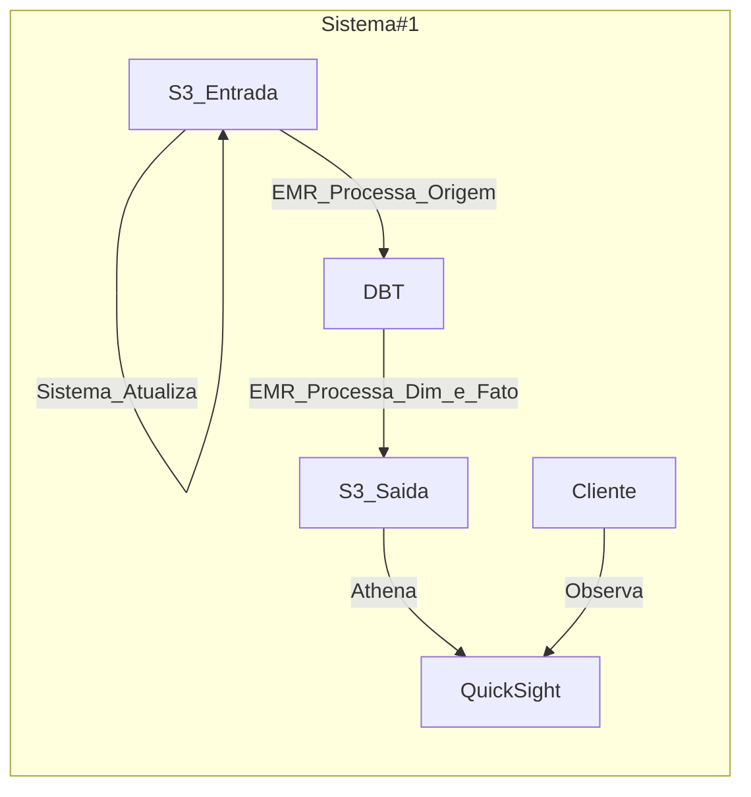
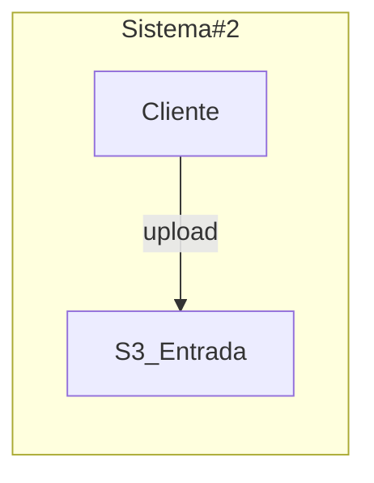

# MVP Modelagem Trabalho

O primeiro subsistema, chamado Sistema #1, é responsável pelo processamento e atualização dos dados, enquanto o segundo subsistema, chamado Sistema #2, permite que os clientes façam upload de informações.

No Sistema #1, os dados são armazenados em um repositório S3 de entrada, que é atualizado periodicamente. Em seguida, o processamento dos dados é realizado por meio do serviço EMR, que extrai informações da origem e as envia para a plataforma DBT. A partir daí, as dimensões e os fatos são processados pelo EMR, que gera a saída em um repositório S3. Os dados processados são consultados usando o serviço Athena e visualizados no QuickSight, onde os clientes podem observar e analisar os resultados.

No Sistema #2, os clientes podem fazer upload de dados diretamente para o repositório S3 de entrada, permitindo que essas informações sejam incorporadas ao processo de análise e visualização no Sistema #1.

A combinação desses dois subsistemas permite um fluxo contínuo de dados e análises, proporcionando aos clientes informações atualizadas e insights valiosos sobre seus dados.

## Representação

