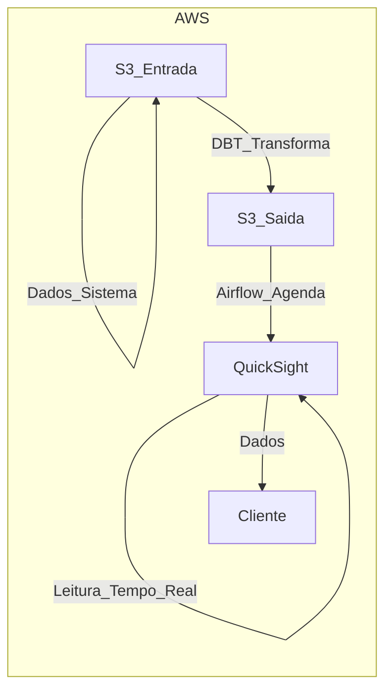

# Problema

Este sistema de processamento de dados em nuvem foi construído utilizando a plataforma da AWS. Os dados são carregados em um bucket no S3_Entrada, onde são processados usando o serviço EMR_Processa. Após o processamento, os dados são transformados usando o serviço DBT_Transforma e então são transferidos para outro bucket no S3_Saida. O fluxo de dados é gerenciado pelo Airflow_Agendamento, que é responsável por agendar e orquestrar as tarefas de processamento e transformação. Por fim, os dados são visualizados pelo cliente usando o QuickSight_Visualizacao. Este sistema permite o processamento escalável e eficiente de grandes volumes de dados em um ambiente de nuvem seguro e confiável.

Entrada de dados em S3_Entrada
Processamento de dados em EMR_Processa
Transformação de dados em DBT_Transforma
Saída de dados em S3_Saida
Gerenciamento de fluxo de dados com Airflow_Agendamento
Visualização de dados com QuickSight_Visualizacao

## Conjunto de Estados
S = {S3_Entrada, S3_Saida, EMR_Processa, DBT_Transforma, Airflow_Agendamento, QuickSight_Visualizacao}

## Alfabeto
E = {processar, transformar, transferir, agendar, visualizar}

## Funções de Transição
f: S x E -> S
- f(S3_Entrada, processar) = EMR_Processa
- f(EMR_Processa, transformar) = DBT_Transforma
- f(DBT_Transforma, transferir) = S3_Saida
- f(S3_Entrada, agendar) = Airflow_Agendamento
- f(Airflow_Agendamento, processar) = EMR_Processa
- f(EMR_Processa, transformar) = DBT_Transforma
- f(DBT_Transforma, transferir) = S3_Saida
- f(S3_Saida, visualizar) = QuickSight_Visualizacao

## Estado Inicial
S0 = S3_Entrada

## Estado Final
Sm = QuickSight_Visualizacao

Nesta máquina de estados, o conjunto de estados S é composto pelos seis estados: S3_Entrada, S3_Saida, EMR_Processa, DBT_Transforma, Airflow_Agendamento e QuickSight_Visualizacao. O alfabeto E é composto pelas cinco ações: processar, transformar, transferir, agendar e visualizar. A função de transição f mapeia cada estado e ação para um novo estado. O estado inicial é S3_Entrada e o estado final é QuickSight_Visualizacao.