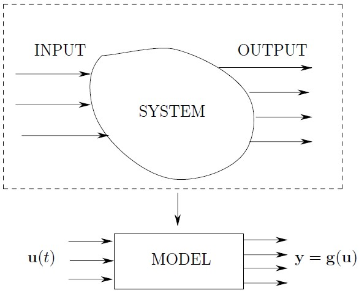
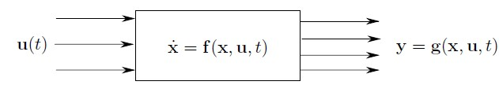
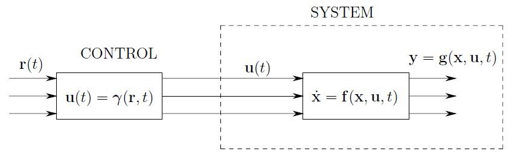
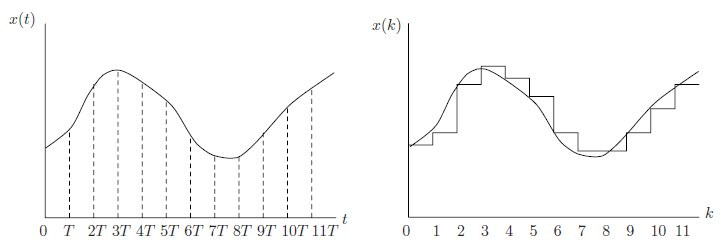

# Systems and Models

:::info Book
```abnt title="Introduction to Discrete Event Systems"
CASSANDRAS, C. G.; LAFORTUNE, S. Introduction to Discrete Event Systems. 2nd ed. New York: Springer, 2008.
```
:::

## Introductions

Geralmente, há um interesse maior em estudar os sistemas com **variáveis contínuas**.

Porém, com o advento da tecnologia, há um crescente interesse no estudo de sistemas com **variáveis discretas**. 

Quais são as **variáveis discretas ?**

Aquelas em que eu posso **contar através de números inteiros**, por exemplo:

- Número de componentes defeituosos em uma linha de produção;
- Número de **instâncias** de servidores em execução;
- Quantidade de **armazenamento** de dados utilizada em um serviço;
- Número de **usuários conectados** a um aplicativo;
- Quantidade de **tráfego de rede** em um serviço;
- Quantidade de **eventos processados** em um serviço;
- Número de **solicitações** de API em um serviço;
- Quantidade de **transações** financeiras realizadas em um serviço;
- Número de **conexões** de banco de dados em um serviço.

Essas são apenas algumas das muitas variáveis discretas que podem ser encontradas em diferentes sistemas e contextos. O estudo de sistemas com variáveis discretas é importante em diversas áreas, como engenharia, **ciência da computação**, economia, logística, entre outras.

## Conceito de Sistema

Uma combinação de componentes que atuam de forma conjunta para executar uma função que não seria possível realizar por nenhum dos componentes individualmente. Essa definição do IEEE Standard Dictionary of Electrical and Electronics destaca a importância da sinergia entre componentes em diferentes sistemas, como por exemplo em sistemas eletrônicos e de computação. É por meio dessa combinação que é possível obter resultados que transcendem as capacidades de cada componente individualmente.

Um exemplo de sistema que pode ser criado na arquitetura de dados AWS é um sistema de processamento de grandes volumes de dados, como um data lake ou um data warehouse (a principal diferença entre um Data Warehouse e um Data Lake é que o Data Warehouse é projetado para suportar análises complexas em dados estruturados e normalizados, enquanto o Data Lake é projetado para armazenar grandes volumes de dados brutos, semiestruturados e não estruturados em diferentes formatos, permitindo uma análise mais flexível e exploratória.). Para que esse sistema possa executar suas funções, é necessário combinar vários componentes, como serviços de armazenamento em nuvem, ferramentas de análise e processamento de dados, ferramentas de monitoramento e gerenciamento, entre outros.

Cada um desses componentes, individualmente, pode oferecer recursos limitados para a implementação de um sistema de processamento de dados de grande escala. No entanto, quando combinados de forma adequada, esses componentes podem criar um sistema que é capaz de lidar com grandes volumes de dados, executar análises complexas em tempo real, oferecer recursos escaláveis e ser facilmente gerenciado por meio de uma interface intuitiva.

Recursos para um sistema de **Data Warehouse**:

Um Data Warehouse é um sistema projetado para armazenar dados estruturados e normalizados de diferentes fontes em um formato consistente e padronizado, para suportar análises complexas e relatórios estruturados. Os dados em um Data Warehouse geralmente são armazenados em tabelas relacionais e organizados de acordo com um modelo de dados bem definido. Esse modelo de dados é otimizado para análises de negócios 

**Ferramentas de ETL**: Talend, Pentaho, Informatica;
**Armazenamento de dados**: Amazon Redshift, Microsoft SQL Server, Oracle Database;
**Ferramentas de análise de dados**: Tableau, Microsoft Power BI, SAP Business Objects;
**Ferramentas de gerenciamento de dados e segurança**: AWS Glue Data Catalog, AWS Identity and Access Management.

Recursos para um sistema de **Data Lake**:

Já um Data Lake é um sistema que armazena dados brutos, sem transformações, em seu formato original e sem a necessidade de modelagem de dados estruturados. O objetivo do Data Lake é armazenar todos os tipos de dados, estruturados, semiestruturados e não estruturados, em uma escala muito grande. Os dados em um Data Lake são organizados em camadas e não possuem esquema fixo, permitindo que sejam explorados de diferentes maneiras. Além disso, um Data Lake geralmente é construído usando uma abordagem bottom-up, em que a ênfase está na coleta de dados e na criação de um grande repositório de dados para exploração.

**Ferramentas de ingestão de dados**: Apache Kafka, Apache NiFi, AWS Glue;
**Armazenamento de dados**: Amazon S3, Google Cloud Storage, Hadoop Distributed File System (HDFS);
**Ferramentas de análise de dados**: Apache Spark, Amazon Athena, Presto;
**Ferramentas de gerenciamento de dados e segurança**: AWS Identity and Access Management (IAM), Apache Ranger, Cloudera Navigator.

### Processos de Modelagem em Input-Output

Precisamos desenvolver meios matemáticos que descreva o sistema a ser estudado. Sistema esse que modela um sistema real.

Seguem os principais passos para modelar um sistema durante um **periodo de tempo** $$[t_0,t_f]$$.

1. Definir um Conjunto de Variáveis Mensuráveis
2. Selecionar um Subconjunto das variáveis e assumir que temos habilidade de variar ao longo do tempo
Para essa habilidade, nós definimos um **conjunto de funções** em que podemos chamar de **variáveis de input**.

Por exemplo, adotamos os vetores de input e output abaixo, em formato transposto $$[.]^T$$:

Vetor of Input Variables $$\boldsymbol{u}(t)$$

$$\boldsymbol{u}(t) = [u_1(t),\ldots,u_p(t)]^T \quad t_0 \leq t \leq t_f$$

Vetor of Output Variables $$\boldsymbol{y}(t)$$

$$\boldsymbol{u}(t) = [y_1(t),\ldots,y_m(t)]^T \quad t_0 \leq t \leq t_f$$

Além disso, podemos definir uma vetor $$\boldsymbol{y}=\boldsymbol{g}(\boldsymbol{u})$$ para definir o modelo do sistema, em que para o vetor de entrada $$\boldsymbol{u}(t)$$, eu tenho uma função $$g_m(u_1(t),\ldots,u_p(t))$$ que a transforma e me gera um vetor de saida $$\boldsymbol{y}(t)$$, através do vetor de transformação $$\boldsymbol{g}(t)$$.

Nem sempre a modelagem de um sistema está no campo das soluções reais. QUando temos uma saída, por exemplo, em que $$y = \sqrt{-1}$$, então dizemos que **o sistema não é fisicamente realizável (not realizable)**.

A figura 1 ilustra o sitema modelado anteriormente (Cassandras et al., 2010).


<p align="center">Figura 1: Simple Modeling Process</p>

### Sistemas Estáticos e Dinâmicos

Para alguns sistemas, não é tão fácil obter de forma algébrica ou diferencial uma solução para $$y(t)$$. Para sistemas estáticos, não precisamos de uma memória para observar os valores passados, porque nesses sistemas isso não importa. Já para sistemas dinâmicos, os valores passados importam e eu preciso deles para modelar meu sistema. Preciso de uma memória, dado que eu preciso relacionar, por equações diferenciais, uma taxa de mudança de saída com as variáveis de entrada. Por exemplo, em um sistema de massa e mola, a posição da massa em relação ao repouso varia com o tempo. 

### Time-Varying e Time-Invariant Dynamic Systems

Voltando a modelagem descrita anteriormente, uma representação mais geral de $$g(.)$$, anteriormente dita indepedente, é: $$\boldsymbol{y}=\boldsymbol{g}(\boldsymbol{u},t)$$.

- **time-invarying**: $$\boldsymbol{y}=\boldsymbol{g}(\boldsymbol{u})$$

Se um input $$\boldsymbol{u}(t)$$ resulta em um output $$\boldsymbol{y}(t)$$, então um input $$\boldsymbol{u}(\tau-t)$$ resulta em um output $$\boldsymbol{y}(\tau-t)$$ para todo $$\tau<t$$.

Em um gráfico, por exemplo, se uma curva de saída $$y(0)$$ é obtida através de uma entrada $$u(0)$$, em um instante $$\tau>0$$, a curva $$y(\tau)$$ é simplesmente deslocada em um valor de $$\tau>0$$.

- **time-varying (stationary systems)**: $$\boldsymbol{y}=\boldsymbol{g}(\boldsymbol{u},t)$$

Se um input $$u(t_1)$$ resulta em um output $$y(t_1)$$ em um instante de tempo específico $$t_1$$, então um input $$u(t_2)$$ resulta em um output $$y(t_2)$$ em um instante de tempo diferente $$t_2$$, onde $$t_1<t_2$$, e o comportamento do sistema pode mudar com o tempo.

Por exemplo, no caso de um sistema que controla a temperatura de uma sala, as condições externas podem mudar com o tempo, como a temperatura ambiente, a presença de pessoas, a incidência de luz solar, etc. Isso pode afetar o comportamento do sistema e **levar a diferentes respostas para a mesma entrada em diferentes momentos do tempo**.


## The Concept of State

O estado de um sistema, é um vetor, denominado $$\boldsymbol{x}(t)={x_1(t),\ldots,x_n(t)}$$ em que essas **variáveis de estado** me fornecem toda a informação necessária em $$t_0$$ para pever o output $$y(t)$$ do sistema, dado $$u(t)$$ para $$t \geq t_0$$.

### The State Space Modeling Process

Para modelar completamente um sistema, precisamos então de 3 conjunto de variáveis em adição ao estado inicial do sistema, $$t_0$$.

1.$$\boldsymbol{x}(t)$$
2.$$\boldsymbol{u}(t)$$
3.$$\boldsymbol{y}(t)$$

- Definimos então **equações de estado (state equations)** como o conjunto de equações que me fornece o vetor $$\boldsymbol{x}(t)$$.
- Definimos **espaço de estados (state space)** como o conjunto de todos os valores possíveis que um determinado estado me fornece, dado pelas equações:

$$\dot{\boldsymbol{x}}(t) = f(\boldsymbol{x}(t), \boldsymbol{u}(t), t),\quad x(t_0) = x_0$$
$$\boldsymbol{y}(t) = g(\boldsymbol{x}(t), \boldsymbol{u}(t), t)$$

A primeira equação representa um sistema dinâmico no tempo contínuo, onde $\dot{\boldsymbol{x}}(t)$ é a derivada de $x(t)$ em relação ao tempo, $f(x(t), u(t), t)$ é uma função que descreve como a derivada de $x(t)$ depende de $x(t)$, $u(t)$ e $t$, $x(t_0)$ é a condição inicial de $x(t)$ no instante de tempo $t_0$ e $x_0$ é o valor inicial de $x(t)$.

A segunda equação representa a saída do sistema em função de $x(t)$, $u(t)$ e $t$, onde $y(t)$ é a saída, $g(x(t), u(t), t)$ é uma função que descreve como $y(t)$ depende de $x(t)$, $u(t)$ e $t$.

Para sistemas estáticos, temos que $$\dot{\boldsymbol{x}}(t)=0$$ para todo $$t$$, ou seja, o estado desse sistema se mantém fixo por todo tempo. 

Como mostrado na figura 2 (Cassandras et al., 2010), temos que esse sistema é chamado de caixa preta (black-box).


<p align="center">Figura 2: Black Box</p>

Esse sistema é capturado apenas observando as variáveis de entrada e as saídas. Ou seja, em diversos casos de estudo, nós podemos modelar o sistema apenas observando-os em cada período de tempo. Não precisamos saber o que tem dentro deles.

As equações de estado são usadas para modelar sistemas dinâmicos, que podem mudar ao longo do tempo. Esses sistemas podem ter várias variáveis que mudam ao longo do tempo, e essas variáveis são chamadas de variáveis de estado.

Um exemplo simples de um sistema dinâmico é um tanque de água com uma entrada e uma saída. As variáveis de estado podem incluir o nível de água no tanque, a vazão de entrada e a vazão de saída. As equações de estado descrevem como essas variáveis de estado mudam ao longo do tempo.

Por exemplo, se a taxa de entrada de água for maior que a taxa de saída, o nível de água no tanque irá aumentar. A equação de estado pode ser escrita como $\dot{x}(t) = f(x(t),u(t),t)$, onde $\dot{x}(t)$ representa a taxa de mudança do nível de água, $f(x(t),u(t),t)$ é a função que descreve como a taxa de mudança muda com o tempo, e $u(t)$ é a taxa de entrada de água.

### Linear and Nonlinear Systems

Matematicamente, escrevemos $$g: U \rightarrow Y$$ para representar **funções** que **mapeiam** elementos de um **conjunto U** em elementos de um **conjunto Y**. Essa notação é representada pela função $$g: U \rightarrow Y$$. 

Quando um elemento u pertence ao conjunto U e um elemento y pertence ao conjunto Y, **é possível representar a relação entre eles através da notação** $$y = g(u)$$. Essa notação é usada para definir a **função g que mapeia os elementos do conjunto U nos elementos do conjunto Y**.

A definição acima é importante porque permite que os matemáticos usem a notação para descrever as relações entre conjuntos e suas respectivas funções. Por exemplo, **se U é o conjunto de todos os números reais e Y é o conjunto dos números reais positivos, a função g pode mapear os números negativos em zero (que significa que para qualquer número negativo presente em U, a função g retorna 0 em Y) e os números positivos em si mesmos**. A notação g(u) = y mostra que quando um número u é dado como entrada na função, um número y é produzido como saída.


1. Sistemas Lineares

Na definição apresentada, $$g$$ e $$f$$ são funções que descrevem o comportamento de um sistema, em um contexto de modelagem matemática. A função **g mapeia as variáveis de estado e entrada do sistema em variáveis de saída**, enquanto a função **f descreve como a evolução do sistema é governada pelas variáveis de estado e entrada**.

Essas funções são fundamentais para a representação matemática de sistemas dinâmicos, uma vez que permitem que sejam feitas previsões sobre o comportamento do sistema a partir de condições iniciais e entradas conhecidas. No contexto da definição apresentada, um sistema é dito linear se as funções g e f são lineares.

$$\dot{x}(t) = A(t)x(t) + B(t)u(t)$$

$$y(t) = C(t)x(t) + D(t)u(t)$$

Onde $\boldsymbol{x}(t)$ é o vetor de estado do sistema, $\boldsymbol{u}(t)$ é o vetor de entrada do sistema e $\boldsymbol{y}(t)$ é o vetor de saída do sistema. $\boldsymbol{A}(t)$, $\boldsymbol{B}(t)$, $\boldsymbol{C}(t)$ e $\boldsymbol{D}(t)$ são matrizes que descrevem as características do sistema e podem variar no tempo. O sistema é dito linear se $\boldsymbol{A}(t)$, $\boldsymbol{B}(t)$, $\boldsymbol{C}(t)$ e $\boldsymbol{D}(t)$ são todas matrizes lineares.

A equaçõesa cima são conhecidas como equação de estado do sistema e descreve a evolução do vetor de estado $\boldsymbol{x}(t)$ ao longo do tempo. A equação de saída $\boldsymbol{y}(t)$ descreve a relação entre o vetor de saída e o vetor de estado e entrada do sistema. O modelo é amplamente utilizado em sistemas dinâmicos e pode ser usado para descrever uma ampla gama de sistemas, desde sistemas mecânicos até sistemas elétricos e de controle.

Em casos de um sistema em time-invariance, temos que **A, B, C e D** são chamados de **parâmetros do modelo**.

Em sistemas AWS (Amazon Web Services), alguns exemplos de parâmetros do modelo incluem:

- **Número de instâncias EC2**: Este é um parâmetro que determina quantas instâncias do Amazon Elastic Compute Cloud (EC2) serão usadas para executar um aplicativo ou serviço. Dependendo do número de instâncias escolhidas, o desempenho do sistema pode ser afetado, bem como o custo de uso do serviço.
- **Tamanho do bucket S3**: O Amazon Simple Storage Service (S3) é um serviço de armazenamento em nuvem que permite armazenar e recuperar grandes quantidades de dados. Um parâmetro importante do modelo para o S3 é o tamanho do bucket, que é a unidade básica de armazenamento do serviço. O tamanho do bucket pode influenciar o desempenho do sistema e o custo de armazenamento.
- **Número de zonas de disponibilidade**: O Amazon Elastic Load Balancer (ELB) é um serviço que distribui o tráfego de entrada entre vários servidores EC2 em diferentes zonas de disponibilidade. O número de zonas de disponibilidade escolhido é um parâmetro do modelo que afeta o desempenho e a disponibilidade do sistema, bem como o custo de uso do serviço.

A transformada de Laplace é uma técnica matemática para resolver equações diferenciais lineares com coeficientes constantes. Ela é amplamente usada na análise de sistemas dinâmicos, onde a resposta do sistema é modelada por uma equação diferencial.

No entanto, a aplicação das transformadas de Laplace em modelos complexos e grandes pode se tornar complicada e impraticável devido à complexidade da matemática envolvida e à necessidade de resolver equações diferenciais não lineares. Além disso, muitas vezes é difícil obter a função de transferência do sistema a partir das equações de estado, o que limita a aplicabilidade das técnicas de controle baseadas em frequência.

### Continuous-State and Discrete-State Systems

Existem outras maneiras de classificar a natureza de um **state space** de um modelo.

#### Continuous-State

Um sistema Continuous-State é aquele cujas variáveis de estado podem assumir valores contínuos, ou seja, podem ter uma infinidade de valores possíveis dentro de um intervalo específico. Por exemplo, a posição e a velocidade de um objeto em movimento podem ser medidas em um intervalo de tempo contínuo, e portanto são variáveis de estado contínuas.

#### Discrete-State

Variáveis de estado podem assumir apenas um número finito de valores. Por exemplo, o estado de uma chave elétrica pode ser "ligado" ou "desligado", ou seja, apenas dois valores possíveis. Os sistemas discretos são frequentemente usados em sistemas digitais, como em circuitos eletrônicos, onde a lógica binária é usada para representar informações.

### Sistemas Determinísticos e Estocásticos

Os sistemas estocásticos são uma classe de sistemas que envolvem a aleatoriedade em suas entradas, saídas ou condições iniciais. Ao contrário dos sistemas determinísticos, em que a saída é determinada com certeza a partir das entradas e condições iniciais conhecidas, os sistemas estocásticos produzem uma saída incerta para uma entrada incerta.

#### Sistemas Determinísticos

Um sistema determinístico é aquele em que todas as entradas e condições iniciais são conhecidas e, portanto, a saída é determinada com certeza. Um exemplo de sistema determinístico é um pêndulo simples, que pode ser modelado pela equação diferencial:

$\dfrac{d^2\theta}{dt^2} + \dfrac{g}{l}\sin(\theta) = 0$

onde $\theta$ é o ângulo de deslocamento, $g$ é a aceleração da gravidade e $l$ é o comprimento do pêndulo.

Na arquitetura AWS, um exemplo de sistema determinístico é o Amazon Elastic Compute Cloud (EC2), que é uma instância virtual que fornece capacidade computacional na nuvem com controle total sobre a configuração do servidor. As entradas e condições iniciais são conhecidas e controladas pelo usuário, permitindo a previsão da saída com certeza.

#### Sistemas Estocásticos

Já um sistema estocástico é aquele em que há incerteza nas entradas ou condições iniciais, resultando em uma saída probabilística. Um exemplo de sistema estocástico é um processo de ruído branco, que pode ser modelado pela equação:

$y(t)=x(t)+n(t)$

onde $y(t)$ é a saída, $x(t)$ é a entrada e $n(t)$ é o ruído adicionado ao sinal. O ruído pode ser modelado como uma variável aleatória com média zero e desvio padrão finito.

Um exemplo de sistema estocástico na arquitetura AWS é o Amazon Simple Storage Service (S3), que é um serviço de armazenamento de objetos altamente escalável e durável na nuvem. As entradas e condições iniciais do sistema são incertas, uma vez que a quantidade de dados e a taxa de acesso podem variar ao longo do tempo, resultando em uma saída probabilística.

Outro exemplo de sistema estocástico na arquitetura AWS é o Amazon Kinesis, que é um serviço de streaming de dados em tempo real. A entrada e as condições iniciais do sistema são incertas, uma vez que o volume e a taxa de chegada de dados podem variar aleatoriamente, resultando em uma saída probabilística. O Amazon Kinesis usa técnicas de processamento de fluxo de eventos para filtrar e analisar dados em tempo real.

### Conceito de Controle

Definimos uma função $r(t)$ como o **comportamento desejado** ao sistema. E esse comportamento dessejado é obtigo a partir de **sinais de controle**.

Como mostrado na figura 3, abaixo (Cassandras et al., 2010), temos que o vetorde entrada **u** é definido a partir de uma função de controle $\gamma$ em que $\boldsymbol{u}(t)=\gamma(\boldsymbol{r},t)$ dado um sinal de referência $r(t)$.


<p align="center">Figura 3: Control Input</p>

Um exemplo prático usando sinais de controle de entrada na arquitetura AWS é a utilização do AWS Lambda eAmazon API Gateway para criar um serviço de API HTTP que recebe dados de entrada, executa uma função lambda e retorna uma resposta para o usuário.

O usuário envia uma solicitação HTTP para o API Gateway, que atua como uma camada de entrada e autenticação, e encaminha a solicitação para a função Lambda. A função Lambda processa a entrada de acordo com o algoritmo de controle e retorna uma resposta para o API Gateway, que envia a resposta de volta ao usuário.

Por exemplo, imagine um sistema de controle de temperatura em um prédio. Sensores de temperatura enviam dados de entrada para uma função lambda que implementa um algoritmo de controle para ajustar o sistema de aquecimento e resfriamento. Os sinais de controle de entrada seriam os dados de temperatura dos sensores, e o vetor de entrada u(t) seria o sinal de controle enviado para o sistema de aquecimento e resfriamento.

Este é apenas um exemplo simples de como a arquitetura AWS pode ser usada para implementar um sistema de controle determinístico com sinais de controle de entrada. Há muitas outras maneiras de implementar sistemas de controle utilizando a arquitetura AWS, dependendo dos requisitos específicos do sistema.

### Conceito de Feedback

A ideia de feedback, ou retroalimentação, é simples de entender intuitivamente: usar qualquer informação disponível sobre o comportamento do sistema para ajustar continuamente a entrada de controle. Em outras palavras, um sistema de controle de feedback usa informações da saída do sistema para ajustar a entrada e alcançar um determinado objetivo.

Matematicamente, temos que $\boldsymbol{u}(t)=\gamma(\boldsymbol{r},\boldsymbol{y ou x},t)$

Na arquitetura AWS, um exemplo de sistema de controle de feedback é o Amazon EC2 Auto Scaling. Ele monitora a utilização dos recursos de um conjunto de instâncias EC2 e ajusta automaticamente a escala do grupo para atender à demanda atual. O sistema usa informações da utilização atual do recurso e ajusta o número de instâncias em execução para manter a capacidade desejada, reduzindo custos e melhorando o desempenho.

Outro exemplo de sistema de controle de feedback na arquitetura AWS é o AWS Lambda. Ele é um serviço de computação sem servidor que executa código em resposta a eventos, como uploads de arquivos ou chamadas de API. O serviço usa informações da execução atual do código e ajusta a alocação de recursos para atender à demanda atual. Isso permite que as empresas reduzam o tempo de desenvolvimento e a complexidade da infraestrutura, mantendo a capacidade desejada em todos os momentos.

### Open-Loop System e Closed-Loop System

Open-Loop System e Closed-Loop System são dois tipos de sistemas de controle que diferem na forma como a saída do sistema é usada para ajustar a entrada de controle. A principal diferença entre eles é que o Open-Loop System não usa informações da saída do sistema para ajustar a entrada de controle, enquanto o Closed-Loop System usa informações da saída para ajustar a entrada e alcançar um determinado objetivo.

#### Open-Loop System

Em um Open-Loop System, a entrada de controle é definida de forma independente da saída do sistema. A saída do sistema não é usada para ajustar a entrada de controle, o que significa que o sistema não pode se adaptar a mudanças nas condições do ambiente. Um exemplo de Open-Loop System é um forno elétrico, em que a temperatura é definida manualmente pelo usuário e não é ajustada automaticamente com base na temperatura atual do forno.

Um exemplo de sistema de controle de malha aberta na AWS é um processo de importação/exportação de dados, no qual os usuários transferem dados entre a AWS e outros sistemas ou serviços. Nesse processo, o usuário configura as tarefas de importação ou exportação de dados, mas não recebe feedback ou monitoramento do sistema em tempo real. O processo é executado de forma independente e não faz ajustes ou correções com base em erros ou outros fatores externos.

#### Closed-Loop System

Já em um Closed-Loop System, a saída do sistema é usada para ajustar continuamente a entrada de controle e alcançar um determinado objetivo. Isso permite que o sistema se adapte a mudanças nas condições do ambiente e minimize erros na saída do sistema. Um exemplo de Closed-Loop System é um termostato, em que a temperatura é ajustada automaticamente com base na temperatura atual do ambiente, para alcançar a temperatura desejada.

Um exemplo de sistema de controle de malha fechada na AWS é um serviço de autoescalação (autoscaling), no qual a AWS monitora a carga de trabalho em um grupo de instâncias EC2 e adiciona ou remove automaticamente instâncias com base em regras de escalabilidade definidas pelo usuário. O sistema de autoescalação ajusta continuamente o número de instâncias em execução para manter o uso ideal dos recursos, garantindo que a carga de trabalho seja distribuída de forma equilibrada e que os usuários recebam uma experiência consistente e confiável.

### Dicrete-Time Systems

Um sistema de tempo discreto é aquele em que as variáveis de entrada e saída do sistema são definidas apenas em intervalos de tempo discretos (tik-tak do relógio), ao contrário dos sistemas de tempo contínuo. Esses sistemas são amplamente utilizados em aplicações que envolvem processamento digital, como em computadores e dispositivos eletrônicos.

Muitas equações diferenciais que são de interesse em nossos modelos contínuos só podem ser resolvidas numericamente com o auxílio de um computador. Essas soluções geradas pelo computador são, na verdade, versões discretas de funções contínuas. Por esse motivo, é justificável começar com modelos de tempo discreto se as soluções finais forem necessariamente nessa forma.

Como mostrado na figura 4, abaixo (Cassandras et al., 2010), ilustramos o gráfico à esquerda, com tempos contínuos e o gráfico a direita, com tempos discretos.


<p align="center">Figura 4: Continuous and Discrete-Time Graphs</p>

## Discrete-Event System

Quando o espaço de estados de um sistema é descrito naturalmente por um conjunto discreto como ${0, 1, 2, ...}$, e as transições de estado são observadas apenas em momentos discretos, associamos essas transições de estado a "eventos" e falamos sobre um "sistema de eventos discretos".

Espaço de estados e transições de estado são conceitos importantes para entender como os sistemas funcionam. No contexto do AWS Lambda, esses conceitos podem ser explicados da seguinte maneira:

Os sistemas de eventos discretos são comuns em várias aplicações, incluindo sistemas de computação em nuvem, como a arquitetura da Amazon Web Services (AWS). Vamos usar alguns exemplos de serviços da AWS para ilustrar como isso funciona.

- AWS Lambda: O Lambda é um serviço de computação sem servidor que permite executar seu código em resposta a eventos, como mudanças em dados no Amazon S3 ou atualizações de tabela no Amazon DynamoDB. Nesse caso, o estado do sistema está relacionado à execução do código. Os eventos discretos são gatilhos que disparam a execução das funções Lambda.

- Amazon Simple Notification Service (SNS): O SNS é um serviço de mensagens que permite enviar mensagens a diferentes assinantes, como filas do Amazon SQS, funções do AWS Lambda ou até mesmo dispositivos móveis. Nesse caso, os eventos discretos são as mensagens enviadas e os estados do sistema são representados pelas assinaturas e mensagens armazenadas no tópico do SNS.

- Amazon Simple Queue Service (SQS): O SQS é um serviço de fila de mensagens que permite armazenar mensagens e processá-las de forma assíncrona por componentes do sistema. Os eventos discretos aqui são as mensagens sendo adicionadas ou removidas da fila e os estados do sistema são as mensagens na fila e seu status de processamento.

Nesses exemplos, os eventos discretos estão relacionados às ações que ocorrem nos serviços, como o acionamento de uma função Lambda, o envio de uma mensagem no SNS ou a adição de uma mensagem à fila do SQS. A arquitetura da AWS permite a criação de sistemas complexos baseados em eventos discretos, onde cada componente do sistema reage a eventos específicos e altera seu estado de acordo.

### Espaço de Estados

Espaço de estados: O espaço de estados representa todas as possíveis condições em que um sistema pode existir. No caso do AWS Lambda, o espaço de estados pode incluir condições como:

- Função Lambda não invocada: Nenhum evento gatilho ocorreu e a função Lambda permanece inativa.
- Função Lambda invocada: Um evento gatilho ocorreu e a função Lambda é executada.
- Função Lambda em erro: A função Lambda encontrou um erro durante a execução e parou.
- Função Lambda em tempo limite: A função Lambda atingiu o tempo limite de execução e foi interrompida.

### Transições de Estado

Transições de estado: As transições de estado são mudanças no estado do sistema de um estado para outro. No caso do AWS Lambda, as transições de estado podem ocorrer devido a eventos específicos ou ações no sistema:

- Invocação da função Lambda: Um evento gatilho, como uma mudança de arquivo no Amazon S3 ou uma atualização no Amazon DynamoDB, ocorre e a função Lambda é invocada, passando do estado "não invocada" para o estado "invocada".
- Erro na função Lambda: Durante a execução, a função Lambda encontra um erro e muda do estado "invocada" para o estado "em erro".
- Tempo limite da função Lambda: A função Lambda atinge o tempo limite de execução e passa do estado "invocada" para o estado "em tempo limite".
- Conclusão da função Lambda: A função Lambda conclui a execução com sucesso e retorna ao estado "não invocada".

No exemplo do AWS Lambda, o espaço de estados é composto por diferentes condições em que a função pode existir, enquanto as transições de estado são as mudanças entre essas condições. As transições de estado ocorrem quando a função Lambda é invocada, encontra um erro, atinge o tempo limite ou conclui a execução com sucesso.

### Representação Real de Espaço e Transições de Estado

Vamos representar matematicamente o exemplo do **AWS Lambda** utilizando o **conjunto de espaço de estados discretos e o conjunto de transições de estado discreto**. Primeiro, definimos o conjunto de espaço de estados discretos como S:

- Espaço de Estados:
$$
S = 
\left\lbrace 
Nao Invocada, Invocada, Em Erro, Em Tempo Limite
\right\rbrace
$$

Agora, vamos definir o conjunto de transições de estado discreto como T. Para isso, precisamos listar todas as possíveis transições entre os estados em S. Vamos representar as transições de estado como pares ordenados (estado inicial, estado final):

- Transições de Estado:

$$
T = 
\left\lbrace
(Nao Invocada, Invocada),
(Invocada, Em Erro),
(Invocada, Em Tempo Limite),
(Invocada, Nao Invocada)
\right\rbrace
$$

Neste caso, o conjunto S representa os estados discretos possíveis do AWS Lambda, e o conjunto T representa as possíveis transições de estado entre os estados em S. Por exemplo, a transição de estado (Não Invocada, Invocada) indica que a função Lambda passa do estado "Não Invocada" para o estado "Invocada" quando um evento gatilho ocorre.

Agora, podemos representar o espaço de estados S e o conjunto de transições de estado T como matrizes de transição de estado. Para isso, usaremos uma matriz P de dimensão 4x4, onde cada entrada P(i, j) representa a probabilidade de transição do estado i para o estado j. Nesse caso, as entradas não nulas da matriz P são determinadas pelo conjunto de transições de estado T:

$$
P = \begin{bmatrix}
0 & p_{12} & 0 & 0 \\
0 & 0 & p_{23} & p_{24} \\
0 & 0 & 0 & 0 \\
0 & p_{42} & 0 & 0 \\
\end{bmatrix}
$$

Aqui, p_{ij} é a probabilidade de transição do estado i para o estado j. Por exemplo, p_{12} é a probabilidade de transição do estado "Não Invocada" para o estado "Invocada". As entradas com valor zero na matriz P indicam que a transição entre os estados correspondentes não é possível.

Essa matriz de transição de estado P representa as transições de estado para um sistema discreto não variante no tempo, onde as probabilidades de transição não mudam ao longo do tempo. Note que, embora estejamos usando probabilidades para representar as transições, em alguns casos, essas probabilidades podem ser tratadas como certezas (por exemplo, se uma transição sempre ocorrer, a probabilidade de transição seria 1).

Podemos representar o conjunto de gatilhos r(t) como um vetor, onde cada elemento corresponde a um evento que causa uma transição de estado específica. Neste exemplo, consideramos apenas uma transição de estado, de "Não Invocada" para "Invocada", causada por um evento gatilho. Vamos representar o evento gatilho como r1(t).

A matriz de transição de estado P pode ser estendida para incluir os eventos gatilhos. Para isso, vamos adicionar uma coluna extra à matriz P para representar as transições de estado causadas pelos gatilhos. A matriz estendida P' é dada por:

$$
P' =
\begin{bmatrix}
0 & 0 & 0 & 0 & r_{1}(t) \\
p_{12} & 0 & p_{42} & 0 & 0 \\
0 & p_{23} & 0 & 0 & 0 \\
0 & p_{24} & 0 & 0 & 0
\end{bmatrix}
$$


Nesta matriz, a quinta coluna representa os eventos gatilhos $r(t)$. Neste exemplo, apenas a primeira linha possui um valor não nulo na coluna dos gatilhos, correspondendo à transição de estado (Não Invocada, Invocada) causada pelo evento gatilho $r1(t)$.

A matriz $P'$ agora representa o sistema discreto não variante no tempo, incluindo as transições de estado causadas pelos eventos gatilhos.

## FALTA INCLUIR MAIS EXEMPLOS DE SISTEMAS DISCRETOS CONTINUAR NA PAGINA 27


## Revisão

Além das equações de estado, também há a equação de saída, que descreve a relação entre as variáveis de estado e a saída do sistema. No exemplo do tanque de água, a equação de saída pode ser escrita como $y(t) = g(x(t),u(t),t)$, onde $y(t)$ é a vazão de saída do tanque e $g(x(t),u(t),t)$ é a função que descreve como a vazão de saída depende do nível de água e da taxa de entrada de água.

Durante esta sessão, aprendemos sobre alguns conceitos fundamentais em sistemas dinâmicos e controle. Em particular, vimos que os sistemas dinâmicos são representados por equações que descrevem a evolução de suas variáveis ao longo do tempo. Essas variáveis podem ser divididas em dois tipos: as variáveis de entrada, que representam as informações que o sistema recebe do ambiente externo, e as variáveis de estado, que representam as informações internas do sistema que mudam ao longo do tempo.

Vimos também que as equações que descrevem os sistemas dinâmicos podem ser lineares ou não-lineares. A linearidade é uma propriedade importante que torna a análise e o projeto de sistemas mais simples e diretos. Finalmente, vimos que, em muitos casos, é possível controlar a evolução do sistema, alterando as variáveis de entrada. Isso é feito através do controle realimentado, em que a saída do sistema é medida e usada para ajustar a entrada de modo a alcançar um determinado objetivo.

Além disso, também aprendemos sobre os conceitos de sistemas black-box e sistemas de equações de estado. Sistemas black-box são sistemas cujo comportamento é determinado apenas pelas entradas e saídas do sistema, sem qualquer informação sobre seu funcionamento interno. Já os sistemas de equações de estado são sistemas descritos por um conjunto de equações que relacionam as variáveis de estado e as entradas do sistema às saídas do sistema. Essas equações são geralmente representadas como um sistema de equações diferenciais.