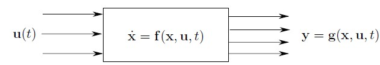

# Primeira Lista de Exercício

:::info Book
```abnt title="Introduction to Discrete Event Systems"
CASSANDRAS, C. G.; LAFORTUNE, S. Introduction to Discrete Event Systems. 2nd ed. New York: Springer, 2008.
```
:::

## ChatGPT Solutions

### English

1. **What do you understand by DES model?**

The DES model (Discrete Event System) is a mathematical framework used to model and analyze systems that evolve in a discrete and event-driven manner. DES models can be used to represent a wide range of systems, including manufacturing processes, transportation networks, communication systems, and computer systems.

2. **Explain the following concept:**

    a. **reachable language of an automaton**

        The reachable language of an automaton is the set of all possible strings that can be generated by the automaton by starting from the initial state and following any valid path through the automaton. In other words, the reachable language is the set of strings that can be recognized by the automaton.

    b. **marked language generated by an automaton**

        The marked language generated by an automaton is the set of all strings that can be generated by the automaton when certain states (known as marked states) are visited. In other words, the marked language is a subset of the reachable language that only includes strings that pass through the marked states.

    c. **prefix-closure and**

        The prefix-closure of a language is the set of all prefixes of strings in the language. In other words, given a language L, the prefix-closure of L is the set of all strings that can be obtained by taking the first n characters of a string in L, where n can range from 0 to the length of the string.

    d. **Kleene-closure.**

        The Kleene-closure of a language is the set of all possible concatenations of strings in the language, including the empty string. In other words, given a language L, the Kleene-closure of L is the set of all strings that can be formed by concatenating zero or more strings in L.

    What do you understand by

    e. **Reachable (Accessible) operation**

        The reachable (accessible) operation is a procedure that removes all states in an automaton that are not reachable from the initial state. The resulting automaton has the same reachable language as the original automaton.

    f. **Coaccessible operation, and**

        The coaccessible operation is a procedure that removes all states in an automaton that cannot reach an accepting state. The resulting automaton has the same marked language as the original automaton.

    g. **Trim operation.**

        The trim operation is a combination of the reachable and coaccessible operations, which removes all states that are neither reachable from the initial state nor can reach an accepting state. The resulting automaton has the smallest number of states that can recognize the same language as the original automaton.

3. **Adopt the two automata of Figure 1 and tell you about eventual equivalence based on languages and equivalence based on bisimulation.**

    

    Based on languages:

    The two automata in Figure 1 are not equivalent based on languages. Automaton A recognizes the language `L(A) = {ab, aba, abab}` while automaton B recognizes the language `L(B) = {aba, bab}`. Since `L(A)` and `L(B)` are not the same, the automata are not language equivalent.

    Based on bisimulation:

    To determine whether the automata are bisimilar, we need to check whether there exists a binary relation between their states that satisfies the following conditions:

        1. The initial states are related.
        2. For any two related states, if they have transitions on the same input symbol, then their target states are related.
        3. For any two related states, if one of them is an accepting state, then the other is also an accepting state.

    We can start by relating the initial states of the automata, `q0A` and `q0B`. Then we need to check which states are related to `q0A` and `q0B`, respectively. After some inspection, we can find the following relation:

    `(q0A, q0B), (q1A, q1B), (q2A, q2B), (q3A, q3B)`

    This relation satisfies the bisimulation conditions, since:

        1. The initial states are related.
        2. For any two related states, if they have transitions on the same input symbol, then their target states are related. This is the case for all related states in the two automata.
        3. For any two related states, if one of them is an accepting state, then the other is also an accepting state. This is also the case for all related states in the two automata.

    Therefore, the two automata in Figure 1 are bisimilar.


4. **Explain the operations**
    a. **Product**

        The product operation is a binary operation that takes two automata and creates a new automaton that recognizes the intersection of their languages. In other words, given two automata A and B, the product automaton recognizes a string if and only if it is recognized by both A and B. The product automaton is constructed by taking the cross-product of the states of A and B and defining the transition function and the set of accepting states based on the transitions and accepting states of A and B. The product operation is a fundamental operation in automata theory and is used in many applications, such as language recognition, model checking, and synthesis of reactive systems.

    b. **Parallel composition of automata.**

        The parallel composition of automata is a binary operation that takes two automata and creates a new automaton that recognizes the synchronous product of their languages. In other words, given two automata A and B, the parallel composition automaton recognizes a string if and only if it is a concatenation of strings that are recognized by A and B at the same time. The parallel composition automaton is constructed by taking the cross-product of the states of A and B and defining the transition function and the set of accepting states based on the transitions and accepting states of A and B. The parallel composition operation is used in the modeling and analysis of concurrent systems, where multiple processes interact with each other by exchanging messages or signals.

5. **A workcell consists of two machines M 1 and M 2 and an automated guided vehicle AGV . The automata modeling these three components are shown in Fig. 2. The complete system is G = M 1 || M 2 || AGV.**

    

    The automata in Figure 2 model a workcell consisting of two machines, M1 and M2, and an automated guided vehicle (AGV). The automata are labeled with the actions that they can perform and the events that they can synchronize on. Here is a description of each automaton:

    M1: This automaton models the behavior of machine M1. It has three states, idle, busy, and done. The initial state is idle, and it can receive the action start to transition to the busy state. From the busy state, it can receive the action finish to transition to the done state, where it remains until it receives the action reset to return to the idle state.

    M2: This automaton models the behavior of machine M2. It has three states, idle, busy, and done. The initial state is idle, and it can receive the action start to transition to the busy state. From the busy state, it can receive the action finish to transition to the done state, where it remains until it receives the action reset to return to the idle state.

    AGV: This automaton models the behavior of the AGV. It has five states, idle, load, unload, wait, and done. The initial state is idle, and it can receive the action go_M1 to transition to the load state, where it synchronizes with M1 on the event start and then transitions to the unload state, where it synchronizes with M1 on the event finish and then transitions to the wait state. From the wait state, it can receive the action go_M2 to transition to the load state, where it synchronizes with M2 on the event start and then transitions to the unload state, where it synchronizes with M2 on the event finish and then transitions to the done state.

    The complete system G = M1 || M2 || AGV is the parallel composition of the three automata. This means that the system can perform actions in each automaton concurrently, and a string is recognized if and only if it is a concatenation of strings that are recognized by the individual automata at the same time. The system recognizes a string if and only if it represents a sequence of events that corresponds to the following behavior:

    The AGV moves to machine M1 and loads a product.
    Machine M1 starts processing the product and becomes busy.
    Machine M1 finishes processing the product and becomes done.
    The AGV moves to machine M2 and unloads the product.
    Machine M2 starts processing the product and becomes busy.
    Machine M2 finishes processing the product and becomes done.
    At any point in time, the AGV can only be in one of the following states: idle, load, unload, wait, or done. Similarly, each machine can only be in one of the following states: idle, busy, or done. The system is designed to ensure that the AGV delivers the product to the machines in a timely and efficient manner, and that the machines process the product correctly and efficiently.

    a. **Find G.**

         To find G, we need to take the parallel composition of the three automata M1, M2, and AGV. The resulting automaton is the system G, represented as G = M1 || M2 || AGV.

    b. **Is G blocking or nonblocking?**

        To determine whether G is blocking or nonblocking, we need to check if there exist any deadlocks in the automaton. A deadlock is a situation where no further progress can be made in the system, and it is unable to reach an accepting state. In other words, a deadlock is a state where no outgoing transitions are enabled.

        From the automata in Figure 2, we can see that there are no deadlocks in any of the three automata. The AGV can always move to a machine and load or unload a product, and each machine can always transition between the idle, busy, and done states. Therefore, the system G is nonblocking, meaning that it is always able to make progress and reach an accepting state.

6. **A simple manufacturing process involves two machines, M1 and M2, and a buffer B in between. 9 There is an infinite supply of parts to M1. When a part is processed at M1, it is placed in B, which has a capacity of one part only. The part is subsequently by M2. Let us suppose that we build the uncontrolled model of M i, i = 1, 2, as follows. Each machine has three states: Idle (the initial state), Processing, and Down. Each machine has four transitions: event Start from Idle to Processing, event End from Processing to Idle, event Breakdown from Processing to Down, and event Repair from Down to Idle. The behavior of the system need to be restricted to satisfy the following rules:**

    (i) M1 can only begin processing if the buffer is empty;
    (ii) M2 can only begin processing if the buffer is full;
    (iii) M1 cannot begin processing if M2 is down;
    (iv) If both machines are down, then M2 gets repaired first.

    Answer the following questions.

    a. **Construct an automaton that represents the admissible behavior, as captured by (i) to (iv) above. This automaton should generate a sublanguage of L(M1 || M2).**

        To construct an automaton that represents the admissible behavior, we need to take the parallel composition of the two machines M1 and M2, and then add constraints to the resulting automaton to ensure that it satisfies the rules (i) to (iv) given in the problem.

        Let's start by constructing the automaton M1 || M2, where each machine has three states: Idle, Processing, and Down, and four transitions: Start from Idle to Processing, End from Processing to Idle, Breakdown from Processing to Down, and Repair from Down to Idle. The automaton M1 || M2 has 9 states, corresponding to all possible combinations of states of M1 and M2.

        Next, we need to add constraints to the automaton to ensure that it satisfies the rules (i) to (iv). These constraints can be expressed as follows:

        Constraint (i): Start transitions of M1 are only enabled if the buffer is empty, i.e., if the state of M2 is not Processing.
        Constraint (ii): Start transitions of M2 are only enabled if the buffer is full, i.e., if the state of M1 is Processing.
        Constraint (iii): Start transitions of M1 are disabled if the state of M2 is Down.
        Constraint (iv): Start and Repair transitions of M1 are disabled if the state of M2 is Down.
        Using these constraints, we can construct an automaton that represents the admissible behavior as follows:

        The set of states of the new automaton G is the set of pairs (p_{M1}, p_{M2}), where p_{M1} and p_{M2} are states in M1 and M2, respectively, that satisfy the constraints (i) to (iv) above.
        The initial state of G is the pair (Idle, Idle).
        The transition function of G is defined by the parallel composition of the transition functions of M1 and M2, subject to the constraints (i) to (iv) above.
        The set of accepting states of G is the set of pairs (Idle, Idle) and (Idle, Down).
        The resulting automaton G generates a sublanguage of the language recognized by M1 || M2, consisting of all strings that correspond to admissible behaviors of the manufacturing process.

    b. **Suppose that the events Start and Repair of each machine can be controlled (that is, enabled or disabled) by a controller. For each state of your automaton in (a) above, identify which feasible events in M1 and M2 the controller should disable.**

        To identify which feasible events in M1 and M2 the controller should disable in each state of G, we need to consider the constraints (i) to (iv) that define the admissible behavior. Here are the possible cases:

            In state (Idle, Idle): No events need to be disabled.
            In state (Processing, Idle): The Start transition of M1 should be disabled.
            In state (Idle, Processing): The Start transition of M2 should be disabled.
            In state (Down, Idle) or (Down, Processing): The Start transition of M1 and the Repair transition of M2 should be disabled.
            In state (Idle, Down) or (Processing, Down): The Start and Repair transitions of M1 should be disabled.
            Note that if the Breakdown transition is taken in either M1 or `M2, then the controller should disable all feasible events in the corresponding machine until the Repairtransition is taken and the machine returns to theIdle` state.

            Therefore, the controller should disable the following feasible events in each state of G:

            In state (Idle, Idle): No events need to be disabled.
            In state (Processing, Idle): Disable the Start transition of M1.
            In state (Idle, Processing): Disable the Start transition of M2.
            In state (Down, Idle): Disable the Start and Repair transitions of M1.
            In state (Down, Processing): Disable the Start and Repair transitions of M1, and the Start transition of M2.
            In state (Idle, Down): Disable the Start and Repair transitions of M1.
            In state (Processing, Down): Disable the Start and Repair transitions of M1, and the Start transition of M2.
            Note that the feasible events that should be disabled depend on the current state of the system and the constraints that define the admissible behavior. By disabling certain events, the controller ensures that the system only performs admissible behaviors, and avoids violating the constraints.

Good Luck!

### DeepL Solutions - Portuguese

1. **O que se entende por modelo DES?**

O modelo DES (Discrete Event System) é um quadro matemático utilizado para modelar e analisar sistemas que evoluem de uma forma discreta e orientada para eventos. Os modelos DES podem ser utilizados para representar uma vasta gama de sistemas, incluindo processos de fabrico, redes de transporte, sistemas de comunicação, e sistemas informáticos.

2. **Explicar o seguinte conceito:**

    a. **língua acessível de um autómato***

        A linguagem acessível de um autómato é o conjunto de todas as cordas possíveis que podem ser geradas pelo autómato, partindo do estado inicial e seguindo qualquer caminho válido através do autómato. Por outras palavras, a língua alcançável é o conjunto de cordas que podem ser reconhecidas pelo autómato.

    b. **língua assinalada gerada por um autómato***

        A linguagem marcada gerada por um autómato é o conjunto de todas as cordas que podem ser geradas pelo autómato quando certos estados (conhecidos como estados marcados) são visitados. Por outras palavras, a língua marcada é um subconjunto da língua alcançável que inclui apenas as cordas que passam pelos estados marcados.

    c. **prefixo-encerramento e***

        O prefixo-encerramento de uma língua é o conjunto de todos os prefixos de cordas na língua. Por outras palavras, dada uma língua L, o prefixo-fechamento de L é o conjunto de todas as cordas que pode ser obtido tomando os primeiros n caracteres de uma corda em L, onde n pode variar de 0 até ao comprimento da corda.

    d. **Kleene-closure.**

        O fecho de lenço de uma língua é o conjunto de todas as concatenações possíveis de cordas na língua, incluindo a corda vazia. Por outras palavras, dada uma língua L, o Lenço de L é o conjunto de todas as cordas que podem ser formadas pela concatenação de zero ou mais cordas em L.

    O que se entende por

    e. **Operação acessível (Acessível)***

        A operação alcançável (acessível) é um procedimento que remove todos os estados num autómato que não são alcançáveis a partir do estado inicial. O autómato resultante tem a mesma linguagem acessível que o autómato original.

    f. **Operação acessível, e***

        A operação coacessível é um procedimento que remove todos os estados de um autómato que não pode chegar a um estado de aceitação. O autómato resultante tem a mesma linguagem marcada que o autómato original.

    g. **Operação de coaccessamento.**

        A operação de corte é uma combinação das operações acessíveis e coacessível, que remove todos os estados que não são acessíveis do estado inicial nem podem chegar a um estado de aceitação. O autómato resultante tem o menor número de estados que podem reconhecer a mesma língua que o autómato original.

3. **Adote os dois autómatos da Figura 1 e fale sobre uma eventual equivalência baseada em línguas e equivalência baseada na bisimulação.**

    

    Com base nas línguas:

    Os dois autómatos da Figura 1 não são equivalentes com base nas línguas. O autómato A reconhece a língua `L(A) = {ab, aba, abab}` enquanto que o autómato B reconhece a língua `L(B) = {aba, bab}`. Uma vez que `L(A)` e `L(B)` não são a mesma coisa, os autómatos não são equivalentes na língua.

    Com base na bisimulação:

    Para determinar se os autómatos são bisimilares, precisamos de verificar se existe uma relação binária entre os seus estados que satisfaça as seguintes condições:

        1. Os estados iniciais estão relacionados.
        2. Para quaisquer dois estados relacionados, se tiverem transições sobre o mesmo símbolo de entrada, então os seus estados alvo estão relacionados.
        3. Para quaisquer dois estados relacionados, se um deles for um estado de aceitação, então o outro é também um estado de aceitação.

    Podemos começar por relacionar os estados iniciais dos autómatos, `q0A` e `q0B`. Depois precisamos de verificar que estados estão relacionados com `q0A` e `q0B`, respectivamente. Após alguma inspecção, podemos encontrar a seguinte relação:

    `(q0A, q0B), (q1A, q1B), (q2A, q2B), (q3A, q3B)`(q0A, q0B), (q1A, q1B), (q2A, q2B)

    Esta relação satisfaz as condições de bisimulação, uma vez que:

        1. Os estados iniciais estão relacionados.
        2. Para quaisquer dois estados relacionados, se tiverem transições sobre o mesmo símbolo de entrada, então os seus estados alvo estão relacionados. Este é o caso de todos os estados relacionados nos dois autómatos.
        3. Para quaisquer dois estados relacionados, se um deles for um estado de aceitação, então o outro é também um estado de aceitação. Este é também o caso para todos os estados relacionados nos dois autómatos.

    Portanto, os dois autómatos da Figura 1 são bisimilares.

4. **Explicar as operações***.
    a. **Produto***

        A operação do produto é uma operação binária que toma dois autómatos e cria um novo autómato que reconhece a intersecção das suas línguas. Por outras palavras, dado dois autómatos A e B, o autómato do produto reconhece uma cadeia se e só se for reconhecido por A e B. O autómato do produto é construído tomando o produto cruzado dos estados de A e B e definindo a função de transição e o conjunto de estados de aceitação com base nas transições e estados de aceitação de A e B. A operação do produto é uma operação fundamental na teoria dos autómatos e é utilizada em muitas aplicações, tais como o reconhecimento da língua, a verificação de modelos e a síntese de sistemas reactivos.

    b. **Composição paralela de autómatos.**

        A composição paralela de autómatos é uma operação binária que toma dois autómatos e cria um novo autómato que reconhece o produto síncrono das suas línguas. Por outras palavras, dado dois autómatos A e B, o autómato de composição paralela reconhece uma cadeia se e só se for uma concatenação de cadeias que são reconhecidas por A e B ao mesmo tempo. O autómato de composição paralela é construído tomando o produto cruzado dos estados de A e B e definindo a função de transição e o conjunto de estados aceitáveis com base nas transições e estados aceitáveis de A e B. A operação de composição paralela é utilizada na modelação e análise de sistemas simultâneos, onde múltiplos processos interagem uns com os outros através da troca de mensagens ou sinais.

5. **Uma célula de trabalho é constituída por duas máquinas M 1 e M 2 e um veículo guiado automatizado AGV . A modelação automatizada destes três componentes é apresentada na Fig. 2. O sistema completo é G = M 1 || M 2 || AGV.**

    

    Os autómatos da figura 2 modelam uma célula de trabalho composta por duas máquinas, M1 e M2, e um veículo guiado automatizado (AGV). Os autómatos são etiquetados com as acções que podem realizar e os eventos sobre os quais podem sincronizar. Aqui está uma descrição de cada autómato:

    M1: Este autómato modela o comportamento da máquina M1. Tem três estados, ocioso, ocupado, e feito. O estado inicial é ocioso, e pode receber o início da acção de transição para o estado ocupado. A partir do estado ocupado, pode receber o fim da acção até à transição para o estado feito, onde permanece até receber a reposição da acção para regressar ao estado inactivo.

    M2: Este autómato modela o comportamento da máquina M2. Tem três estados, ocioso, ocupado, e pronto. O estado inicial é ocioso, e pode receber a acção começa a transição para o estado ocupado. A partir do estado ocupado, pode receber o fim da acção até à transição para o estado feito, onde permanece até receber a reposição da acção para regressar ao estado inactivo.

    AGV: Este autómato modela o comportamento da AGV. Tem cinco estados, ocioso, carregar, descarregar, esperar, e pronto. O estado inicial é ocioso, e pode receber a acção go_M1 para transitar para o estado de carga, onde sincroniza com M1 no início do evento e depois transições para o estado de descarga, onde sincroniza com M1 no final do evento e depois transições para o estado de espera. A partir do estado de espera, pode receber a acção go_M2 para transitar para o estado de carga, onde sincroniza com M2 no início do evento e depois transições para o estado de descarga, onde sincroniza com M2 no final do evento e depois transições para o estado feito.

    O sistema completo G = M1 || M2 ||| AGV é a composição paralela dos três autómatos. Isto significa que o sistema pode executar acções em cada autómato simultaneamente, e uma cadeia é reconhecida se e só se for uma concatenação de cadeias que são reconhecidas pelos autómatos individuais ao mesmo tempo. O sistema reconhece uma cadeia se e apenas se representar uma sequência de eventos que corresponda ao seguinte comportamento:

    O AGV move-se para a máquina M1 e carrega um produto.
    A máquina M1 começa a processar o produto e torna-se ocupada.
    A máquina M1 termina o processamento do produto e fica pronta.
    A AGV move-se para a máquina M2 e descarrega o produto.
    A máquina M2 começa a processar o produto e fica ocupada.
    A máquina M2 termina o processamento do produto e fica pronta.
    Em qualquer momento, a AGV só pode estar num dos seguintes estados: inactiva, carregar, descarregar, esperar, ou terminada. Da mesma forma, cada máquina só pode estar num dos seguintes estados: ociosa, ocupada, ou pronta. O sistema é concebido para assegurar que a AGV entrega o produto às máquinas de forma atempada e eficiente, e que as máquinas processam o produto de forma correcta e eficiente.


    a. **Localizar G.**

         Para encontrar G, precisamos de tomar a composição paralela dos três autómatos M1, M2, e AGV. O autómato resultante é o sistema G, representado como G = M1 ||| M2 || AGV.

    b. **Is G blocking or nonblocking?**

        Para determinar se G é bloqueio ou não bloqueio, precisamos de verificar se existem bloqueios no autómato. Um impasse é uma situação em que não é possível fazer mais progressos no sistema, e em que este não consegue alcançar um estado de aceitação. Por outras palavras, um impasse é um estado em que não são permitidas transições de saída.

        A partir dos autómatos da Figura 2, podemos ver que não há bloqueios em nenhum dos três autómatos. O AGV pode sempre mudar para uma máquina e carregar ou descarregar um produto, e cada máquina pode sempre fazer a transição entre os estados ocioso, ocupado, e feito. Portanto, o sistema G não está bloqueado, o que significa que é sempre capaz de progredir e alcançar um estado de aceitação.

6. **Um processo de fabrico simples envolve duas máquinas, M1 e M2, e um tampão B no meio. 9 Há um fornecimento infinito de peças à M1. Quando uma peça é processada em M1, é colocada em B, que tem uma capacidade de apenas uma peça. A peça é subsequentemente por M2. Suponhamos que construímos o modelo descontrolado de M i, i = 1, 2, como se segue. Cada máquina tem três estados: Ocioso (o estado inicial), Processamento, e Down. Cada máquina tem quatro transições: evento Início do inactivo para o processamento, evento Fim do processamento para o inactivo, evento Paragem do processamento para o inactivo, e evento Reparação do inactivo para o inactivo. O comportamento do sistema precisa de ser restringido para satisfazer as seguintes regras:**

    (i) M1 só pode iniciar o processamento se o buffer estiver vazio;
    (ii) M2 só pode iniciar o processamento se a memória intermédia estiver cheia;
    (iii) M1 não pode iniciar o processamento se o M2 estiver em baixo;
    (iv) Se ambas as máquinas estiverem em baixo, então M2 é reparado primeiro.

    Responda às seguintes perguntas.

    a. **Construir um autómato que represente o comportamento admissível, tal como capturado por (i) a (iv) acima. Este autómato deve gerar uma sublinguagem de L(M1 || M2).**

        Para construir um autómato que represente o comportamento admissível, precisamos de tomar a composição paralela das duas máquinas M1 e M2, e depois adicionar restrições ao autómato resultante para assegurar que este satisfaz as regras (i) a (iv) dadas no problema.

        Comecemos pela construção do autómato M1 || M2, onde cada máquina tem três estados: Ocioso, Processamento, e Down, e quatro transições: Iniciar do inactivo para o processamento, Terminar do processamento para o inactivo, Avaria do processamento para o inactivo, e Reparação do inactivo para o inactivo. O autómato M1 || M2 tem 9 estados, correspondentes a todas as combinações possíveis de estados de M1 e M2.

        A seguir, precisamos de adicionar restrições ao autómato para assegurar que este satisfaz as regras (i) a (iv). Estas restrições podem ser expressas da seguinte forma:

        Restrição (i): As transições iniciais de M1 só são activadas se o tampão estiver vazio, ou seja, se o estado de M2 não estiver a processar.
        Restrição (ii): As transições de início de M2 só são activadas se o buffer estiver cheio, isto é, se o estado de M1 estiver a Processar.
        Restrição (iii): As transições de início de M1 são desactivadas se o estado de M2 estiver em baixo.
        Restrição (iv): As transições de arranque e reparação de M1 são desactivadas se o estado de M2 estiver em baixo.
        Usando estas restrições, podemos construir um autómato que represente o comportamento admissível da seguinte forma:

        O conjunto de estados do novo autómato G é o conjunto de pares (p_{M1}, p_{M2}), onde p_{M1} e p_{M2} são estados em M1 e M2, respectivamente, que satisfazem as restrições (i) a (iv) acima.
        O estado inicial de G é o par (ocioso, ocioso).
        A função de transição de G é definida pela composição paralela das funções de transição de M1 e M2, sujeita às restrições (i) a (iv) acima.
        O conjunto de estados aceitáveis de G é o conjunto de pares (inactivo, inactivo) e (inactivo, inactivo, inactivo).
        O autómato resultante G gera uma sublinguagem da língua reconhecida por M1 || M2, que consiste em todas as cordas que correspondem a comportamentos admissíveis do processo de fabricação.


    b. **Ponha que os eventos Start and Repair de cada máquina podem ser controlados (ou seja, activados ou desactivados) por um controlador. Para cada estado do seu autómato em (a) acima, identifique que eventos viáveis em M1 e M2 o controlador deve desactivar.**

        Para identificar quais os eventos viáveis em M1 e M2 que o controlador deve desactivar em cada estado de G, precisamos de considerar as restrições (i) a (iv) que definem o comportamento admissível. Aqui estão os casos possíveis:

            Em estado (inactivo, inactivo): Nenhum evento precisa de ser desactivado.
            Em estado (processamento, inactivo): A transição inicial do M1 deve ser desactivada.
            Em estado (inactivo, Processamento): A transição de início de M2 deve ser desactivada.
            No estado (Em estado (Em baixo, Ocioso) ou (Em baixo, Processamento): A transição de início de M1 e a transição de reparação de M2 deve ser desactivada.
            Em estado (inactivo, inactivo) ou (processamento, inactivo): As transições de Início e Reparação de M1 devem ser desactivadas.
            Note que se a transição de Reparação for tomada em M1 ou `M2, então o controlador deverá desactivar todos os eventos viáveis na máquina correspondente até que a Transição de Reparação seja tomada e a máquina regresse ao estadoIdle`.

            Portanto, o controlador deve desactivar os seguintes eventos viáveis em cada estado de G:

            Em estado (inactivo, inactivo): Nenhum evento precisa de ser desactivado.
            No estado (processamento, inactivo): Desactivar a transição Inicial de M1.
            No estado (inactivo, Processamento): Desactivar a transição de início de M2.
            No estado (Em estado (Em baixo, Ocioso): Desactivar a transição de arranque e reparação de M1.
            No estado (Para baixo, Processamento): Desactivar as transições de Início e Reparação de M1, e a transição de Início de M2.
            Em estado (inactivo, em processamento): Desactivar as transições de Arranque e Reparação de M1.
            No estado (Processamento, Para baixo): Desactivar as transições de Início e Reparação de M1, e a transição de Início de M2.
            Note-se que os eventos viáveis que devem ser desactivados dependem do estado actual do sistema e das restrições que definem o comportamento admissível. Ao desactivar determinados eventos, o controlador assegura que o sistema apenas executa comportamentos admissíveis, e evita violar as restrições.

Boa Sorte!

Traduzido com a versão gratuita do tradutor - www.DeepL.com/Translator

## Teoria

:::info Book
```abnt title="Introduction to Discrete Event Systems"
CASSANDRAS, C. G.; LAFORTUNE, S. Introduction to Discrete Event Systems. 2nd ed. New York: Springer, 2008.
```
:::

### Cap01 - Systems and Models

#### Introductions

Geralmente, há um interesse maior em estudar os sistemas com **variáveis contínuas**.

Porém, com o advento da tecnologia, há um crescente interesse no estudo de sistemas com **variáveis discretas**. 

Quais são as **variáveis discretas ?**

Aquelas em que eu posso **contar através de números inteiros**, por exemplo:

- Número de componentes defeituosos em uma linha de produção;
- Número de **instâncias** de servidores em execução;
- Quantidade de **armazenamento** de dados utilizada em um serviço;
- Número de **usuários conectados** a um aplicativo;
- Quantidade de **tráfego de rede** em um serviço;
- Quantidade de **eventos processados** em um serviço;
- Número de **solicitações** de API em um serviço;
- Quantidade de **transações** financeiras realizadas em um serviço;
- Número de **conexões** de banco de dados em um serviço.

Essas são apenas algumas das muitas variáveis discretas que podem ser encontradas em diferentes sistemas e contextos. O estudo de sistemas com variáveis discretas é importante em diversas áreas, como engenharia, **ciência da computação**, economia, logística, entre outras.

#### Conceito de Sistema

Uma combinação de componentes que atuam de forma conjunta para executar uma função que não seria possível realizar por nenhum dos componentes individualmente. Essa definição do IEEE Standard Dictionary of Electrical and Electronics destaca a importância da sinergia entre componentes em diferentes sistemas, como por exemplo em sistemas eletrônicos e de computação. É por meio dessa combinação que é possível obter resultados que transcendem as capacidades de cada componente individualmente.

Um exemplo de sistema que pode ser criado na arquitetura de dados AWS é um sistema de processamento de grandes volumes de dados, como um data lake ou um data warehouse (a principal diferença entre um Data Warehouse e um Data Lake é que o Data Warehouse é projetado para suportar análises complexas em dados estruturados e normalizados, enquanto o Data Lake é projetado para armazenar grandes volumes de dados brutos, semiestruturados e não estruturados em diferentes formatos, permitindo uma análise mais flexível e exploratória.). Para que esse sistema possa executar suas funções, é necessário combinar vários componentes, como serviços de armazenamento em nuvem, ferramentas de análise e processamento de dados, ferramentas de monitoramento e gerenciamento, entre outros.

Cada um desses componentes, individualmente, pode oferecer recursos limitados para a implementação de um sistema de processamento de dados de grande escala. No entanto, quando combinados de forma adequada, esses componentes podem criar um sistema que é capaz de lidar com grandes volumes de dados, executar análises complexas em tempo real, oferecer recursos escaláveis e ser facilmente gerenciado por meio de uma interface intuitiva.

Recursos para um sistema de **Data Warehouse**:

Um Data Warehouse é um sistema projetado para armazenar dados estruturados e normalizados de diferentes fontes em um formato consistente e padronizado, para suportar análises complexas e relatórios estruturados. Os dados em um Data Warehouse geralmente são armazenados em tabelas relacionais e organizados de acordo com um modelo de dados bem definido. Esse modelo de dados é otimizado para análises de negócios 

**Ferramentas de ETL**: Talend, Pentaho, Informatica;
**Armazenamento de dados**: Amazon Redshift, Microsoft SQL Server, Oracle Database;
**Ferramentas de análise de dados**: Tableau, Microsoft Power BI, SAP Business Objects;
**Ferramentas de gerenciamento de dados e segurança**: AWS Glue Data Catalog, AWS Identity and Access Management.

Recursos para um sistema de **Data Lake**:

Já um Data Lake é um sistema que armazena dados brutos, sem transformações, em seu formato original e sem a necessidade de modelagem de dados estruturados. O objetivo do Data Lake é armazenar todos os tipos de dados, estruturados, semiestruturados e não estruturados, em uma escala muito grande. Os dados em um Data Lake são organizados em camadas e não possuem esquema fixo, permitindo que sejam explorados de diferentes maneiras. Além disso, um Data Lake geralmente é construído usando uma abordagem bottom-up, em que a ênfase está na coleta de dados e na criação de um grande repositório de dados para exploração.

**Ferramentas de ingestão de dados**: Apache Kafka, Apache NiFi, AWS Glue;
**Armazenamento de dados**: Amazon S3, Google Cloud Storage, Hadoop Distributed File System (HDFS);
**Ferramentas de análise de dados**: Apache Spark, Amazon Athena, Presto;
**Ferramentas de gerenciamento de dados e segurança**: AWS Identity and Access Management (IAM), Apache Ranger, Cloudera Navigator.

#### Processos de Modelagem em Input-Output

Precisamos desenvolver meios matemáticos que descreva o sistema a ser estudado. Sistema esse que modela um sistema real.

Seguem os principais passos para modelar um sistema durante um **periodo de tempo** $$[t_0,t_f]$$.

1. Definir um Conjunto de Variáveis Mensuráveis
2. Selecionar um Subconjunto das variáveis e assumir que temos habilidade de variar ao longo do tempo
Para essa habilidade, nós definimos um **conjunto de funções** em que podemos chamar de **variáveis de input**.

Por exemplo, adotamos os vetores de input e output abaixo, em formato transposto $$[.]^T$$:

Vetor of Input Variables $$\boldsymbol{u}(t)$$

$$\boldsymbol{u}(t) = [u_1(t),\ldots,u_p(t)]^T \quad t_0 \leq t \leq t_f$$

Vetor of Output Variables $$\boldsymbol{y}(t)$$

$$\boldsymbol{u}(t) = [y_1(t),\ldots,y_m(t)]^T \quad t_0 \leq t \leq t_f$$

Além disso, podemos definir uma vetor $$\boldsymbol{y}=\boldsymbol{g}(\boldsymbol{u})$$ para definir o modelo do sistema, em que para o vetor de entrada $$\boldsymbol{u}(t)$$, eu tenho uma função $$g_m(u_1(t),\ldots,u_p(t))$$ que a transforma e me gera um vetor de saida $$\boldsymbol{y}(t)$$, através do vetor de transformação $$\boldsymbol{g}(t)$$.

Nem sempre a modelagem de um sistema está no campo das soluções reais. QUando temos uma saída, por exemplo, em que $$y = \sqrt{-1}$$, então dizemos que **o sistema não é fisicamente realizável (not realizable)**.

A figura 1 ilustra o sitema modelado anteriormente (Cassandras et al., 2010).


#### Sistemas Estáticos e Dinâmicos

Para alguns sistemas, não é tão fácil obter de forma algébrica ou diferencial uma solução para $$y(t)$$. Para sistemas estáticos, não precisamos de uma memória para observar os valores passados, porque nesses sistemas isso não importa. Já para sistemas dinâmicos, os valores passados importam e eu preciso deles para modelar meu sistema. Preciso de uma memória, dado que eu preciso relacionar, por equações diferenciais, uma taxa de mudança de saída com as variáveis de entrada. Por exemplo, em um sistema de massa e mola, a posição da massa em relação ao repouso varia com o tempo. 

#### Time-Varying e Time-Invariant Dynamic Systems

Voltando a modelagem descrita anteriormente, uma representação mais geral de $$g(.)$$, anteriormente dita indepedente, é: $$\boldsymbol{y}=\boldsymbol{g}(\boldsymbol{u},t)$$.

- **time-invarying**: $$\boldsymbol{y}=\boldsymbol{g}(\boldsymbol{u})$$

Se um input $$\boldsymbol{u}(t)$$ resulta em um output $$\boldsymbol{y}(t)$$, então um input $$\boldsymbol{u}(\tau-t)$$ resulta em um output $$\boldsymbol{y}(\tau-t)$$ para todo $$\tau<t$$.

Em um gráfico, por exemplo, se uma curva de saída $$y(0)$$ é obtida através de uma entrada $$u(0)$$, em um instante $$\tau>0$$, a curva $$y(\tau)$$ é simplesmente deslocada em um valor de $$\tau>0$$.

- **time-varying (stationary systems)**: $$\boldsymbol{y}=\boldsymbol{g}(\boldsymbol{u},t)$$

Se um input $$u(t_1)$$ resulta em um output $$y(t_1)$$ em um instante de tempo específico $$t_1$$, então um input $$u(t_2)$$ resulta em um output $$y(t_2)$$ em um instante de tempo diferente $$t_2$$, onde $$t_1<t_2$$, e o comportamento do sistema pode mudar com o tempo.

Por exemplo, no caso de um sistema que controla a temperatura de uma sala, as condições externas podem mudar com o tempo, como a temperatura ambiente, a presença de pessoas, a incidência de luz solar, etc. Isso pode afetar o comportamento do sistema e **levar a diferentes respostas para a mesma entrada em diferentes momentos do tempo**.


#### The Concept of State

O estado de um sistema, é um vetor, denominado $$\boldsymbol{x}(t)={x_1(t),\ldots,x_n(t)}$$ em que essas **variáveis de estado** me fornecem toda a informação necessária em $$t_0$$ para pever o output $$y(t)$$ do sistema, dado $$u(t)$$ para $$t \geq t_0$$.

#### The State Space Modeling Process

Para modelar completamente um sistema, precisamos então de 3 conjunto de variáveis em adição ao estado inicial do sistema, $$t_0$$.

1.$$\boldsymbol{x}(t)$$
2.$$\boldsymbol{u}(t)$$
3.$$\boldsymbol{y}(t)$$

- Definimos então **equações de estado (state equations)** como o conjunto de equações que me fornece o vetor $$\boldsymbol{x}(t)$$.
- Definimos **espaço de estados (state space)** como o conjunto de todos os valores possíveis que um determinado estado me fornece, dado pelas equações:

$$\dot{\boldsymbol{x}}(t) = f(\boldsymbol{x}(t), \boldsymbol{u}(t), t),\quad x(t_0) = x_0$$
$$\boldsymbol{y}(t) = g(\boldsymbol{x}(t), \boldsymbol{u}(t), t)$$

A primeira equação representa um sistema dinâmico no tempo contínuo, onde $\dot{\boldsymbol{x}}(t)$ é a derivada de $x(t)$ em relação ao tempo, $f(x(t), u(t), t)$ é uma função que descreve como a derivada de $x(t)$ depende de $x(t)$, $u(t)$ e $t$, $x(t_0)$ é a condição inicial de $x(t)$ no instante de tempo $t_0$ e $x_0$ é o valor inicial de $x(t)$.

A segunda equação representa a saída do sistema em função de $x(t)$, $u(t)$ e $t$, onde $y(t)$ é a saída, $g(x(t), u(t), t)$ é uma função que descreve como $y(t)$ depende de $x(t)$, $u(t)$ e $t$.

Para sistemas estáticos, temos que $$\dot{\boldsymbol{x}}(t)=0$$ para todo $$t$$, ou seja, o estado desse sistema se mantém fixo por todo tempo. 

Como mostrado na figura 2 (Cassandras et al., 2010), temos que esse sistema é chamado de caixa preta (black-box).



Esse sistema é capturado apenas observando as variáveis de entrada e as saídas. Ou seja, em diversos casos de estudo, nós podemos modelar o sistema apenas observando-os em cada período de tempo. Não precisamos saber o que tem dentro deles.

As equações de estado são usadas para modelar sistemas dinâmicos, que podem mudar ao longo do tempo. Esses sistemas podem ter várias variáveis que mudam ao longo do tempo, e essas variáveis são chamadas de variáveis de estado.

Um exemplo simples de um sistema dinâmico é um tanque de água com uma entrada e uma saída. As variáveis de estado podem incluir o nível de água no tanque, a vazão de entrada e a vazão de saída. As equações de estado descrevem como essas variáveis de estado mudam ao longo do tempo.

Por exemplo, se a taxa de entrada de água for maior que a taxa de saída, o nível de água no tanque irá aumentar. A equação de estado pode ser escrita como $\dot{x}(t) = f(x(t),u(t),t)$, onde $\dot{x}(t)$ representa a taxa de mudança do nível de água, $f(x(t),u(t),t)$ é a função que descreve como a taxa de mudança muda com o tempo, e $u(t)$ é a taxa de entrada de água.

#### Linear and Nonlinear Systems

Matematicamente, escrevemos $$g: U \rightarrow Y$$ para representar **funções** que **mapeiam** elementos de um **conjunto U** em elementos de um **conjunto Y**. Essa notação é representada pela função $$g: U \rightarrow Y$$. 

Quando um elemento u pertence ao conjunto U e um elemento y pertence ao conjunto Y, **é possível representar a relação entre eles através da notação** $$y = g(u)$$. Essa notação é usada para definir a **função g que mapeia os elementos do conjunto U nos elementos do conjunto Y**.

A definição acima é importante porque permite que os matemáticos usem a notação para descrever as relações entre conjuntos e suas respectivas funções. Por exemplo, **se U é o conjunto de todos os números reais e Y é o conjunto dos números reais positivos, a função g pode mapear os números negativos em zero (que significa que para qualquer número negativo presente em U, a função g retorna 0 em Y) e os números positivos em si mesmos**. A notação g(u) = y mostra que quando um número u é dado como entrada na função, um número y é produzido como saída.


1. Sistemas Lineares

Na definição apresentada, $$g$$ e $$f$$ são funções que descrevem o comportamento de um sistema, em um contexto de modelagem matemática. A função **g mapeia as variáveis de estado e entrada do sistema em variáveis de saída**, enquanto a função **f descreve como a evolução do sistema é governada pelas variáveis de estado e entrada**.

Essas funções são fundamentais para a representação matemática de sistemas dinâmicos, uma vez que permitem que sejam feitas previsões sobre o comportamento do sistema a partir de condições iniciais e entradas conhecidas. No contexto da definição apresentada, um sistema é dito linear se as funções g e f são lineares.

$$\dot{x}(t) = A(t)x(t) + B(t)u(t)$$

$$y(t) = C(t)x(t) + D(t)u(t)$$

Onde $\boldsymbol{x}(t)$ é o vetor de estado do sistema, $\boldsymbol{u}(t)$ é o vetor de entrada do sistema e $\boldsymbol{y}(t)$ é o vetor de saída do sistema. $\boldsymbol{A}(t)$, $\boldsymbol{B}(t)$, $\boldsymbol{C}(t)$ e $\boldsymbol{D}(t)$ são matrizes que descrevem as características do sistema e podem variar no tempo. O sistema é dito linear se $\boldsymbol{A}(t)$, $\boldsymbol{B}(t)$, $\boldsymbol{C}(t)$ e $\boldsymbol{D}(t)$ são todas matrizes lineares.

A equaçõesa cima são conhecidas como equação de estado do sistema e descreve a evolução do vetor de estado $\boldsymbol{x}(t)$ ao longo do tempo. A equação de saída $\boldsymbol{y}(t)$ descreve a relação entre o vetor de saída e o vetor de estado e entrada do sistema. O modelo é amplamente utilizado em sistemas dinâmicos e pode ser usado para descrever uma ampla gama de sistemas, desde sistemas mecânicos até sistemas elétricos e de controle.

Em casos de um sistema em time-invariance, temos que **A, B, C e D** são chamados de **parâmetros do modelo**.

Em sistemas AWS (Amazon Web Services), alguns exemplos de parâmetros do modelo incluem:

- **Número de instâncias EC2**: Este é um parâmetro que determina quantas instâncias do Amazon Elastic Compute Cloud (EC2) serão usadas para executar um aplicativo ou serviço. Dependendo do número de instâncias escolhidas, o desempenho do sistema pode ser afetado, bem como o custo de uso do serviço.
- **Tamanho do bucket S3**: O Amazon Simple Storage Service (S3) é um serviço de armazenamento em nuvem que permite armazenar e recuperar grandes quantidades de dados. Um parâmetro importante do modelo para o S3 é o tamanho do bucket, que é a unidade básica de armazenamento do serviço. O tamanho do bucket pode influenciar o desempenho do sistema e o custo de armazenamento.
- **Número de zonas de disponibilidade**: O Amazon Elastic Load Balancer (ELB) é um serviço que distribui o tráfego de entrada entre vários servidores EC2 em diferentes zonas de disponibilidade. O número de zonas de disponibilidade escolhido é um parâmetro do modelo que afeta o desempenho e a disponibilidade do sistema, bem como o custo de uso do serviço.

A transformada de Laplace é uma técnica matemática para resolver equações diferenciais lineares com coeficientes constantes. Ela é amplamente usada na análise de sistemas dinâmicos, onde a resposta do sistema é modelada por uma equação diferencial.

No entanto, a aplicação das transformadas de Laplace em modelos complexos e grandes pode se tornar complicada e impraticável devido à complexidade da matemática envolvida e à necessidade de resolver equações diferenciais não lineares. Além disso, muitas vezes é difícil obter a função de transferência do sistema a partir das equações de estado, o que limita a aplicabilidade das técnicas de controle baseadas em frequência.

#### Revisão

Além das equações de estado, também há a equação de saída, que descreve a relação entre as variáveis de estado e a saída do sistema. No exemplo do tanque de água, a equação de saída pode ser escrita como $y(t) = g(x(t),u(t),t)$, onde $y(t)$ é a vazão de saída do tanque e $g(x(t),u(t),t)$ é a função que descreve como a vazão de saída depende do nível de água e da taxa de entrada de água.

Durante esta sessão, aprendemos sobre alguns conceitos fundamentais em sistemas dinâmicos e controle. Em particular, vimos que os sistemas dinâmicos são representados por equações que descrevem a evolução de suas variáveis ao longo do tempo. Essas variáveis podem ser divididas em dois tipos: as variáveis de entrada, que representam as informações que o sistema recebe do ambiente externo, e as variáveis de estado, que representam as informações internas do sistema que mudam ao longo do tempo.

Vimos também que as equações que descrevem os sistemas dinâmicos podem ser lineares ou não-lineares. A linearidade é uma propriedade importante que torna a análise e o projeto de sistemas mais simples e diretos. Finalmente, vimos que, em muitos casos, é possível controlar a evolução do sistema, alterando as variáveis de entrada. Isso é feito através do controle realimentado, em que a saída do sistema é medida e usada para ajustar a entrada de modo a alcançar um determinado objetivo.

Além disso, também aprendemos sobre os conceitos de sistemas black-box e sistemas de equações de estado. Sistemas black-box são sistemas cujo comportamento é determinado apenas pelas entradas e saídas do sistema, sem qualquer informação sobre seu funcionamento interno. Já os sistemas de equações de estado são sistemas descritos por um conjunto de equações que relacionam as variáveis de estado e as entradas do sistema às saídas do sistema. Essas equações são geralmente representadas como um sistema de equações diferenciais.

### Continuous-State and Discrete-State Systems

## Resolução